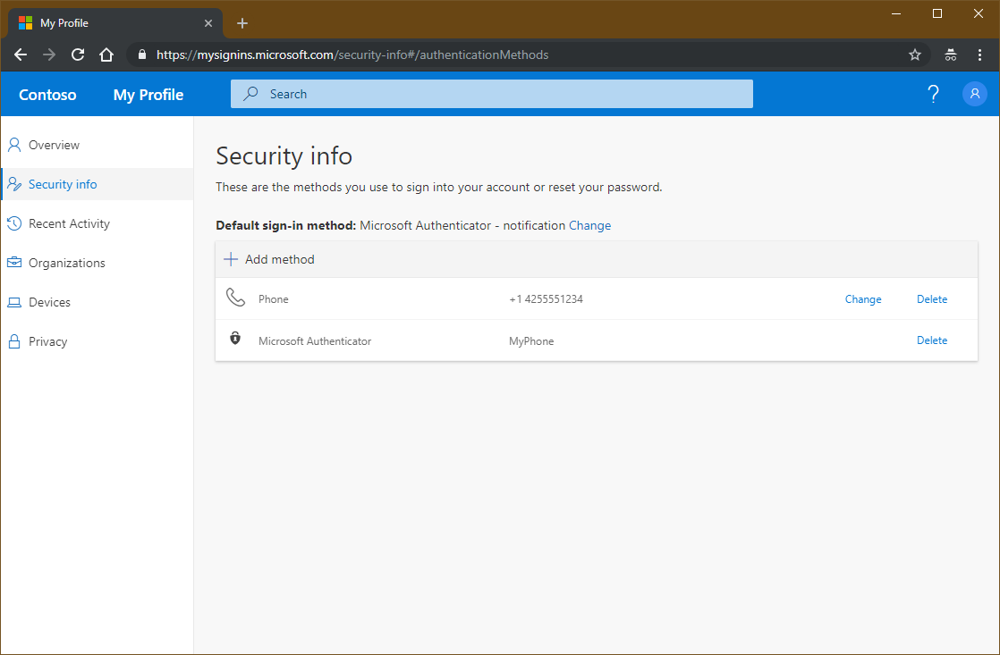
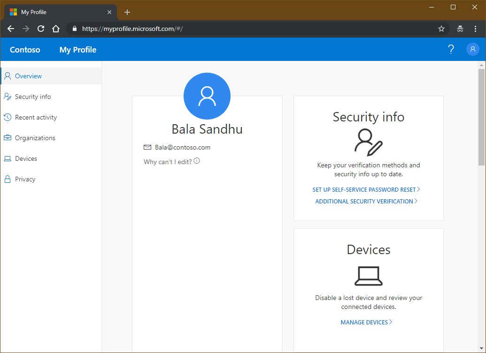

# Combined security information registration (preview)

Before combined registration, users registered authentication methods for Azure Multi-Factor Authentication (MFA) and self-service password reset (SSPR) through two different experiences. People were confused that similar methods were used for both Azure MFA and SSPR but they had to register for each feature separately. Now, with combined registration, users can register once and get the benefits of both Azure MFA and SSPR.

Before enabling the new experience, review this administrator-focused documentation and the user-focused documentation to ensure you understand the functionality and impact of this feature. Base your training on the user documentation to prepare your users for the new experience and help to ensure a successful rollout.

|     |
| --- |
| Combined security information registration for Azure Multi-Factor Authentication and Azure AD self-service password reset is a public preview feature of Azure Active Directory. For more information about previews, see  [Supplemental Terms of Use for Microsoft Azure Previews](https://azure.microsoft.com/support/legal/preview-supplemental-terms/)|
|     |

> [!IMPORTANT]
> If a user is enabled for both the original preview and the enhanced combined registration experience, they will see the new experience. Users who are enabled for both experiences will only see the new My Profile experience. The new My Profile aligns with the look and feel of combined registration and provides a seamless experience for users. Users can see My Profile by going to [https://myprofile.microsoft.com](https://myprofile.microsoft.com).

The MyProfile pages are localized based on the current language settings on the machine accessing the page. Microsoft stores the most recent language utilized in the browser cache so subsequent attempts to access will continue to render in the last language used. Clearing the cache will cause the pages to re-render. If you would like to force a specific language adding a `?lng=de-DE` to the end of the URL where `de-DE` is set to the appropriate language code will force the pages to render in that language.

## Methods available in converged registration

At this time, combined registration supports the following methods and actions for those methods:

|   | Register | Change | Delete |
| --- | --- | --- | --- |
| Microsoft Authenticator | Yes (max 5) | No | Yes |
| Other authenticator app | Yes (max 5) | No | Yes |
| Hardware token | No | No | Yes |
| Phone | Yes | Yes | Yes |
| Alternate phone | Yes | Yes | Yes |
| Office phone | No | No | No |
| Email | Yes | Yes | Yes |
| Security questions | Yes | No | Yes |
| App passwords | Yes | No | Yes |

> [!NOTE]
> App passwords are only available to users who have been enforced for MFA. App passwords are not available to users who are enabled for MFA via a conditional access policy.

Users can set the following options as their default method for MFA:

- Microsoft Authenticator – notification
- Authenticator app or hardware token – code
- Phone call
- Text message

As we continue to add more authentication methods such to Azure AD, those methods will be available in combined registration.

## Combined registration Modes

There are two “modes” of combined registration: interrupt and manage.

Interrupt mode, is a wizard-like experience, shown to a user when they register or refresh their security info at sign in.

Manage mode is part of the user’s profile and allows them to manage their security info.

For both modes, if a user has previously registered a method that can be used for MFA, they will need to perform MFA before they can access their security info.

### Interrupt mode

Combined registration respects both MFA and SSPR policies, if both are enabled for your tenant. These policies control, whether a user is interrupted to register during sign in, and which methods are available to register.

The following list several scenarios where a user may be prompted to register or refresh their security info:

* MFA registration enforced through Identity Protection: Users will be asked to register during sign in. They register MFA methods and SSPR methods (if the user is enabled for SSPR).
* MFA registration enforced through per-user MFA: Users will be asked to register during sign in. They  register MFA methods and SSPR methods (if the user is enabled for SSPR).
* MFA registration enforced through conditional access or other policies: Users are asked to register when accessing a resource that requires MFA. Users will register MFA methods and SSPR methods (if the user is enabled for SSPR).
* SSPR registration enforced: Users are asked to register during sign in. They only register SSPR methods
* SSPR refresh enforced: Users are required to review their security info at an interval set by the admin. Users are shown their info and can choose "Looks good" or make changes if needed.

When registration is enforced, users are shown the minimum number of methods needed to be compliant with both MFA and SSPR policies from most to least secure.

Example:

* A user is enabled for SSPR. The SSPR policy required two methods to reset and has enabled mobile app code, email, and phone.
   * This user is required to register two methods.
      * They're shown authenticator app and phone by default.
      * The user can choose to register email instead of authenticator app or phone.

The following flowchart describes which methods are shown to a user when interrupted to register during sign in:

If you have both MFA and SSPR enabled, we recommend that you enforce MFA registration.

If the SSPR policy requires users to review their security info at a regular interval, users are interrupted during sign in and shown all their registered methods. They can choose “Looks good” if the info is up-to-date or they can choose “Edit info” to make changes.

### Manage mode

Users can access manage mode by going to [https://aka.ms/mysecurityinfo](https://aka.ms/mysecurityinfo) or by choosing “Security info” from My Profile. From there, users can add methods, delete or change existing methods, change their default method, and more.

## Key usage scenarios

### Set up security info during sign in

An admin has enforced registration.

A user has not set up all required security info and navigates to the Azure portal. After entering their username and password, the user is prompted to set up security info. The user then follows the steps shown in the wizard to set up the required security info. The user can choose to set up methods other than what is shown by default if your settings allow. At the end of the wizard, the user reviews the methods they set up and their default method for MFA. To complete the setup process, the user confirms the info and continues to the Azure portal.

### Set up security info from My Profile

An admin has not enforced registration.

A user who has not yet set up all required security info navigates to [https://myprofile.microsoft.com](https://myprofile.microsoft.com). The user then chooses **Security info** from the left-hand navigation. From there, the user chooses to add a method, selects any of the methods available to them, and follows the steps to set up that method. When finished, the user sees the method they just set up on the security info page.

### Delete security info from My Profile

A user who has previously set up at least one method navigates to [https://aka.ms/mysecurityinfo](https://aka.ms/mysecurityinfo). The user chooses to delete one of the previously registered methods. When finished, the user no longer sees that method on the security info page.

### Change default method from My Profile

A user who has previously set up at least one method that can be used for MFA navigates to [https://aka.ms/mysecurityinfo](https://aka.ms/mysecurityinfo). The user changes their current default method to a different default method. When finished, the user sees their new default method on the security info page.

## Next steps

[Enable combined registration in your tenant](howto-registration-mfa-sspr-combined.md)

[Available methods for MFA and SSPR](concept-authentication-methods.md)

[Configure self-service password reset](howto-sspr-deployment.md)

[Configure Azure Multi-Factor Authentication](howto-mfa-getstarted.md)
