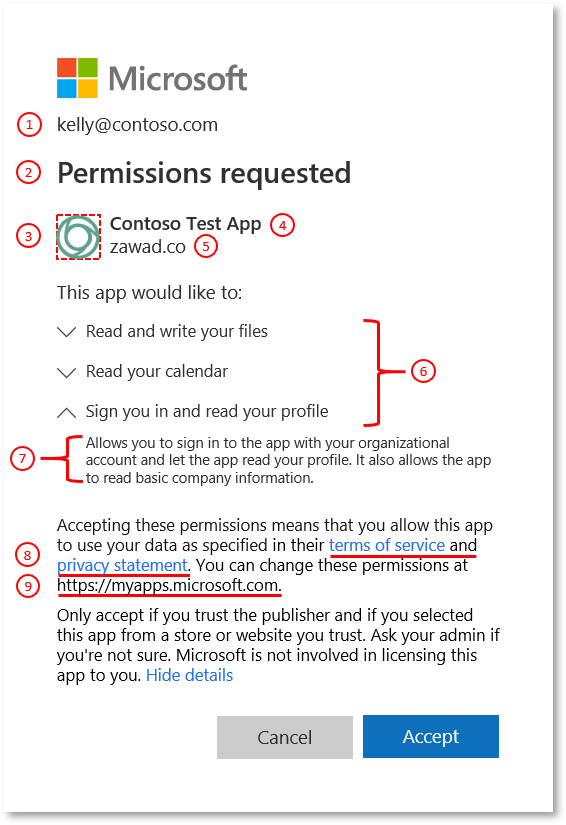
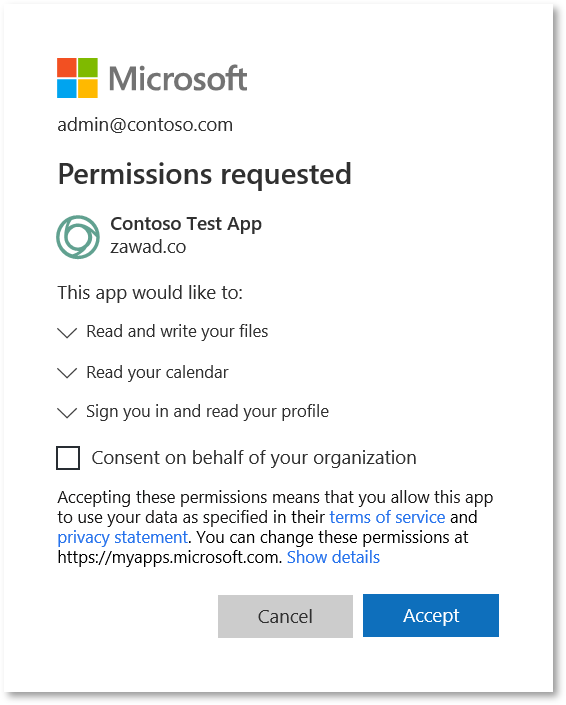
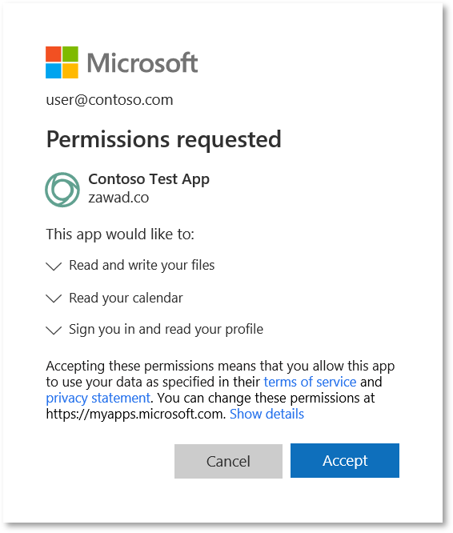
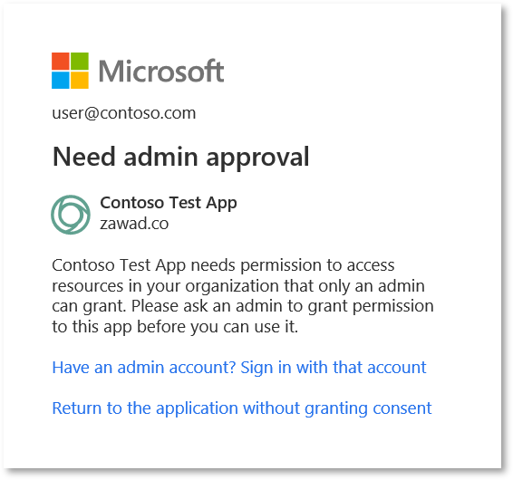
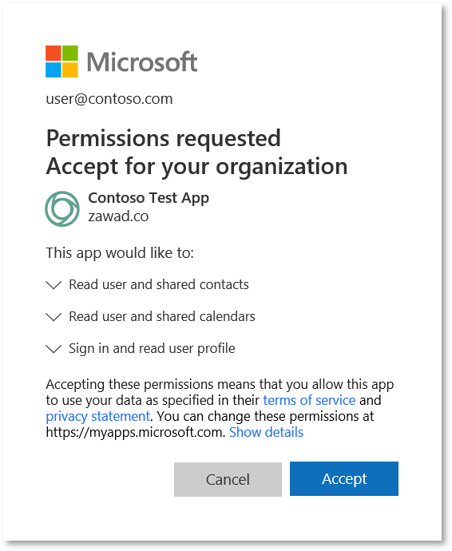

# Understanding Azure AD application consent experiences

Learn more about the Azure Active Directory (Azure AD) application consent user experience. So you can intelligently manage applications for your organization and/or develop applications with a more seamless consent experience.

## Consent and permissions

Consent is the process of a user granting authorization to an application to access protected resources on their behalf. An admin or user can be asked for consent to allow access to their organization/individual data.

The actual user experience of granting consent will differ depending on policies set on the user's tenant, the user's scope of authority (or role), and the type of [permissions](https://docs.microsoft.com/azure/active-directory/develop/active-directory-permissions) being requested by the client application. This means that application developers and tenant admins have some control over the consent experience. Admins have the flexibility of setting and disabling policies on a tenant or app to control the consent experience in their tenant. Application developers can dictate what types of permissions are being requested and if they want to guide users through the user consent flow or  the admin consent flow.

- **User consent flow** is when an application developer directs users to the authorization endpoint with the intent to record consent for only the current user.
- **Admin consent flow** is when an application developer directs users to the admin consent endpoint with the intent to record consent for the entire tenant. To ensure the admin consent flow works properly, application developers must list all permissions in the `RequiredResourceAccess` property in the application manifest. For more info, see [Application manifest](https://docs.microsoft.com/azure/active-directory/develop/reference-app-manifest).

## Building blocks of the consent prompt

The consent prompt is designed to ensure users have enough information to determine if they trust the client application to access protected resources on their behalf. Understanding the building blocks will help users granting consent make more informed decisions and it will help developers build better user experiences.

The following diagram and table provide information about the building blocks of the consent prompt.

| # | Component | Purpose |
| ----- | ----- | ----- |
| 1 | User identifier | This identifier represents the user that the client application is requesting to access protected resources on behalf of. |
| 2 | Title | The title changes based on whether the users are going through the user or admin consent flow. In user consent flow, the title will be “Permissions requested” while in the admin consent flow the title will have an additional line “Accept for your organization”. |
| 3 | App logo | This image should help users have a visual cue of whether this app is the app they intended to access. This image is provided by application developers and the ownership of this image isn't validated. |
| 4 | App name | This value should inform users which application is requesting access to their data. Note this name is provided by the developers and the ownership of this app name isn't validated. |
| 5 | Publisher domain | This value should provide users with a domain they may be able to evaluate for trustworthiness. This domain is provided by the developers and the ownership of this publisher domain is validated. |
| 6 | Permissions | This list contains the permissions being requested by the client application. Users should always evaluate the types of permissions being requested to understand what data the client application will be authorized to access on their behalf if they accept. As an application developer it is best to request access, to the permissions with the least privilege. |
| 7 | Permission description | This value is provided by the service exposing the permissions. To see the permission descriptions, you must toggle the chevron next to the permission. |
| 8 | App terms | These terms contain links to the terms of service and privacy statement of the application. The publisher is responsible for outlining their rules in their terms of service. Additionally, the publisher is responsible for disclosing the way they use and share user data in their privacy statement. If the publisher doesn't provide links to these values for multi-tenant applications, there will be a bolded warning on the consent prompt. |
| 9 | https://myapps.microsoft.com | This is the link where users can review and remove any non-Microsoft applications that currently have access to their data. |

## Common consent scenarios

Here are the consent experiences that a user may see in the common consent scenarios:

1. Individuals accessing an app that directs them to the user consent flow while requiring a permission set that is within their scope of authority.
    
    1. Admins will see an additional control on the traditional consent prompt that will allow them consent on behalf of the entire tenant. The control will be defaulted to off, so only when admins explicitly check the box will consent be granted on behalf of the entire tenant. As of today, this check box will only show for the Global Admin role, so Cloud Admin and App Admin will not see this checkbox.

        
    
    2. Users will see the traditional consent prompt.

        

2. Individuals accessing an app that requires at least one permission that is outside their scope of authority.
    1. Admins will see the same prompt as 1.i shown above.
    2. Users will be blocked from granting consent to the application, and they will be told to ask their admin for access to the app. 
                
        

3. Individuals that navigate or are directed to the admin consent flow.
    1. Admin users will see the admin consent prompt. The title and the permission descriptions changed on this prompt, the changes highlight the fact that accepting this prompt will grant the app access to the requested data on behalf of the entire tenant.
        
        
        
    1. Non-admin users will see the same screen as 2.ii shown above.

## Next steps
- Get a step-by-step overview of [how the Azure AD consent framework implements consent](https://docs.microsoft.com/azure/active-directory/develop/active-directory-integrating-applications).
- For more depth, learn [how a multi-tenant application can use the consent framework](https://docs.microsoft.com/azure/active-directory/develop/active-directory-devhowto-multi-tenant-overview) to implement "user" and "admin" consent, supporting more advanced multi-tier application patterns.
