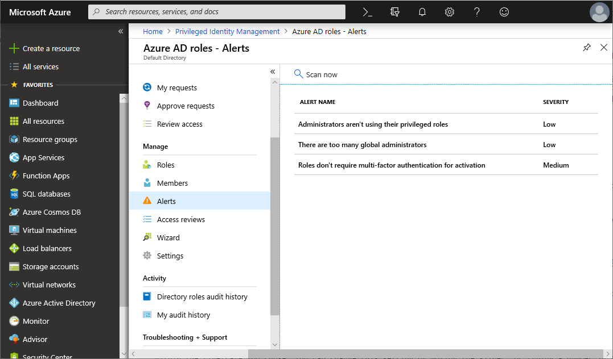
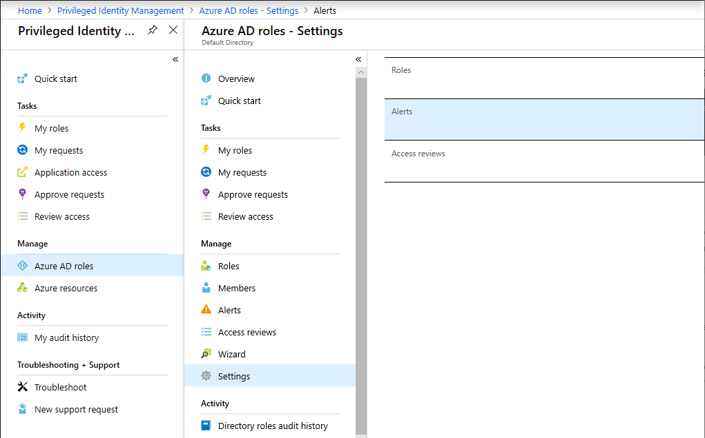
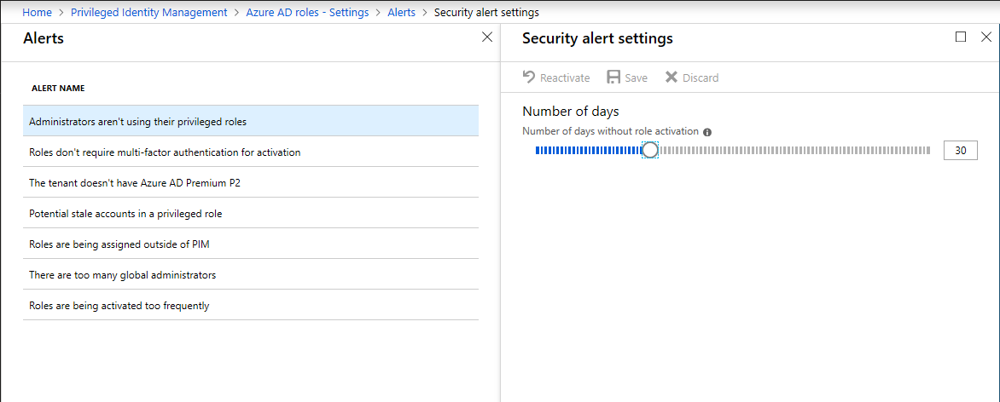

# Configure security alerts for Azure AD directory roles in PIM

Azure AD Privileged Identity Management (PIM) generates alerts when there is suspicious or unsafe activity in your environment. When an alert is triggered, it shows up on the PIM dashboard. Select the alert to see a report that lists the users or roles that triggered the alert.

## Security alerts

This section lists all the security alerts for directory roles, along with how to fix and how to prevent. Severity has the following meaning:

* **High**: Requires immediate action because of a policy violation.
* **Medium**: Does not require immediate action but signals a potential policy violation.
* **Low**: Does not require immediate action but suggests a preferable policy change.

### Administrators aren't using their privileged roles

| | |
| --- | --- |
| **Severity** | Low |
| **Why do I get this alert?** | Users that have been assigned privileged roles they don't need increases the chance of an attack. It is also easier for attackers to remain unnoticed in accounts that are not actively being used. |
| **How to fix?** | Review the users in the list and remove them from privileged roles they do not need. |
| **Prevention** | Only assign privileged roles to users that have a business justification.  Schedule regular [access reviews](pim-how-to-start-security-review.md) to verify that users still need their access. |
| **In-portal mitigation action** | Removes the account from their privileged role. |
| **Trigger** | Triggered if a user goes a certain amount of time without activating a role. |
| **Number of days** | This setting specifies the number of days, from 0 to 100, that a user can go without activating a role.|

### Roles don't require multi-factor authentication for activation

| | |
| --- | --- |
| **Severity** | Low |
| **Why do I get this alert?** | Without MFA, compromised users can activate privileged roles. |
| **How to fix?** | Review the list of roles and [require MFA](pim-how-to-change-default-settings.md) for every role. |
| **Prevention** | [Require MFA](pim-how-to-change-default-settings.md) for every role.  |
| **In-portal mitigation action** | Makes MFA required for activation of the privileged role. |

### The tenant doesn't have Azure AD Premium P2

| | |
| --- | --- |
| **Severity** | Low |
| **Why do I get this alert?** | The current tenant does not have Azure AD Premium P2. |
| **How to fix?** | Review information about [Azure AD editions](../fundamentals/active-directory-whatis.md). Upgrade to Azure AD Premium P2. |

### Potential stale accounts in a privileged role

| | |
| --- | --- |
| **Severity** | Medium |
| **Why do I get this alert?** | Accounts in a privileged role that have not changed their password in the past 90 days. These accounts might be service or shared accounts that aren't being maintained and are vulnerable to attackers. |
| **How to fix?** | Review the accounts in the list. If they no longer need access, remove them from their privileged roles. |
| **Prevention** | Ensure that accounts that are shared are rotating strong passwords when there is a change in the users that know the password.  Regularly review accounts with privileged roles using [access reviews](pim-how-to-start-security-review.md) and remove role assignments that are no longer needed. |
| **In-portal mitigation action** | Removes the account from their privileged role. |
| **Best practices** | Shared, service, and emergency access accounts that authenticate using a password and are assigned to highly privileged administrative roles such as Global Administrator or Security Administrator should have their passwords rotated for the following cases:<ul><li>After a security incident involving misuse or compromise of administrative access rights</li><li>After any user's privileges are changed so that they are no longer an administrator (for example, after an employee who was an administrator leaves IT or leaves the organization)</li><li>At regular intervals (for example, quarterly or yearly), even if there was no known breach or change to IT staffing</li></ul>Since multiple people have access to these accounts' credentials, the credentials should be rotated to ensure that people that have left their roles can no longer access the accounts. [Learn more](https://aka.ms/breakglass) |

### Roles are being assigned outside of PIM

| | |
| --- | --- |
| **Severity** | High |
| **Why do I get this alert?** | Privileged role assignments made outside of PIM are not properly monitored and may indicate an active attack. |
| **How to fix?** | Review the users in the list and remove them from privileged roles assigned outside of PIM. |
| **Prevention** | Investigate where users are being assigned privileged roles outside of PIM and prohibit future assignments from there. |
| **In-portal mitigation action** | Removes the account from their privileged role. |

### There are too many global administrators

| | |
| --- | --- |
| **Severity** | Low |
| **Why do I get this alert?** | Global Administrator is the highest privileged role. If  a Global Administrator is compromised, the attacker gains access to all of their permissions, which puts your whole system at risk. |
| **How to fix?** | Review the users in the list and remove any that do not absolutely need the Global Administrator role.  Assign these users lower privileged roles. |
| **Prevention** | Assign users the least privileged role they need. |
| **In-portal mitigation action** | Removes the account from their privileged role. |
| **Trigger** | Triggered if two different criteria are met, and you can configure both of them. First, you need to reach a certain threshold of Global Administrators. Second, a certain percentage of your total role assignments must be Global Administrators. If you only meet one of these measurements, the alert does not appear. |
| **Minimum number of Global Administrators** | This setting specifies the number of Global Administrators, from 2 to 100, that you consider an unsafe amount. |
| **Percentage of Global Administrators** | This setting specifies the minimum percentage of administrators who are Global Administrators, from 0% to 100%, that is unsafe in your environment. |

### Roles are being activated too frequently

| | |
| --- | --- |
| **Severity** | Low |
| **Why do I get this alert?** | Multiple activations to the same privileged role by the same user is a sign of an attack. |
| **How to fix?** | Review the users in the list and ensure that the [activation duration](pim-how-to-change-default-settings.md) for their privileged role is set long enough for them to perform their tasks. |
| **Prevention** | Ensure that the [activation duration](pim-how-to-change-default-settings.md) for privileged roles is set long enough for users to perform their tasks. [Require MFA](pim-how-to-change-default-settings.md) for privileged roles that have accounts shared by multiple administrators. |
| **In-portal mitigation action** | N/A |
| **Trigger** | Triggered if a user activates the same privileged role multiple times within a specified period. You can configure both the time period and the number of activations. |
| **Activation renewal timeframe** | This setting specifies in days, hours, minutes, and second the time period you want to use to track suspicious renewals. |
| **Number of activation renewals** | This setting specifies the number of activations, from 2 to 100, that you consider worthy of alert, within the timeframe you chose. You can change this setting by moving the slider, or typing a number in the text box. |

## Configure security alert settings

You can customize some of the security alerts in PIM to work with your environment and security goals. Follow these steps to open the security alert settings:

1. Open **Azure AD Privileged Identity Management**.

1. Click **Azure AD roles**.

1. Click **Settings** and then **Alerts**.

    

1. Click an alert name to configure the setting for that alert.

    

## Next steps

- [Configure Azure AD directory role settings in PIM](pim-how-to-change-default-settings.md)
