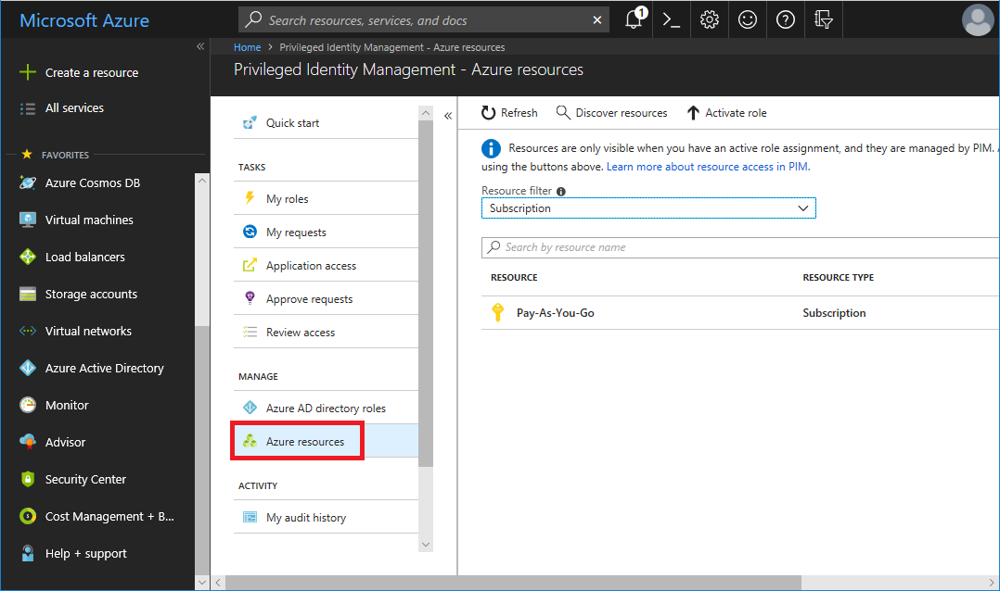
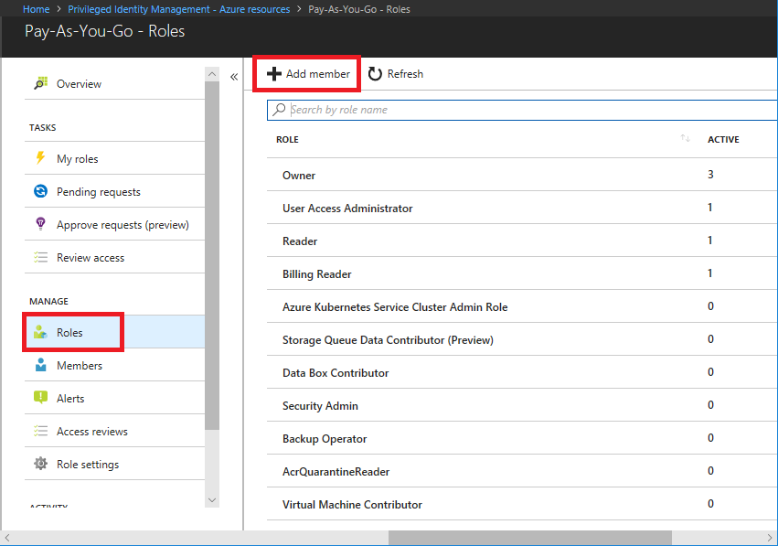
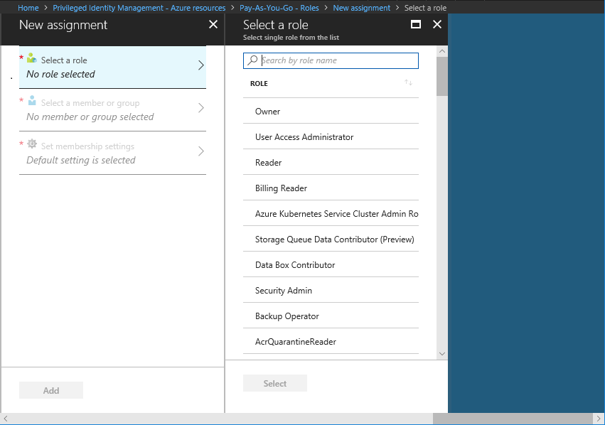
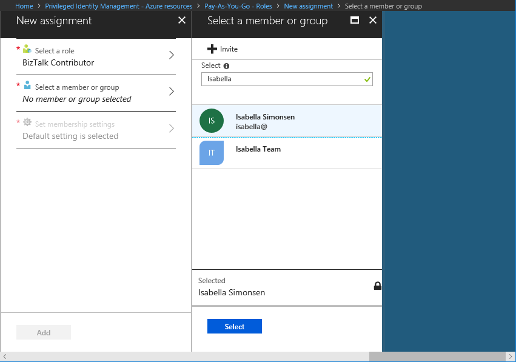
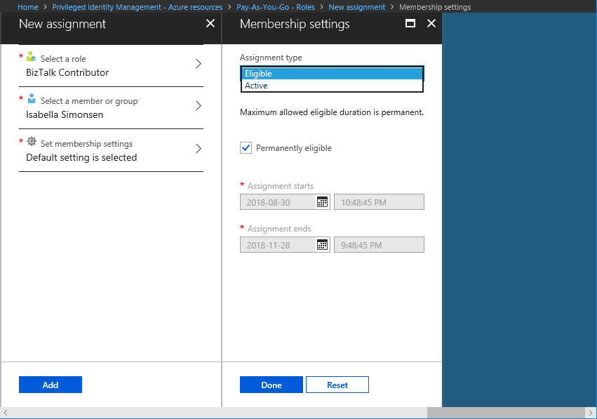
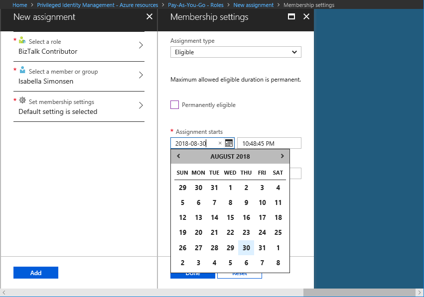
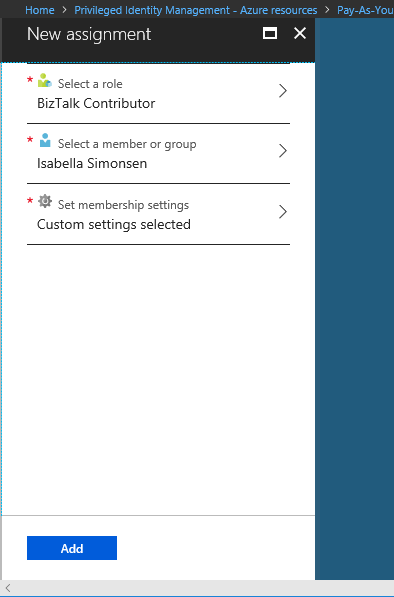
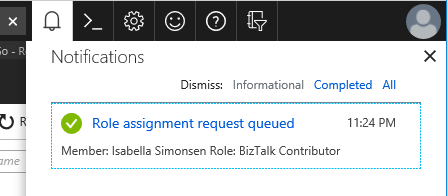
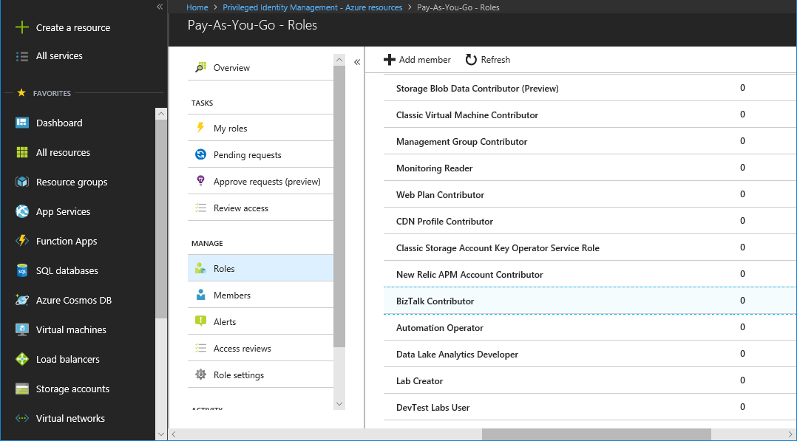
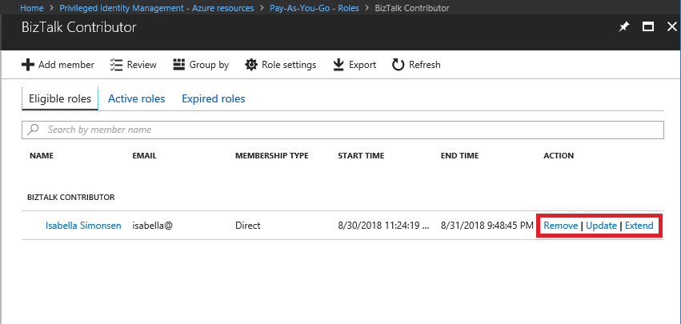

# Assign Azure resource roles in PIM

Azure AD PIM can manage the built-in Azure resource roles, as well as custom roles, including (but not limited to):

- Owner
- User Access Administrator
- Contributor
- Security Admin
- Security Manager, and more

> [!NOTE]
> Users or members of a group assigned to the Owner or User Access Administrator roles, and Global Administrators that enable subscription management in Azure AD are Resource Administrators. These administrators may assign roles, configure role settings, and review access using PIM for Azure resources. View the list of [built-in roles for Azure resources](../../role-based-access-control/built-in-roles.md).

## Assign a role

Follow these steps to make a user eligible for an Azure resource role.

1. Sign in to [Azure portal](https://portal.azure.com/) with a user that is a member of the [Privileged Role Administrator](../users-groups-roles/directory-assign-admin-roles.md#privileged-role-administrator) role.

    For information about how to grant another administrator access to manage PIM, see [Grant access to other administrators to manage PIM](pim-how-to-give-access-to-pim.md).

1. Open **Azure AD Privileged Identity Management**.

    If you haven't started PIM in the Azure portal yet, go to [Start using PIM](pim-getting-started.md).

1. Click **Azure resources**.

1. Use the **Resource filter** to filter the list of managed resources.

    

1. Click the resource you want to manage, such as a subscription or management group.

1. Under Manage, click **Roles** to see the list of roles for Azure resources.

    

1. Click **Add member** to open the New assignment pane.

1. Click **Select a role** to open the Select a role pane.

    

1. Click a role you want to assign and then click **Select**.

    The Select a member or group pane opens.

1. Click a member or group you want to assign to the role and then click **Select**.

    

    The Membership settings pane opens.

1. In the **Assignment type** list, select **Eligible** or **Active**.

    

    PIM for Azure resources provides two distinct assignment types:

    - **Eligible** assignments require the member of the role to perform an action to use the role. Actions might include performing a multi-factor authentication (MFA) check, providing a business justification, or requesting approval from designated approvers.

    - **Active** assignments don't require the member to perform any action to use the role. Members assigned as active have the privileges assigned to the role at all times.

1. If the assignment should be permanent (permanently eligible or permanently assigned), select the **Permanently** check box.

    Depending on the role settings, the check box might not appear or might be unmodifiable.

1. To specify a specific assignment duration, clear the check box and modify the start and/or end date and time boxes.

    

1. When finished, click **Done**.

    

1. To create the new role assignment, click **Add**. A notification of the status is displayed.

    

## Update or remove an existing role assignment

Follow these steps to update or remove an existing role assignment.

1. Open **Azure AD Privileged Identity Management**.

1. Click **Azure resources**.

1. Click the resource you want to manage, such as a subscription or management group.

1. Under Manage, click **Roles** to see the list of roles for Azure resources.

    

1. Click the role that you want to update or remove.

1. Find the role assignment on the **Eligible roles** or **Active roles** tabs.

    

1. Click **Update** or **Remove** to update or remove the role assignment.

    For information about extending a role assignment, see [Extend or renew Azure resource roles in PIM](pim-resource-roles-renew-extend.md).

## Next steps

- [Extend or renew Azure resource roles in PIM](pim-resource-roles-renew-extend.md)
- [Configure Azure resource role settings in PIM](pim-resource-roles-configure-role-settings.md)
- [Assign Azure AD directory roles in PIM](pim-how-to-add-role-to-user.md)
