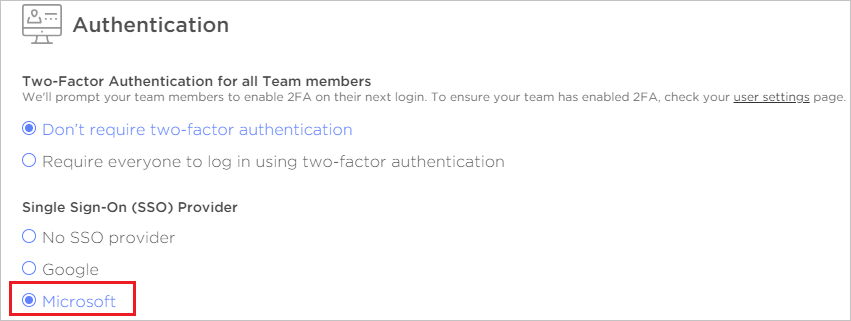
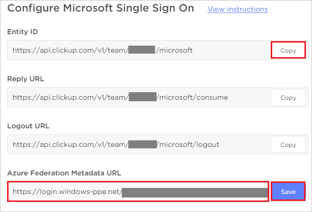
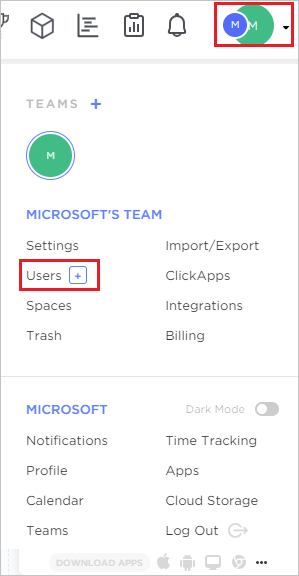

# Tutorial: Azure Active Directory integration with ClickUp Productivity Platform

In this tutorial, you learn how to integrate ClickUp Productivity Platform with Azure Active Directory (Azure AD).
Integrating ClickUp Productivity Platform with Azure AD provides you with the following benefits:

* You can control in Azure AD who has access to ClickUp Productivity Platform.
* You can enable your users to be automatically signed-in to ClickUp Productivity Platform (Single Sign-On) with their Azure AD accounts.
* You can manage your accounts in one central location - the Azure portal.

If you want to know more details about SaaS app integration with Azure AD, see [What is application access and single sign-on with Azure Active Directory](https://docs.microsoft.com/azure/active-directory/active-directory-appssoaccess-whatis).
If you don't have an Azure subscription, [create a free account](https://azure.microsoft.com/free/) before you begin.

## Prerequisites

To configure Azure AD integration with ClickUp Productivity Platform, you need the following items:

* An Azure AD subscription. If you don't have an Azure AD environment, you can get one-month trial [here](https://azure.microsoft.com/pricing/free-trial/)
* ClickUp Productivity Platform single sign-on enabled subscription

## Scenario description

In this tutorial, you configure and test Azure AD single sign-on in a test environment.

* ClickUp Productivity Platform supports **SP** initiated SSO

## Adding ClickUp Productivity Platform from the gallery

To configure the integration of ClickUp Productivity Platform into Azure AD, you need to add ClickUp Productivity Platform from the gallery to your list of managed SaaS apps.

**To add ClickUp Productivity Platform from the gallery, perform the following steps:**

1. In the **[Azure portal](https://portal.azure.com)**, on the left navigation panel, click **Azure Active Directory** icon.

	

2. Navigate to **Enterprise Applications** and then select the **All Applications** option.

	

3. To add new application, click **New application** button on the top of dialog.

	

4. In the search box, type **ClickUp Productivity Platform**, select **ClickUp Productivity Platform** from result panel then click **Add** button to add the application.

	 

## Configure and test Azure AD single sign-on

In this section, you configure and test Azure AD single sign-on with ClickUp Productivity Platform based on a test user called **Britta Simon**.
For single sign-on to work, a link relationship between an Azure AD user and the related user in ClickUp Productivity Platform needs to be established.

To configure and test Azure AD single sign-on with ClickUp Productivity Platform, you need to complete the following building blocks:

1. **[Configure Azure AD Single Sign-On](#configure-azure-ad-single-sign-on)** - to enable your users to use this feature.
2. **[Configure ClickUp Productivity Platform Single Sign-On](#configure-clickup-productivity-platform-single-sign-on)** - to configure the Single Sign-On settings on application side.
3. **[Create an Azure AD test user](#create-an-azure-ad-test-user)** - to test Azure AD single sign-on with Britta Simon.
4. **[Assign the Azure AD test user](#assign-the-azure-ad-test-user)** - to enable Britta Simon to use Azure AD single sign-on.
5. **[Create ClickUp Productivity Platform test user](#create-clickup-productivity-platform-test-user)** - to have a counterpart of Britta Simon in ClickUp Productivity Platform that is linked to the Azure AD representation of user.
6. **[Test single sign-on](#test-single-sign-on)** - to verify whether the configuration works.

### Configure Azure AD single sign-on

In this section, you enable Azure AD single sign-on in the Azure portal.

To configure Azure AD single sign-on with ClickUp Productivity Platform, perform the following steps:

1. In the [Azure portal](https://portal.azure.com/), on the **ClickUp Productivity Platform** application integration page, select **Single sign-on**.

    

2. On the **Select a Single sign-on method** dialog, select **SAML/WS-Fed** mode to enable single sign-on.

    

3. On the **Set up Single Sign-On with SAML** page, click **Edit** icon to open **Basic SAML Configuration** dialog.

	

4. On the **Basic SAML Configuration** section, perform the following steps:

    

	a. In the **Sign on URL** text box, type a URL:
    `https://app.clickup.com/login/sso`

    b. In the **Identifier (Entity ID)** text box, type a URL using the following pattern:
    `https://api.clickup.com/v1/team/<team_id>/microsoft`

	> [!NOTE]
	> The Identifier value is not real. Update this value with the actual Identifier, which is explained later in this tutorial.

5. On the **Set up Single Sign-On with SAML** page, In the **SAML Signing Certificate** section, click copy button to copy **App Federation Metadata Url** and save it on your computer.

	

### Configure ClickUp Productivity Platform Single Sign-On

1. In a different web browser window, sign-on to your ClickUp Productivity Platform tenant as an administrator.

2. Click on the **User profile** and select **Settings**.

    

3. Select **Microsoft**, under Single Sign-On (SSO) Provider.

    

4. On the **Configure Microsoft Single Sign On** page, perform the following steps:

    

    a. Click **Copy** to copy the Entity ID value and paste it into the **Identifier (Entity ID)** textbox in the **Basic SAML Configuration** section in the Azure portal.
    
    b. In the **Azure Federation Metadata URL** textbox, paste the App Federation Metadata Url value, which you have copied from the Azure portal and then click **Save**.

5. To complete the setup, click **Authenticate With Microsoft to complete setup** and authenticate with microsoft account.

    

### Create an Azure AD test user

The objective of this section is to create a test user in the Azure portal called Britta Simon.

1. In the Azure portal, in the left pane, select **Azure Active Directory**, select **Users**, and then select **All users**.

    

2. Select **New user** at the top of the screen.

    

3. In the User properties, perform the following steps.

    

    a. In the **Name** field enter **BrittaSimon**.
  
    b. In the **User name** field type **brittasimon\@yourcompanydomain.extension**  
    For example, BrittaSimon@contoso.com

    c. Select **Show password** check box, and then write down the value that's displayed in the Password box.

    d. Click **Create**.

### Assign the Azure AD test user

In this section, you enable Britta Simon to use Azure single sign-on by granting access to ClickUp Productivity Platform.

1. In the Azure portal, select **Enterprise Applications**, select **All applications**, then select **ClickUp Productivity Platform**.

	

2. In the applications list, select **ClickUp Productivity Platform**.

	

3. In the menu on the left, select **Users and groups**.

    

4. Click the **Add user** button, then select **Users and groups** in the **Add Assignment** dialog.

    

5. In the **Users and groups** dialog select **Britta Simon** in the Users list, then click the **Select** button at the bottom of the screen.

6. If you are expecting any role value in the SAML assertion then in the **Select Role** dialog select the appropriate role for the user from the list, then click the **Select** button at the bottom of the screen.

7. In the **Add Assignment** dialog click the **Assign** button.

### Create ClickUp Productivity Platform test user

1. In a different web browser window, sign-on to your ClickUp Productivity Platform tenant as an administrator.

2. Click on the **User profile** and select **Users**.

    

3. Enter the email address of the user in the textbox and click **Invite**.

    

    > [!NOTE]
    > User will get the notification and he has to accept the invitation to activate the account.

### Test single sign-on

In this section, you test your Azure AD single sign-on configuration using the Access Panel.

When you click the ClickUp Productivity Platform tile in the Access Panel, you should be automatically signed in to the ClickUp Productivity Platform for which you set up SSO. For more information about the Access Panel, see [Introduction to the Access Panel](https://docs.microsoft.com/azure/active-directory/active-directory-saas-access-panel-introduction).

## Additional Resources

- [ List of Tutorials on How to Integrate SaaS Apps with Azure Active Directory ](https://docs.microsoft.com/azure/active-directory/active-directory-saas-tutorial-list)

- [What is application access and single sign-on with Azure Active Directory? ](https://docs.microsoft.com/azure/active-directory/active-directory-appssoaccess-whatis)

- [What is conditional access in Azure Active Directory?](https://docs.microsoft.com/azure/active-directory/conditional-access/overview)

