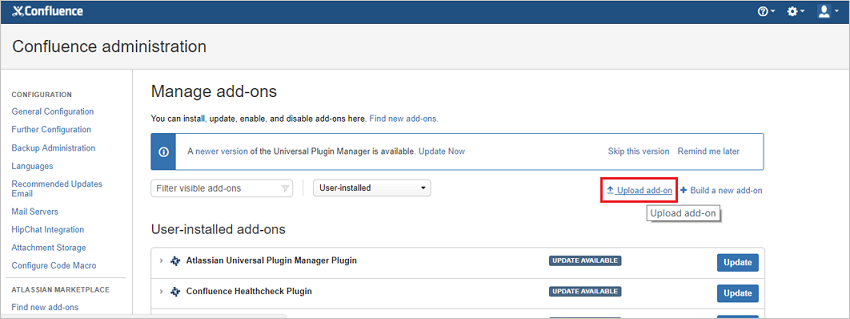
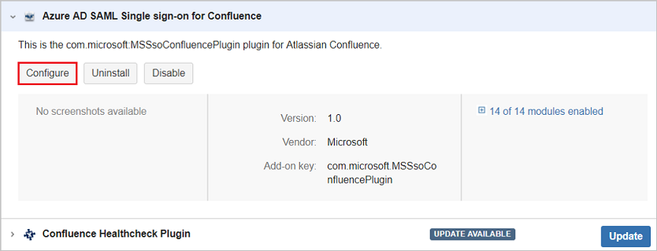
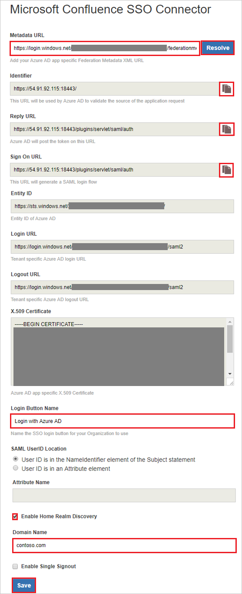

# Tutorial: Azure Active Directory integration with Confluence SAML SSO by Microsoft

In this tutorial, you learn how to integrate Confluence SAML SSO by Microsoft with Azure Active Directory (Azure AD).
Integrating Confluence SAML SSO by Microsoft with Azure AD provides you with the following benefits:

* You can control in Azure AD who has access to Confluence SAML SSO by Microsoft.
* You can enable your users to be automatically signed-in to Confluence SAML SSO by Microsoft (Single Sign-On) with their Azure AD accounts.
* You can manage your accounts in one central location - the Azure portal.

If you want to know more details about SaaS app integration with Azure AD, see [What is application access and single sign-on with Azure Active Directory](https://docs.microsoft.com/azure/active-directory/active-directory-appssoaccess-whatis).
If you don't have an Azure subscription, [create a free account](https://azure.microsoft.com/free/) before you begin.

## Description:

Use your Microsoft Azure Active Directory account with Atlassian Confluence server to enable single sign-on. This way all your organization users can use the Azure AD credentials to login into the Confluence application. This plugin uses SAML 2.0 for federation.

## Prerequisites

To configure Azure AD integration with Confluence SAML SSO by Microsoft, you need the following items:

- An Azure AD subscription
- Confluence server application installed on a Windows 64-bit server (on-premises or on the cloud IaaS infrastructure)
- Confluence server is HTTPS enabled
- Note the supported versions for Confluence Plugin are mentioned in below section.
- Confluence server is reachable on internet particularly to Azure AD Login page for authentication and should able to receive the token from Azure AD
- Admin credentials are set up in Confluence
- WebSudo is disabled in Confluence
- Test user created in the Confluence server application

> [!NOTE]
> To test the steps in this tutorial, we do not recommend using a production environment of Confluence. Test the integration first in development or staging environment of the application and then use the production environment.

To test the steps in this tutorial, you should follow these recommendations:

- Do not use your production environment, unless it is necessary.
- If you don't have an Azure AD trial environment, you can get a one-month trial here: [Trial offer](https://azure.microsoft.com/pricing/free-trial/).

## Supported versions of Confluence

As of now, following versions of Confluence are supported:

- Confluence: 5.0 to 5.10
- Confluence: 6.0.1
- Confluence: 6.1.1
- Confluence: 6.2.1
- Confluence: 6.3.4
- Confluence: 6.4.0
- Confluence: 6.5.0
- Confluence: 6.6.2
- Confluence: 6.7.0
- Confluence: 6.8.1
- Confluence: 6.9.0
- Confluence: 6.10.0
- Confluence: 6.11.0
- Confluence: 6.12.0

## Scenario description

In this tutorial, you configure and test Azure AD single sign-on in a test environment.

* Confluence SAML SSO by Microsoft supports **SP** initiated SSO

## Adding Confluence SAML SSO by Microsoft from the gallery

To configure the integration of Confluence SAML SSO by Microsoft into Azure AD, you need to add Confluence SAML SSO by Microsoft from the gallery to your list of managed SaaS apps.

**To add Confluence SAML SSO by Microsoft from the gallery, perform the following steps:**

1. In the **[Azure portal](https://portal.azure.com)**, on the left navigation panel, click **Azure Active Directory** icon.

	

2. Navigate to **Enterprise Applications** and then select the **All Applications** option.

	

3. To add new application, click **New application** button on the top of dialog.

	

4. In the search box, type **Confluence SAML SSO by Microsoft**, select **Confluence SAML SSO by Microsoft** from result panel then click **Add** button to add the application.

	 

## Configure and test Azure AD single sign-on

In this section, you configure and test Azure AD single sign-on with Confluence SAML SSO by Microsoft based on a test user called **Britta Simon**.
For single sign-on to work, a link relationship between an Azure AD user and the related user in Confluence SAML SSO by Microsoft needs to be established.

To configure and test Azure AD single sign-on with Confluence SAML SSO by Microsoft, you need to complete the following building blocks:

1. **[Configure Azure AD Single Sign-On](#configure-azure-ad-single-sign-on)** - to enable your users to use this feature.
2. **[Configure Confluence SAML SSO by Microsoft Single Sign-On](#configure-confluence-saml-sso-by-microsoft-single-sign-on)** - to configure the Single Sign-On settings on application side.
3. **[Create an Azure AD test user](#create-an-azure-ad-test-user)** - to test Azure AD single sign-on with Britta Simon.
4. **[Assign the Azure AD test user](#assign-the-azure-ad-test-user)** - to enable Britta Simon to use Azure AD single sign-on.
5. **[Create Confluence SAML SSO by Microsoft test user](#create-confluence-saml-sso-by-microsoft-test-user)** - to have a counterpart of Britta Simon in Confluence SAML SSO by Microsoft that is linked to the Azure AD representation of user.
6. **[Test single sign-on](#test-single-sign-on)** - to verify whether the configuration works.

### Configure Azure AD single sign-on

In this section, you enable Azure AD single sign-on in the Azure portal.

To configure Azure AD single sign-on with Confluence SAML SSO by Microsoft, perform the following steps:

1. In the [Azure portal](https://portal.azure.com/), on the **Confluence SAML SSO by Microsoft** application integration page, select **Single sign-on**.

    

2. On the **Select a Single sign-on method** dialog, select **SAML/WS-Fed** mode to enable single sign-on.

    

3. On the **Set up Single Sign-On with SAML** page, click **Edit** icon to open **Basic SAML Configuration** dialog.

	

4. On the **Basic SAML Configuration** section, perform the following steps:

    

    a. In the **Sign-on URL** text box, type a URL using the following pattern:
    `https://<domain:port>/plugins/servlet/saml/auth`

    b. In the **Identifier** box, type a URL using the following pattern:
    `https://<domain:port>/`

    c. In the **Reply URL** text box, type a URL using the following pattern:
    `https://<domain:port>/plugins/servlet/saml/auth`

	> [!NOTE]
	> These values are not real. Update these values with the actual Identifier, Reply URL, and Sign-On URL. Port is optional in case it’s a named URL. These values are received during the configuration of Confluence plugin, which is explained later in the tutorial.

4. On the **Set up Single Sign-On with SAML** page, In the **SAML Signing Certificate** section, click copy button to copy **App Federation Metadata Url** and save it on your computer.

	

### Configure Confluence SAML SSO by Microsoft Single Sign-On

1. In a different web browser window, log in to your Confluence instance as an administrator.

2. Hover on cog and click the **Add-ons**.

	

3. Download the plugin from [Microsoft Download Center](https://www.microsoft.com/download/details.aspx?id=56503). Manually upload the plugin provided by Microsoft using **Upload add-on** menu. The download of plugin is covered under [Microsoft Service Agreement](https://www.microsoft.com/servicesagreement/).

	

4. Once the plugin is installed, it appears in **User Installed** add-ons section of **Manage Add-on** section. Click **Configure** to configure the new plugin.

	

5. Perform following steps on configuration page:

	

	> [!TIP]
	> Ensure that there is only one certificate mapped against the app so that there is no error in resolving the metadata. If there are multiple certificates, admin gets an error upon resolving the metadata.

	a. In the **Metadata URL** textbox, paste **App Federation Metadata Url** value which you have copied from the Azure portal and click the **Resolve** button. It reads the IdP metadata URL and populates all the fields information.

	b. Copy the **Identifier, Reply URL and Sign on URL** values and paste them in **Identifier, Reply URL and Sign on URL** textboxes respectively in **Basic SAML Configuration** section on Azure portal.

	c. In **Login Button Name** type the name of button your organization wants the users to see on login screen.

	d. In **SAML User ID Locations**, select either **User ID is in the NameIdentifier element of the Subject statement** or **User ID is in an Attribute element**.  This ID has to be the Confluence user id. If the user id is not matched, then system will not allow users to log in. 

	> [!Note]
	> Default SAML User ID location is Name Identifier. You can change this to an attribute option and enter the appropriate attribute name.
	
	e. If you select **User ID is in an Attribute element** option, then in **Attribute name** textbox type the name of the attribute where User Id is expected. 

	f. If you are using the federated domain (like ADFS etc.) with Azure AD, then click on the **Enable Home Realm Discovery** option and configure the **Domain Name**.
	
	g. In **Domain Name** type the domain name here in case of the ADFS-based login.

	h. Check **Enable Single Sign out** if you wish to log out from Azure AD when a user logs out from Confluence. 

	i. Click **Save** button to save the settings.

	> [!NOTE]
	> For more information about installation and troubleshooting, visit [MS Confluence SSO Connector Admin Guide](../ms-confluence-jira-plugin-adminguide.md) and there is also [FAQ](../ms-confluence-jira-plugin-faq.md) for your assistance

### Create an Azure AD test user 

The objective of this section is to create a test user in the Azure portal called Britta Simon.

1. In the Azure portal, in the left pane, select **Azure Active Directory**, select **Users**, and then select **All users**.

    

2. Select **New user** at the top of the screen.

    

3. In the User properties, perform the following steps.

    

    a. In the **Name** field enter **BrittaSimon**.
  
    b. In the **User name** field type **brittasimon\@yourcompanydomain.extension**  
    For example, BrittaSimon@contoso.com

    c. Select **Show password** check box, and then write down the value that's displayed in the Password box.

    d. Click **Create**.

### Assign the Azure AD test user

In this section, you enable Britta Simon to use Azure single sign-on by granting access to Confluence SAML SSO by Microsoft.

1. In the Azure portal, select **Enterprise Applications**, select **All applications**, then select **Confluence SAML SSO by Microsoft**.

	

2. In the applications list, select **Confluence SAML SSO by Microsoft**.

	

3. In the menu on the left, select **Users and groups**.

    

4. Click the **Add user** button, then select **Users and groups** in the **Add Assignment** dialog.

    

5. In the **Users and groups** dialog select **Britta Simon** in the Users list, then click the **Select** button at the bottom of the screen.

6. If you are expecting any role value in the SAML assertion then in the **Select Role** dialog select the appropriate role for the user from the list, then click the **Select** button at the bottom of the screen.

7. In the **Add Assignment** dialog click the **Assign** button.

### Create Confluence SAML SSO by Microsoft test user

To enable Azure AD users to log in to Confluence on-premises server, they must be provisioned into Confluence SAML SSO by Microsoft. For Confluence SAML SSO by Microsoft, provisioning is a manual task.

**To provision a user account, perform the following steps:**

1. Log in to your Confluence on-premises server as an administrator.

2. Hover on cog and click the **User management**.

     

3. Under Users section, click **Add users** tab. On the **Add a User** dialog page, perform the following steps:

	 

	a. In the **Username** textbox, type the email of user like Britta Simon.

	b. In the **Full Name** textbox, type the full name of user like Britta Simon.

	c. In the **Email** textbox, type the email address of user like Brittasimon@contoso.com.

	d. In the **Password** textbox, type the password for Britta Simon.

	e. Click **Confirm Password** reenter the password.

	f. Click **Add** button.

### Test single sign-on 

In this section, you test your Azure AD single sign-on configuration using the Access Panel.

When you click the Confluence SAML SSO by Microsoft tile in the Access Panel, you should be automatically signed in to the Confluence SAML SSO by Microsoft for which you set up SSO. For more information about the Access Panel, see [Introduction to the Access Panel](https://docs.microsoft.com/azure/active-directory/active-directory-saas-access-panel-introduction).

## Additional Resources

- [List of Tutorials on How to Integrate SaaS Apps with Azure Active Directory](https://docs.microsoft.com/azure/active-directory/active-directory-saas-tutorial-list)

- [What is application access and single sign-on with Azure Active Directory?](https://docs.microsoft.com/azure/active-directory/active-directory-appssoaccess-whatis)

- [What is conditional access in Azure Active Directory?](https://docs.microsoft.com/azure/active-directory/conditional-access/overview)

