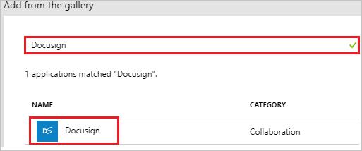
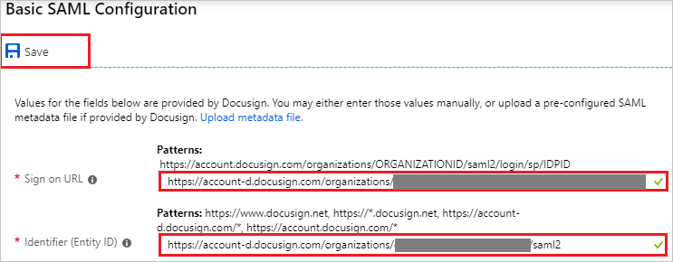

# Tutorial: Azure Active Directory integration with DocuSign

In this tutorial, you learn how to integrate DocuSign with Azure Active Directory (Azure AD).

Integrating DocuSign with Azure AD provides you with the following benefits:

- You can control in Azure AD who has access to DocuSign.
- You can enable your users to automatically get signed-on to DocuSign (Single Sign-On) with their Azure AD accounts.
- You can manage your accounts in one central location - the Azure portal.

If you want to know more details about SaaS app integration with Azure AD, see [what is application access and single sign-on with Azure Active Directory](../manage-apps/what-is-single-sign-on.md)

## Prerequisites

To configure Azure AD integration with DocuSign, you need the following items:

- An Azure AD subscription
- A DocuSign single sign-on enabled subscription

> [!NOTE]
> To test the steps in this tutorial, we do not recommend using a production environment.

To test the steps in this tutorial, you should follow these recommendations:

- Do not use your production environment, unless it is necessary.
- If you don't have an Azure AD trial environment, you can [get a one-month trial](https://azure.microsoft.com/pricing/free-trial/).

## Scenario description

In this tutorial, you test Azure AD single sign-on in a test environment. 
The scenario outlined in this tutorial consists of two main building blocks:

1. Adding DocuSign from the gallery
2. Configuring and testing Azure AD single sign-on

## Adding DocuSign from the gallery

To configure the integration of DocuSign into Azure AD, you need to add DocuSign from the gallery to your list of managed SaaS apps.

**To add DocuSign from the gallery, perform the following steps:**

1. In the **[Azure portal](https://portal.azure.com)**, on the left navigation panel, click **Azure Active Directory** icon. 

	![The Azure Active Directory button][1]

2. Navigate to **Enterprise applications**. Then go to **All applications**.

	![The Enterprise applications blade][2]

3. To add new application, click **New application** button on the top of dialog.

	![The New application button][3]

4. In the search box, type **DocuSign**, select **DocuSign** from result panel then click **Add** button to add the application.

	

## Configure and test Azure AD single sign-on

In this section, you configure and test Azure AD single sign-on with DocuSign based on a test user called "Britta Simon".

For single sign-on to work, Azure AD needs to know what the counterpart user in DocuSign is to a user in Azure AD. In other words, a link relationship between an Azure AD user and the related user in DocuSign needs to be established.

To configure and test Azure AD single sign-on with DocuSign, you need to complete the following building blocks:

1. **[Configuring Azure AD Single Sign-On](#configuring-azure-ad-single-sign-on)** - to enable your users to use this feature.
2. **[Creating an Azure AD test user](#creating-an-azure-ad-test-user)** - to test Azure AD single sign-on with Britta Simon.
3. **[Creating a DocuSign test user](#creating-a-docusign-test-user)** - to have a counterpart of Britta Simon in DocuSign that is linked to the Azure AD representation of user.
4. **[Assigning the Azure AD test user](#assigning-the-azure-ad-test-user)** - to enable Britta Simon to use Azure AD single sign-on.
5. **[Testing single sign-on](#testing-single-sign-on)** - to verify whether the configuration works.

### Configuring Azure AD single sign-on

In this section, you enable Azure AD single sign-on in the Azure portal and configure single sign-on in your DocuSign application.

**To configure Azure AD single sign-on with DocuSign, perform the following steps:**

1. In the Azure portal, on the **DocuSign** application integration page, click **Single sign-on**.

	![Configure single sign-on link][4]

2. On the **Select a Single sign-on method** dialog, Click **Select** for **SAML** mode to enable single sign-on.

    

3. On the **Set up Single Sign-On with SAML** page, click **Edit** icon to open **Basic SAML Configuration** dialog.

	

4. On the **Basic SAML Configuration** section, perform the following steps:

	

    a. In the **Sign-on URL** textbox, type a URL using the following pattern: `https://<subdomain>.docusign.com/organizations/<OrganizationID>/saml2/login/sp/<IDPID>`

	b. In the **Identifier** textbox, type a URL using the following pattern: `https://<subdomain>.docusign.com/organizations/<OrganizationID>/saml2`

	> [!NOTE]
	> These values are not real. Update these values with the actual Sign-On URL and Identifier which is explained later **View SAML 2.0 Endpoints** section in the tutorial.

5. On the **SAML Signing Certificate** page, in the **SAML Signing Certificate** section, click **Download** to download **Certificate (Base64)** and then save certificate file on your computer.

	 

6. On the **Set up DocuSign** section, copy the appropriate URL as per your requirement.

	a. Login URL

	b. Azure AD Identifier

	c. Logout URL

	

7. In a different web browser window, login to your **DocuSign admin portal** as an administrator.

8. On the top right of the page click on profile **logo** and then click on **Go to Admin**.
  
    ![Configuring single sign-on][51]

9. On your domain solutions page, click on **Domains**

	![Configuring single sign-on][50]

10. Under the **Domains** section, click **CLAIM DOMAIN**.

    ![Configuring single sign-on][52]

11. On the **Claim a domain** dialog, in the **Domain Name** textbox, type your company domain, and then click **CLAIM**. Make sure that you verify the domain and the status is active.

    ![Configuring single sign-on][53]

12. On your domain solutions page, click **Identity Providers**.
  
    ![Configuring single sign-on][54]

13. Under **Identity Providers** section, click **ADD IDENTITY PROVIDER**. 

	![Configuring single sign-on][55]

14. On the **Identity Provider Settings** page, perform the following steps:

	![Configuring single sign-on][56]

    a. In the **Name** textbox, type a unique name for your configuration. Do not use spaces.

    b. In the **Identity Provider Issuer textbox**, paste the value of **Azure AD Identifier**, which you have copied from Azure portal.

    c. In the **Identity Provider Login URL** textbox, paste the value of **Login URL**, which you have copied from Azure portal.

    d. In the **Identity Provider Logout URL** textbox, paste the value of **Logout URL**, which you have copied from Azure portal.

    e. Select **Sign AuthN request**.

    f. As **Send AuthN request by**, select **POST**.

    g. As **Send logout request by**, select **GET**.

	h. In the **Custom Attribute Mapping** section, click on **ADD NEW MAPPING**.

	![Configuring single sign-on][62]

	i. Choose the field you want to map with Azure AD Claim. In this example, the **emailaddress** claim is mapped with the value of **http://schemas.xmlsoap.org/ws/2005/05/identity/claims/emailaddress**. It is the default claim name from Azure AD for email claim and then click **SAVE**.

	![Configuring single sign-on][57]

	> [!NOTE]
	> Use the appropriate **User identifier** to map the user from Azure AD to DocuSign user mapping. Select the proper Field and enter the appropriate value based on your organization settings.

	j. In the **Identity Provider Certificates** section, click **ADD CERTIFICATE**, and then upload the certificate you have downloaded from Azure AD portal and click **SAVE**.

	![Configuring single sign-on][58]

	k. In the **Identity Providers** section, click **ACTIONS**, and then click **Endpoints**.

	![Configuring single sign-on][59]

	l. In the **View SAML 2.0 Endpoints** section on **DocuSign admin portal**, perform the following steps:

	![Configuring single sign-on][60]

	* Copy the **Service Provider Issuer URL**, and then paste it into the **Identifier** textbox in **DocuSign Domain and URLs** section on the Azure portal.

	* Copy the **Service Provider Login URL**, and then paste it into the **Sign On URL** textbox in **DocuSign Domain and URLs** section on the Azure portal.

	* Click **Close**

### Creating an Azure AD test user

The objective of this section is to create a test user in the Azure portal called Britta Simon.

1. In the Azure portal, in the left pane, select **Azure Active Directory**, select **Users**, and then select **All users**.

	![Create Azure AD User][100]

2. Select **New user** at the top of the screen.

	 

3. In the User properties, perform the following steps.

	

    a. In the **Name** field, enter **BrittaSimon**.
  
    b. In the **User name** field, type **brittasimon\@yourcompanydomain.extension**  
    For example, BrittaSimon@contoso.com

    c. Select **Properties**, select the **Show password** check box, and then write down the value that's displayed in the Password box.

    d. Select **Create**.

### Creating a DocuSign test user

The objective of this section is to create a user called Britta Simon in DocuSign. DocuSign supports just-in-time provisioning, which is by default enabled. There is no action item for you in this section. A new user is created during an attempt to access DocuSign if it doesn't exist yet.
>[!Note]
>If you need to create a user manually, contact [DocuSign support team](https://support.docusign.com/).

### Assigning the Azure AD test user

In this section, you enable Britta Simon to use Azure single sign-on by granting access to DocuSign.

1. In the Azure portal, select **Enterprise Applications**, select **All applications**.

	![Assign User][201]

2. In the applications list, select **DocuSign**.

	

3. In the menu on the left, click **Users and groups**.

	![Assign User][202]

4. Click **Add** button. Then select **Users and groups** on **Add Assignment** dialog.

	![Assign User][203]

5. In the **Users and groups** dialog select **Britta Simon** in the Users list, then click the **Select** button at the bottom of the screen.

6. In the **Add Assignment** dialog select the **Assign** button.

### Testing single sign-on

In this section, you test your Azure AD single sign-on configuration using the Access Panel.

When you click the DocuSign tile in the Access Panel, you should get automatically signed-on to your DocuSign application.
For more information about the Access Panel, see [Introduction to the Access Panel](../user-help/active-directory-saas-access-panel-introduction.md).

## Additional resources

* [List of Tutorials on How to Integrate SaaS Apps with Azure Active Directory](tutorial-list.md)
* [What is application access and single sign-on with Azure Active Directory?](../manage-apps/what-is-single-sign-on.md)

<!--Image references-->

[1]: common/tutorial_general_01.png
[2]: common/tutorial_general_02.png
[3]: common/tutorial_general_03.png
[4]: common/tutorial_general_04.png

[100]: common/tutorial_general_100.png

[201]: common/tutorial_general_201.png
[202]: common/tutorial_general_202.png
[203]: common/tutorial_general_203.png
[50]: ./media/docusign-tutorial/tutorial_docusign_18.png
[51]: ./media/docusign-tutorial/tutorial_docusign_21.png
[52]: ./media/docusign-tutorial/tutorial_docusign_22.png
[53]: ./media/docusign-tutorial/tutorial_docusign_23.png
[54]: ./media/docusign-tutorial/tutorial_docusign_19.png
[55]: ./media/docusign-tutorial/tutorial_docusign_20.png
[56]: ./media/docusign-tutorial/tutorial_docusign_24.png
[57]: ./media/docusign-tutorial/tutorial_docusign_25.png
[58]: ./media/docusign-tutorial/tutorial_docusign_26.png
[59]: ./media/docusign-tutorial/tutorial_docusign_27.png
[60]: ./media/docusign-tutorial/tutorial_docusign_28.png
[61]: ./media/docusign-tutorial/tutorial_docusign_29.png
[62]: ./media/docusign-tutorial/tutorial_docusign_30.png
