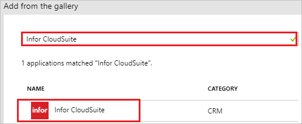
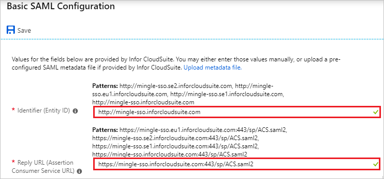
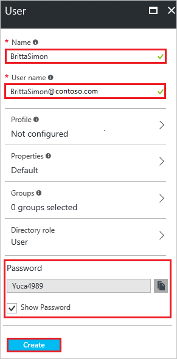

# Tutorial: Azure Active Directory integration with Infor CloudSuite

In this tutorial, you learn how to integrate Infor CloudSuite with Azure Active Directory (Azure AD).

Integrating Infor CloudSuite with Azure AD provides you with the following benefits:

- You can control in Azure AD who has access to Infor CloudSuite.
- You can enable your users to automatically get signed-on to Infor CloudSuite (Single Sign-On) with their Azure AD accounts.
- You can manage your accounts in one central location - the Azure portal.

If you want to know more details about SaaS app integration with Azure AD, see [what is application access and single sign-on with Azure Active Directory](../manage-apps/what-is-single-sign-on.md)

## Prerequisites

To configure Azure AD integration with Infor CloudSuite, you need the following items:

- An Azure AD subscription
- Infor CloudSuite single sign-on enabled subscription

> [!NOTE]
> To test the steps in this tutorial, we do not recommend using a production environment.

To test the steps in this tutorial, you should follow these recommendations:

- Do not use your production environment, unless it is necessary.
- If you don't have an Azure AD trial environment, you can [get a one-month trial](https://azure.microsoft.com/pricing/free-trial/).

## Scenario description

In this tutorial, you test Azure AD single sign-on in a test environment. 
The scenario outlined in this tutorial consists of two main building blocks:

1. Adding Infor CloudSuite from the gallery
2. Configuring and testing Azure AD single sign-on

## Adding Infor CloudSuite from the gallery

To configure the integration of Infor CloudSuite into Azure AD, you need to add Infor CloudSuite from the gallery to your list of managed SaaS apps.

**To add Infor CloudSuite from the gallery, perform the following steps:**

1. In the **[Azure portal](https://portal.azure.com)**, on the left navigation panel, click **Azure Active Directory** icon. 

	![The Azure Active Directory button][1]

2. Navigate to **Enterprise applications**. Then go to **All applications**.

	![The Enterprise applications blade][2]

3. To add new application, click **New application** button on the top of dialog.

	![The New application button][3]

4. In the search box, type **Infor CloudSuite**, select **Infor CloudSuite** from result panel then click **Add** button to add the application.

	

## Configure and test Azure AD single sign-on

In this section, you configure and test Azure AD single sign-on with Infor CloudSuite based on a test user called "Britta Simon".

For single sign-on to work, Azure AD needs to know what the counterpart user in Infor CloudSuite is to a user in Azure AD. In other words, a link relationship between an Azure AD user and the related user in Infor CloudSuite needs to be established.

To configure and test Azure AD single sign-on with Infor CloudSuite, you need to complete the following building blocks:

1. **[Configuring Azure AD Single Sign-On](#configuring-azure-ad-single-sign-on)** - to enable your users to use this feature.
2. **[Creating an Azure AD test user](#creating-an-azure-ad-test-user)** - to test Azure AD single sign-on with Britta Simon.
3. **[Creating Infor CloudSuite test user](#creating-infor-cloudsuite-test-user)** - to have a counterpart of Britta Simon in Infor CloudSuite that is linked to the Azure AD representation of user.
4. **[Assigning the Azure AD test user](#assigning-the-azure-ad-test-user)** - to enable Britta Simon to use Azure AD single sign-on.
5. **[Testing single sign-on](#testing-single-sign-on)** - to verify whether the configuration works.

### Configuring Azure AD single sign-on

In this section, you enable Azure AD single sign-on in the Azure portal and configure single sign-on in your Infor CloudSuite application.

**To configure Azure AD single sign-on with Infor CloudSuite, perform the following steps:**

1. In the Azure portal, on the **Infor CloudSuite** application integration page, click **Single sign-on**.

	![Configure single sign-on link][4]

2. On the **Select a Single sign-on method** dialog, Click **Select** for **SAML** mode to enable single sign-on.

    

3. On the **Set up Single Sign-On with SAML** page, click **Edit** icon to open **Basic SAML Configuration** dialog.

	

4. On the **Basic SAML Configuration** section, perform the following steps, if you wish to configure the application in **IDP** initiated mode:

	

    a. In the **Identifier** textbox, type a URL:
	
	| | |
	|-|-|
	| `	http://mingle-sso.inforcloudsuite.com`|
	| `http://mingle-sso.se1.inforcloudsuite.com`|
	| `http://mingle-sso.eu1.inforcloudsuite.com`|
	| `http://mingle-sso.se2.inforcloudsuite.com`|
	| |

	b. In the **Reply URL** textbox, type a URL:

	| | |
	|-|-|
	| `	https://mingle-sso.inforcloudsuite.com:443/sp/ACS.saml2 `|
	| `https://mingle-sso.se1.inforcloudsuite.com:443/sp/ACS.saml2 `|
	| `https://mingle-sso.se2.inforcloudsuite.com:443/sp/ACS.saml2 `|
	| `https://mingle-sso.eu1.inforcloudsuite.com:443/sp/ACS.saml2`|
	| |

5. Click **Set additional URLs** and perform the following step if you wish to configure the application in **SP** initiated mode:

	

    In the **Sign-on URL** textbox, type a URL using the following pattern:
	
	| | |
	|-|-|
	| `https://mingle-portal.inforcloudsuite.com/Tenant-Name/`|
	| `https://mingle-portal.eu1.inforcloudsuite.com/Tenant-Name/`|
	| `https://mingle-portal.se1.inforcloudsuite.com/Tenant-Name/ `|
	| `https://mingle-portal.se2.inforcloudsuite.com/Tenant-Name/`| 

	> [!NOTE]
	> The Sign-On URL value is not real. Update this value with the actual Sign-On URL. Contact [Infor CloudSuite Client support team](mailto:support@infor.com) to get this value.

6. On the **SAML Signing Certificate** page, in the **SAML Signing Certificate** section, click **Download** to download **Federation Metadata XML** and then save metadata file on your computer.

	

7. To configure single sign-on on **Infor CloudSuite** side, you need to send the downloaded **Federation Metadata XML** to [Infor CloudSuite support team](mailto:support@infor.com). They set this setting to have the SAML SSO connection set properly on both sides.

### Creating an Azure AD test user

The objective of this section is to create a test user in the Azure portal called Britta Simon.

1. In the Azure portal, in the left pane, select **Azure Active Directory**, select **Users**, and then select **All users**.

	![Create Azure AD User][100]

2. Select **New user** at the top of the screen.

	 

3. In the User properties, perform the following steps.

	

    a. In the **Name** field, enter **BrittaSimon**.
  
    b. In the **User name** field, type **brittasimon\@yourcompanydomain.extension**  
    For example, BrittaSimon@contoso.com

    c. Select **Properties**, select the **Show password** check box, and then write down the value that's displayed in the Password box.

    d. Select **Create**.

### Creating Infor CloudSuite test user

The objective of this section is to create a user called Britta Simon in Infor CloudSuite. Infor CloudSuite supports just-in-time provisioning which can be enabled by the tenant admin. There is no action item for you in this section. A new user is created during an attempt to access Infor CloudSuite if it doesn't exist yet.

> [!Note]
> If you need to create a user manually, contact [Infor CloudSuite support team](mailto:support@infor.com).

### Assigning the Azure AD test user

In this section, you enable Britta Simon to use Azure single sign-on by granting access to Infor CloudSuite.

1. In the Azure portal, select **Enterprise Applications**, select **All applications**.

	![Assign User][201]

2. In the applications list, select **Infor CloudSuite**.

	 

3. In the menu on the left, click **Users and groups**.

	![Assign User][202]

4. Click **Add** button. Then select **Users and groups** on **Add Assignment** dialog.

	![Assign User][203]

5. In the **Users and groups** dialog select **Britta Simon** in the Users list, then click the **Select** button at the bottom of the screen.

6. In the **Add Assignment** dialog select the **Assign** button.

### Testing single sign-on

In this section, you test your Azure AD single sign-on configuration using the Access Panel.

When you click the Infor CloudSuite tile in the Access Panel, you should get automatically signed-on to your Infor CloudSuite application.
For more information about the Access Panel, see [Introduction to the Access Panel](../user-help/active-directory-saas-access-panel-introduction.md).

## Additional resources

* [List of Tutorials on How to Integrate SaaS Apps with Azure Active Directory](tutorial-list.md)
* [What is application access and single sign-on with Azure Active Directory?](../manage-apps/what-is-single-sign-on.md)

<!--Image references-->

[1]: common/tutorial-general-01.png
[2]: common/tutorial-general-02.png
[3]: common/tutorial-general-03.png
[4]: common/tutorial-general-04.png

[100]: common/tutorial-general-100.png

[201]: common/tutorial-general-201.png
[202]: common/tutorial-general-202.png
[203]: common/tutorial-general-203.png
