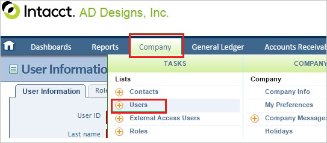
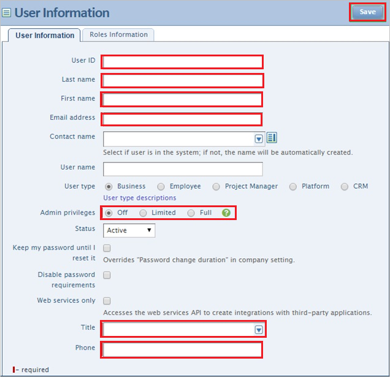

# Tutorial: Azure Active Directory integration with Intacct

In this tutorial, you learn how to integrate Intacct with Azure Active Directory (Azure AD).
Integrating Intacct with Azure AD provides you with the following benefits:

* You can control in Azure AD who has access to Intacct.
* You can enable your users to be automatically signed-in to Intacct (Single Sign-On) with their Azure AD accounts.
* You can manage your accounts in one central location - the Azure portal.

If you want to know more details about SaaS app integration with Azure AD, see [What is application access and single sign-on with Azure Active Directory](https://docs.microsoft.com/azure/active-directory/active-directory-appssoaccess-whatis).
If you don't have an Azure subscription, [create a free account](https://azure.microsoft.com/free/) before you begin.

## Prerequisites

To configure Azure AD integration with Intacct, you need the following items:

* An Azure AD subscription. If you don't have an Azure AD environment, you can get one-month trial [here](https://azure.microsoft.com/pricing/free-trial/)
* Intacct single sign-on enabled subscription

## Scenario description

In this tutorial, you configure and test Azure AD single sign-on in a test environment.

* Intacct supports **IDP** initiated SSO

## Adding Intacct from the gallery

To configure the integration of Intacct into Azure AD, you need to add Intacct from the gallery to your list of managed SaaS apps.

**To add Intacct from the gallery, perform the following steps:**

1. In the **[Azure portal](https://portal.azure.com)**, on the left navigation panel, click **Azure Active Directory** icon.

	

2. Navigate to **Enterprise Applications** and then select the **All Applications** option.

	

3. To add new application, click **New application** button on the top of dialog.

	

4. In the search box, type **Intacct**, select **Intacct** from result panel then click **Add** button to add the application.

	 

## Configure and test Azure AD single sign-on

In this section, you configure and test Azure AD single sign-on with Intacct based on a test user called **Britta Simon**.
For single sign-on to work, a link relationship between an Azure AD user and the related user in Intacct needs to be established.

To configure and test Azure AD single sign-on with Intacct, you need to complete the following building blocks:

1. **[Configure Azure AD Single Sign-On](#configure-azure-ad-single-sign-on)** - to enable your users to use this feature.
2. **[Configure Intacct Single Sign-On](#configure-intacct-single-sign-on)** - to configure the Single Sign-On settings on application side.
3. **[Create an Azure AD test user](#create-an-azure-ad-test-user)** - to test Azure AD single sign-on with Britta Simon.
4. **[Assign the Azure AD test user](#assign-the-azure-ad-test-user)** - to enable Britta Simon to use Azure AD single sign-on.
5. **[Create Intacct test user](#create-intacct-test-user)** - to have a counterpart of Britta Simon in Intacct that is linked to the Azure AD representation of user.
6. **[Test single sign-on](#test-single-sign-on)** - to verify whether the configuration works.

### Configure Azure AD single sign-on

In this section, you enable Azure AD single sign-on in the Azure portal.

To configure Azure AD single sign-on with Intacct, perform the following steps:

1. In the [Azure portal](https://portal.azure.com/), on the **Intacct** application integration page, select **Single sign-on**.

    

2. On the **Select a Single sign-on method** dialog, select **SAML/WS-Fed** mode to enable single sign-on.

    

3. On the **Set up Single Sign-On with SAML** page, click **Edit** icon to open **Basic SAML Configuration** dialog.

	

4. On the **Basic SAML Configuration** section, perform the following steps:

    

    In the **Reply URL** text box, type a URL using the following pattern:
	| |
	|--|
	| `https://<companyname>.intacct.com/ia/acct/sso_response.phtml`|
	| `https://www.intacct.com/ia/acct/sso_response.phtml` |

	> [!NOTE]
	> The value is not real. Update the value with the actual Reply URL. Contact [Intacct Client support team](https://us.intacct.com/support) to get the value. You can also refer to the patterns shown in the **Basic SAML Configuration** section in the Azure portal.

5. On the **Set up Single Sign-On with SAML** page, in the **SAML Signing Certificate** section, click **Download** to download the **Certificate (Base64)** from the given options as per your requirement and save it on your computer.

	

6. On the **Set up Intacct** section, copy the appropriate URL(s) as per your requirement.

	

	a. Login URL

	b. Azure AD Identifier

	c. Logout URL

### Configure Intacct Single Sign-On

1. In a different web browser window, sign in to your Intacct company site as an administrator.

1. Click the **Company** tab, and then click **Company Info**.

    

1. Click the **Security** tab, and then click **Edit**.

    

1. In the **Single sign on (SSO)** section, perform the following steps:

    

    a. Select **Enable single sign on**.

    b. As **Identity provider type**, select **SAML 2.0**.

    c. In **Issuer URL** textbox, paste the value of **Azure Ad Identifier** which you have copied from Azure portal.

    d. In **Login URL** textbox, paste the value of **Login URL** which you have copied from Azure portal.

    e. Open your **base-64** encoded certificate in notepad, copy the content of it into your clipboard, and then paste it to the **Certificate** box.

    f. Click **Save**.

### Create an Azure AD test user

The objective of this section is to create a test user in the Azure portal called Britta Simon.

1. In the Azure portal, in the left pane, select **Azure Active Directory**, select **Users**, and then select **All users**.

    

2. Select **New user** at the top of the screen.

    

3. In the User properties, perform the following steps.

    

    a. In the **Name** field enter **BrittaSimon**.
  
    b. In the **User name** field type **brittasimon@yourcompanydomain.extension**  
    For example, BrittaSimon@contoso.com

    c. Select **Show password** check box, and then write down the value that's displayed in the Password box.

    d. Click **Create**.

### Assign the Azure AD test user

In this section, you enable Britta Simon to use Azure single sign-on by granting access to Intacct.

1. In the Azure portal, select **Enterprise Applications**, select **All applications**, then select **Intacct**.

	

2. In the applications list, select **Intacct**.

	

3. In the menu on the left, select **Users and groups**.

    

4. Click the **Add user** button, then select **Users and groups** in the **Add Assignment** dialog.

    

5. In the **Users and groups** dialog select **Britta Simon** in the Users list, then click the **Select** button at the bottom of the screen.

6. If you are expecting any role value in the SAML assertion then in the **Select Role** dialog select the appropriate role for the user from the list, then click the **Select** button at the bottom of the screen.

7. In the **Add Assignment** dialog click the **Assign** button.

### Create Intacct test user

To set up Azure AD users so they can sign in to Intacct, they must be provisioned into Intacct. For Intacct, provisioning is a manual task.

**To provision user accounts, perform the following steps:**

1. Sign in to your **Intacct** tenant.

1. Click the **Company** tab, and then click **Users**.

    

1. Click the **Add** tab.

    

1. In the **User Information** section, perform the following steps:

    

    a. Enter the **User ID**, the **Last name**, **First name**, the **Email address**, the **Title**, and the **Phone** of an Azure AD account that you want to provision into the **User Information** section.

    b. Select the **Admin privileges** of an Azure AD account that you want to provision.

    c. Click **Save**. The Azure AD account holder receives an email and follows a link to confirm their account before it becomes active.

> [!NOTE]
> To provision Azure AD user accounts, you can use other Intacct user account creation tools or APIs that are provided by Intacct.

### Test single sign-on

In this section, you test your Azure AD single sign-on configuration using the Access Panel.

When you click the Intacct tile in the Access Panel, you should be automatically signed in to the Intacct for which you set up SSO. For more information about the Access Panel, see [Introduction to the Access Panel](https://docs.microsoft.com/azure/active-directory/active-directory-saas-access-panel-introduction).

## Additional Resources

- [ List of Tutorials on How to Integrate SaaS Apps with Azure Active Directory ](https://docs.microsoft.com/azure/active-directory/active-directory-saas-tutorial-list)

- [What is application access and single sign-on with Azure Active Directory? ](https://docs.microsoft.com/azure/active-directory/active-directory-appssoaccess-whatis)

- [What is conditional access in Azure Active Directory?](https://docs.microsoft.com/azure/active-directory/conditional-access/overview)

