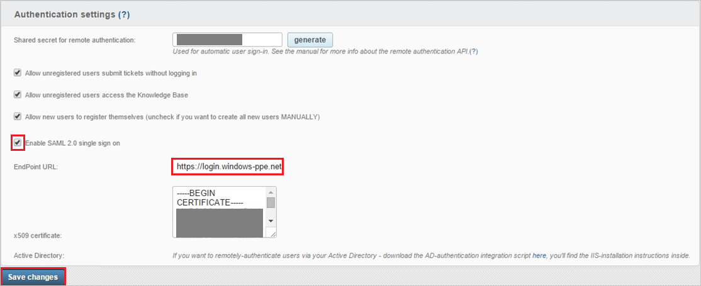
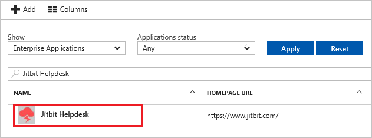

# Tutorial: Azure Active Directory integration with Jitbit Helpdesk

In this tutorial, you learn how to integrate Jitbit Helpdesk with Azure Active Directory (Azure AD).

Integrating Jitbit Helpdesk with Azure AD provides you with the following benefits:

- You can control in Azure AD who has access to Jitbit Helpdesk
- You can enable your users to automatically get signed-on to Jitbit Helpdesk (Single Sign-On) with their Azure AD accounts
- You can manage your accounts in one central location - the Azure portal

If you want to know more details about SaaS app integration with Azure AD, see [what is application access and single sign-on with Azure Active Directory](../manage-apps/what-is-single-sign-on.md).

## Prerequisites

To configure Azure AD integration with Jitbit Helpdesk, you need the following items:

- An Azure AD subscription
- A Jitbit Helpdesk single sign-on enabled subscription

> [!NOTE]
> To test the steps in this tutorial, we do not recommend using a production environment.

To test the steps in this tutorial, you should follow these recommendations:

- Do not use your production environment, unless it is necessary.
- If you don't have an Azure AD trial environment, you can get a one-month trial [here](https://azure.microsoft.com/pricing/free-trial/).

## Scenario description
In this tutorial, you test Azure AD single sign-on in a test environment. 
The scenario outlined in this tutorial consists of two main building blocks:

1. Adding Jitbit Helpdesk from the gallery
1. Configuring and testing Azure AD single sign-on

## Adding Jitbit Helpdesk from the gallery
To configure the integration of Jitbit Helpdesk into Azure AD, you need to add Jitbit Helpdesk from the gallery to your list of managed SaaS apps.

**To add Jitbit Helpdesk from the gallery, perform the following steps:**

1. In the **[Azure portal](https://portal.azure.com)**, on the left navigation panel, click **Azure Active Directory** icon. 

	![Active Directory][1]

1. Navigate to **Enterprise applications**. Then go to **All applications**.

	![Applications][2]
	
1. To add new application, click **New application** button on the top of dialog.

	![Applications][3]

1. In the search box, type **Jitbit Helpdesk**.

	

1. In the results panel, select **Jitbit Helpdesk**, and then click **Add** button to add the application.

	

##  Configuring and testing Azure AD single sign-on
In this section, you configure and test Azure AD single sign-on with Jitbit Helpdesk based on a test user called "Britta Simon".

For single sign-on to work, Azure AD needs to know what the counterpart user in Jitbit Helpdesk is to a user in Azure AD. In other words, a link relationship between an Azure AD user and the related user in Jitbit Helpdesk needs to be established.

In Jitbit Helpdesk, assign the value of the **user name** in Azure AD as the value of the **Username** to establish the link relationship.

To configure and test Azure AD single sign-on with Jitbit Helpdesk, you need to complete the following building blocks:

1. **[Configuring Azure AD Single Sign-On](#configuring-azure-ad-single-sign-on)** - to enable your users to use this feature.
1. **[Creating an Azure AD test user](#creating-an-azure-ad-test-user)** - to test Azure AD single sign-on with Britta Simon.
1. **[Creating a Jitbit Helpdesk test user](#creating-a-jitbit-helpdesk-test-user)** - to have a counterpart of Britta Simon in Jitbit Helpdesk that is linked to the Azure AD representation of user.
1. **[Assigning the Azure AD test user](#assigning-the-azure-ad-test-user)** - to enable Britta Simon to use Azure AD single sign-on.
1. **[Testing Single Sign-On](#testing-single-sign-on)** - to verify whether the configuration works.

### Configuring Azure AD single sign-on

In this section, you enable Azure AD single sign-on in the Azure portal and configure single sign-on in your Jitbit Helpdesk application.

**To configure Azure AD single sign-on with Jitbit Helpdesk, perform the following steps:**

1. In the Azure portal, on the **Jitbit Helpdesk** application integration page, click **Single sign-on**.

	![Configure Single Sign-On][4]

1. On the **Single sign-on** dialog, select **Mode** as	**SAML-based Sign-on** to enable single sign-on.
 
	

1. On the **Jitbit Helpdesk Domain and URLs** section, perform the following steps:

	

    a. In the **Sign-on URL** textbox, type a URL using the following pattern: 
	
	| |     
    | ----------------------------------------|
	| `https://<hostname>/helpdesk/User/Login`|
	| `https://<tenant-name>.Jitbit.com`|
	| |
    
	> [!NOTE] 
	> This value is not real. Update this value with the actual Sign-On URL. Contact [Jitbit Helpdesk Client support team](https://www.jitbit.com/support/) to get this value. 
	
	b.  In the **Identifier** textbox, type a URL as following: `https://www.jitbit.com/web-helpdesk/`

	
 

1. On the **SAML Signing Certificate** section, click **Certificate(Base64)** and then save the certificate file on your computer.

	 

1. Click **Save** button.

	

1. On the **Jitbit Helpdesk Configuration** section, click **Configure Jitbit Helpdesk** to open **Configure sign-on** window. Copy the **SAML Single Sign-On Service URL** from the **Quick Reference section.**

	 

1. In a different web browser window, log into your Jitbit Helpdesk company site as an administrator.

1. In the toolbar on the top, click **Administration**.
   
    

1. Click **General settings**.
   
    

1. In the **Authentication settings** configuration section, perform the following steps:
   
    
	
	a. Select **Enable SAML 2.0 single sign on**, to sign in using Single Sign-On (SSO), with **OneLogin**.

	b. In the **EndPoint URL** textbox, paste the value of **SAML Single Sign-On Service URL** which you have copied from Azure portal.

	c. Open your **base-64** encoded certificate in notepad, copy the content of it into your clipboard, and then paste it to the **X.509 Certificate** textbox

	d. Click **Save changes**.

> [!TIP]
> You can now read a concise version of these instructions inside the [Azure portal](https://portal.azure.com), while you are setting up the app!  After adding this app from the **Active Directory > Enterprise Applications** section, simply click the **Single Sign-On** tab and access the embedded documentation through the **Configuration** section at the bottom. You can read more about the embedded documentation feature here: [Azure AD embedded documentation]( https://go.microsoft.com/fwlink/?linkid=845985)
> 

### Creating an Azure AD test user
The objective of this section is to create a test user in the Azure portal called Britta Simon.

![Create Azure AD User][100]

**To create a test user in Azure AD, perform the following steps:**

1. In the **Azure portal**, on the left navigation pane, click **Azure Active Directory** icon.

	 

1. To display the list of users, go to **Users and groups** and click **All users**.
	
	 

1. To open the **User** dialog, click **Add** on the top of the dialog.
 
	 

1. On the **User** dialog page, perform the following steps:
 
	 

	a. In the **Name** textbox, type name as **BrittaSimon**.

    b. In the **User name** textbox, type the **email address** of BrittaSimon.

	c. Select **Show Password** and write down the value of the **Password**.

    d. Click **Create**.
 
### Creating a Jitbit Helpdesk test user

In order to enable Azure AD users to log into Jitbit Helpdesk, they must be provisioned into Jitbit Helpdesk.  In the case of Jitbit Helpdesk, provisioning is a manual task.

**To provision a user account, perform the following steps:**

1. Log in to your **Jitbit Helpdesk** tenant.

1. In the menu on the top, click **Administration**.
   
    

1. Click **Users, companies and permissions**.
   
    

1. Click **Add user**.
   
    
   
1. In the Create section, type the data of the Azure AD account you want to provision as follows:

    
   
   a. In the **Username** textbox, type **BrittaSimon**, the user name as in the Azure portal.

   b. In the **Email** textbox, type email of the user like **BrittaSimon\@contoso.com**.

   c. In the **First Name** textbox, type first name of the user like **Britta**.

   d. In the **Last Name** textbox, type last name of the user like **Simon**.
   
   e. Click **Create**.

>[!NOTE]
>You can use any other Jitbit Helpdesk user account creation tools or APIs provided by Jitbit Helpdesk to provision Azure AD user accounts.
> 
		

### Assigning the Azure AD test user

In this section, you enable Britta Simon to use Azure single sign-on by granting access to Jitbit Helpdesk.

![Assign User][200] 

**To assign Britta Simon to Jitbit Helpdesk, perform the following steps:**

1. In the Azure portal, open the applications view, and then navigate to the directory view and go to **Enterprise applications** then click **All applications**.

	![Assign User][201] 

1. In the applications list, select **Jitbit Helpdesk**.

	 

1. In the menu on the left, click **Users and groups**.

	![Assign User][202] 

1. Click **Add** button. Then select **Users and groups** on **Add Assignment** dialog.

	![Assign User][203]

1. On **Users and groups** dialog, select **Britta Simon** in the Users list.

1. Click **Select** button on **Users and groups** dialog.

1. Click **Assign** button on **Add Assignment** dialog.
	
### Testing single sign-on

In this section, you test your Azure AD single sign-on configuration using the Access Panel.

When you click the Jitbit Helpdesk tile in the Access Panel, you should get login page of Jitbit Helpdesk application.
For more information about the Access Panel, see [Introduction to the Access Panel](../user-help/active-directory-saas-access-panel-introduction.md).

## Additional resources

* [List of Tutorials on How to Integrate SaaS Apps with Azure Active Directory](tutorial-list.md)
* [What is application access and single sign-on with Azure Active Directory?](../manage-apps/what-is-single-sign-on.md)

<!--Image references-->

[1]: ./media/jitbit-helpdesk-tutorial/tutorial_general_01.png
[2]: ./media/jitbit-helpdesk-tutorial/tutorial_general_02.png
[3]: ./media/jitbit-helpdesk-tutorial/tutorial_general_03.png
[4]: ./media/jitbit-helpdesk-tutorial/tutorial_general_04.png

[100]: ./media/jitbit-helpdesk-tutorial/tutorial_general_100.png

[200]: ./media/jitbit-helpdesk-tutorial/tutorial_general_200.png
[201]: ./media/jitbit-helpdesk-tutorial/tutorial_general_201.png
[202]: ./media/jitbit-helpdesk-tutorial/tutorial_general_202.png
[203]: ./media/jitbit-helpdesk-tutorial/tutorial_general_203.png

