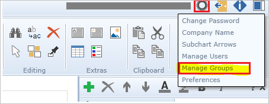
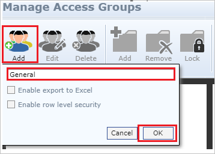
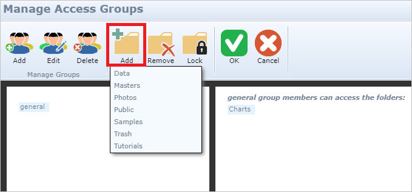
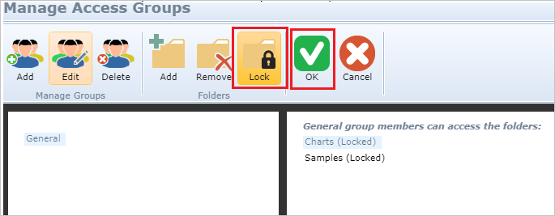
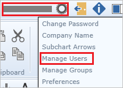
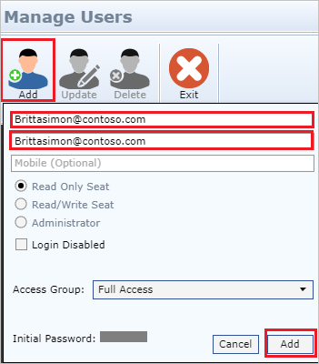

# Tutorial: Azure Active Directory integration with OrgChart Now

In this tutorial, you learn how to integrate OrgChart Now with Azure Active Directory (Azure AD).
Integrating OrgChart Now with Azure AD provides you with the following benefits:

* You can control in Azure AD who has access to OrgChart Now.
* You can enable your users to be automatically signed-in to OrgChart Now (Single Sign-On) with their Azure AD accounts.
* You can manage your accounts in one central location - the Azure portal.

If you want to know more details about SaaS app integration with Azure AD, see [What is application access and single sign-on with Azure Active Directory](https://docs.microsoft.com/azure/active-directory/active-directory-appssoaccess-whatis).
If you don't have an Azure subscription, [create a free account](https://azure.microsoft.com/free/) before you begin.

## Prerequisites

To configure Azure AD integration with OrgChart Now, you need the following items:

* An Azure AD subscription. If you don't have an Azure AD environment, you can get one-month trial [here](https://azure.microsoft.com/pricing/free-trial/)
* OrgChart Now single sign-on enabled subscription

## Scenario description

In this tutorial, you configure and test Azure AD single sign-on in a test environment.

* OrgChart Now supports **SP** and **IDP** initiated SSO

## Adding OrgChart Now from the gallery

To configure the integration of OrgChart Now into Azure AD, you need to add OrgChart Now from the gallery to your list of managed SaaS apps.

**To add OrgChart Now from the gallery, perform the following steps:**

1. In the **[Azure portal](https://portal.azure.com)**, on the left navigation panel, click **Azure Active Directory** icon.

	

2. Navigate to **Enterprise Applications** and then select the **All Applications** option.

	

3. To add new application, click **New application** button on the top of dialog.

	

4. In the search box, type **OrgChart Now**, select **OrgChart Now** from result panel then click **Add** button to add the application.

	 

## Configure and test Azure AD single sign-on

In this section, you configure and test Azure AD single sign-on with OrgChart Now based on a test user called **Britta Simon**.
For single sign-on to work, a link relationship between an Azure AD user and the related user in OrgChart Now needs to be established.

To configure and test Azure AD single sign-on with OrgChart Now, you need to complete the following building blocks:

1. **[Configure Azure AD Single Sign-On](#configure-azure-ad-single-sign-on)** - to enable your users to use this feature.
2. **[Configure OrgChart Now Single Sign-On](#configure-orgchart-now-single-sign-on)** - to configure the Single Sign-On settings on application side.
3. **[Create an Azure AD test user](#create-an-azure-ad-test-user)** - to test Azure AD single sign-on with Britta Simon.
4. **[Assign the Azure AD test user](#assign-the-azure-ad-test-user)** - to enable Britta Simon to use Azure AD single sign-on.
5. **[Create OrgChart Now test user](#create-orgchart-now-test-user)** - to have a counterpart of Britta Simon in OrgChart Now that is linked to the Azure AD representation of user.
6. **[Test single sign-on](#test-single-sign-on)** - to verify whether the configuration works.

### Configure Azure AD single sign-on

In this section, you enable Azure AD single sign-on in the Azure portal.

To configure Azure AD single sign-on with OrgChart Now, perform the following steps:

1. In the [Azure portal](https://portal.azure.com/), on the **OrgChart Now** application integration page, select **Single sign-on**.

    

2. On the **Select a Single sign-on method** dialog, select **SAML/WS-Fed** mode to enable single sign-on.

    

3. On the **Set up Single Sign-On with SAML** page, click **Edit** icon to open **Basic SAML Configuration** dialog.

	

4. On the **Basic SAML Configuration** section, If you wish to configure the application in **IDP** initiated mode, perform the following step:

    

    In the **Identifier** text box, type a URL:
    `https://sso2.orgchartnow.com`

5. Click **Set additional URLs** and perform the following step if you wish to configure the application in **SP** initiated mode:

    

    In the **Sign-on URL** text box, type a URL using the following pattern:
    `https://sso2.orgchartnow.com/Shibboleth.sso/Login?entityID=<YourEntityID>&target=https://sso2.orgchartnow.com`

	> [!NOTE]
	> `<YourEntityID>` is the **Azure AD Identifier** copied from the **Set up OrgChart Now** section, described later in tutorial.

6. On the **Set up Single Sign-On with SAML** page, in the **SAML Signing Certificate** section, click **Download** to download the **Federation Metadata XML** from the given options as per your requirement and save it on your computer.

	

7. On the **Set up OrgChart Now** section, copy the appropriate URL(s) as per your requirement.

	

	a. Login URL

	b. Azure AD Identifier

	c. Logout URL

### Configure OrgChart Now Single Sign-On

To configure single sign-on on **OrgChart Now** side, you need to send the downloaded **Federation Metadata XML** and appropriate copied URLs from Azure portal to [OrgChart Now support team](mailto:ocnsupport@officeworksoftware.com). They set this setting to have the SAML SSO connection set properly on both sides.

### Create an Azure AD test user 

The objective of this section is to create a test user in the Azure portal called Britta Simon.

1. In the Azure portal, in the left pane, select **Azure Active Directory**, select **Users**, and then select **All users**.

    

2. Select **New user** at the top of the screen.

    

3. In the User properties, perform the following steps.

    

    a. In the **Name** field enter **BrittaSimon**.
  
    b. In the **User name** field type **brittasimon@yourcompanydomain.extension**  
    For example, BrittaSimon@contoso.com

    c. Select **Show password** check box, and then write down the value that's displayed in the Password box.

    d. Click **Create**.

### Assign the Azure AD test user

In this section, you enable Britta Simon to use Azure single sign-on by granting access to OrgChart Now.

1. In the Azure portal, select **Enterprise Applications**, select **All applications**, then select **OrgChart Now**.

	

2. In the applications list, select **OrgChart Now**.

	

3. In the menu on the left, select **Users and groups**.

    

4. Click the **Add user** button, then select **Users and groups** in the **Add Assignment** dialog.

    

5. In the **Users and groups** dialog select **Britta Simon** in the Users list, then click the **Select** button at the bottom of the screen.

6. If you are expecting any role value in the SAML assertion then in the **Select Role** dialog select the appropriate role for the user from the list, then click the **Select** button at the bottom of the screen.

7. In the **Add Assignment** dialog click the **Assign** button.

### Create OrgChart Now test user

To enable Azure AD users to log in to OrgChart Now, they must be provisioned into OrgChart Now. 

1. OrgChart Now supports just-in-time provisioning, which is by default enabled. A new user is created during an attempt to access OrgChart Now if it doesn't exist yet. The just-in-time user provisioning feature will only create a **read-only** user when an SSO request comes from a recognized IDP and the email in the SAML assertion is not found in the user list. For this auto provisioning feature you need to create an access group titled **General** in OrgChart Now. Please follow the below steps to create an access group:

	a. Go to the **Manage Groups** option after clicking the **gear** in the top right corner of the UI.

    	

	b. Select the **Add** icon and name the group **General** then click **OK**. 

	

	c. Select the folder(s) you wish the general or read-only users to be able to access:

	

	d. **Lock** the folders so that only Admin users can modify them. Then press **OK**.

	

2. To create **Admin** users and **read/write** users, you must manually create a user in order to get access to their privilege level via SSO. To provision a user account, perform the following steps:

	a. Log in to OrgChart Now as a Security Administrator.

	b.  Click on **Settings** on the top right corner and then navigate to **Manage Users**.

	

	c. Click on **Add** and perform the following steps:

	

	* In the **User ID** textbox, enter the User ID like **brittasimon\@contoso.com**.

	* In **Email Address** text box, enter the email of user like **brittasimon\@contoso.com**.

	* Click **Add**.

### Test single sign-on 

In this section, you test your Azure AD single sign-on configuration using the Access Panel.

When you click the OrgChart Now tile in the Access Panel, you should be automatically signed in to the OrgChart Now for which you set up SSO. For more information about the Access Panel, see [Introduction to the Access Panel](https://docs.microsoft.com/azure/active-directory/active-directory-saas-access-panel-introduction).

## Additional Resources

- [ List of Tutorials on How to Integrate SaaS Apps with Azure Active Directory ](https://docs.microsoft.com/azure/active-directory/active-directory-saas-tutorial-list)

- [What is application access and single sign-on with Azure Active Directory? ](https://docs.microsoft.com/azure/active-directory/active-directory-appssoaccess-whatis)

- [What is conditional access in Azure Active Directory?](https://docs.microsoft.com/azure/active-directory/conditional-access/overview)

