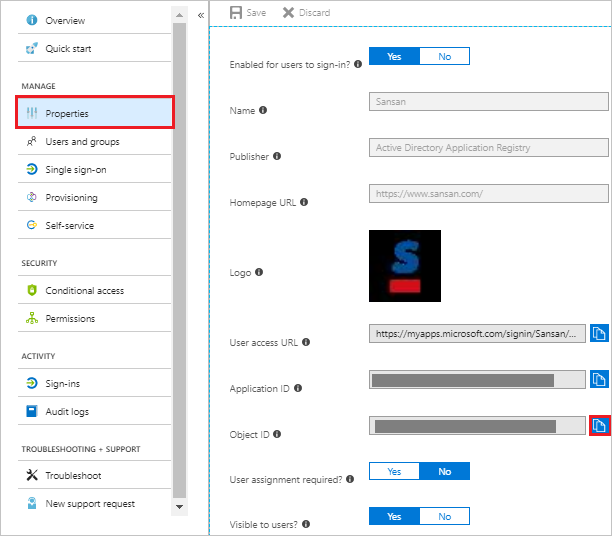
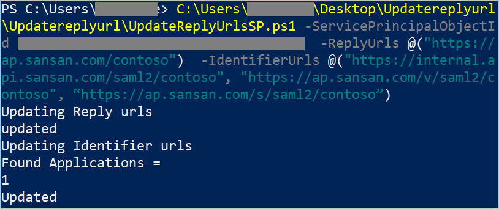

# Tutorial: Azure Active Directory integration with Sansan

In this tutorial, you learn how to integrate Sansan with Azure Active Directory (Azure AD).
Integrating Sansan with Azure AD provides you with the following benefits:

* You can control in Azure AD who has access to Sansan.
* You can enable your users to be automatically signed-in to Sansan (Single Sign-On) with their Azure AD accounts.
* You can manage your accounts in one central location - the Azure portal.

If you want to know more details about SaaS app integration with Azure AD, see [What is application access and single sign-on with Azure Active Directory](https://docs.microsoft.com/azure/active-directory/active-directory-appssoaccess-whatis).
If you don't have an Azure subscription, [create a free account](https://azure.microsoft.com/free/) before you begin.

## Prerequisites

To configure Azure AD integration with Sansan, you need the following items:

* An Azure AD subscription. If you don't have an Azure AD environment, you can get one-month trial [here](https://azure.microsoft.com/pricing/free-trial/)
* Sansan single sign-on enabled subscription

## Scenario description

In this tutorial, you configure and test Azure AD single sign-on in a test environment.

* Sansan supports **SP** initiated SSO

## Adding Sansan from the gallery

To configure the integration of Sansan into Azure AD, you need to add Sansan from the gallery to your list of managed SaaS apps.

**To add Sansan from the gallery, perform the following steps:**

1. In the **[Azure portal](https://portal.azure.com)**, on the left navigation panel, click **Azure Active Directory** icon.

	

2. Navigate to **Enterprise Applications** and then select the **All Applications** option.

	

3. To add new application, click **New application** button on the top of dialog.

	

4. In the search box, type **Sansan**, select **Sansan** from result panel then click **Add** button to add the application.

	 

## Configure and test Azure AD single sign-on

In this section, you configure and test Azure AD single sign-on with Sansan based on a test user called **Britta Simon**.
For single sign-on to work, a link relationship between an Azure AD user and the related user in Sansan needs to be established.

To configure and test Azure AD single sign-on with Sansan, you need to complete the following building blocks:

1. **[Configure Azure AD Single Sign-On](#configure-azure-ad-single-sign-on)** - to enable your users to use this feature.
2. **[Configure Sansan Single Sign-On](#configure-sansan-single-sign-on)** - to configure the Single Sign-On settings on application side.
3. **[Create an Azure AD test user](#create-an-azure-ad-test-user)** - to test Azure AD single sign-on with Britta Simon.
4. **[Assign the Azure AD test user](#assign-the-azure-ad-test-user)** - to enable Britta Simon to use Azure AD single sign-on.
5. **[Create Sansan test user](#create-sansan-test-user)** - to have a counterpart of Britta Simon in Sansan that is linked to the Azure AD representation of user.
6. **[Test single sign-on](#test-single-sign-on)** - to verify whether the configuration works.

### Configure Azure AD single sign-on

In this section, you enable Azure AD single sign-on in the Azure portal.

To configure Azure AD single sign-on with Sansan, perform the following steps:

1. In the [Azure portal](https://portal.azure.com/), on the **Sansan** application integration page, select **Single sign-on**.

    

2. On the **Select a Single sign-on method** dialog, select **SAML/WS-Fed** mode to enable single sign-on.

    

3. On the **Set up Single Sign-On with SAML** page, click **Edit** icon to open **Basic SAML Configuration** dialog.

	

4. On the **Basic SAML Configuration** section, perform the following steps:

    

    In the **Sign-on URL** text box, type a URL using the following pattern:
	| Environment | URL |
    |:--- |:--- |
    | PC web |`https://ap.sansan.com/v/saml2/<company name>/acs` |
    | Native Mobile app |`https://internal.api.sansan.com/saml2/<company name>/acs` |
    | Mobile browser settings |`https://ap.sansan.com/s/saml2/<company name>/acs` |  

	> [!NOTE]
	> The value is not real. Update the value with the actual Sign-On URL. Contact [Sansan Client support team](https://www.sansan.com/form/contact) to get the value. You can also refer to the patterns shown in the **Basic SAML Configuration** section in the Azure portal.

5. On the **Set up Single Sign-On with SAML** page, in the **SAML Signing Certificate** section, click **Download** to download the **Certificate (Base64)** from the given options as per your requirement and save it on your computer.

	

6. Sansan application expects multiple **Identifiers** and **Reply URLs** to support multiple environments (PC web, Native Mobile app, Mobile browser settings), which can be configured using PowerShell script. The detailed steps are explained below.

7. To configure multiple **Identifiers** and **Reply URLs** for Sansan application using PowerShell script, perform following steps:

		

	a. Go to the **Properties** page of **Sansan** application and copy the **Object ID** using **Copy** button and paste it into Notepad.

	b. The **Object ID**, which you have copied from Azure portal will be used as **ServicePrincipalObjectId** in PowerShell script used later in the tutorial.

	c. Now open an elevated Windows PowerShell command prompt.

	>[!NOTE]
	> You need to install the AzureAD module (use the command `Install-Module -Name AzureAD`). If prompted to install a NuGet module or the new Azure Active Directory V2 PowerShell module, type Y and press ENTER.

	d. Run `Connect-AzureAD` and sign in with a Global Admin user account.

	e. Use the following script to update multiple URLs to an application:

	```powershell
	 Param(
	[Parameter(Mandatory=$true)][guid]$ServicePrincipalObjectId,
	[Parameter(Mandatory=$false)][string[]]$ReplyUrls,
	[Parameter(Mandatory=$false)][string[]]$IdentifierUrls
	)

	$servicePrincipal = Get-AzureADServicePrincipal -ObjectId $ServicePrincipalObjectId

	if($ReplyUrls.Length)
	{
	echo "Updating Reply urls"
	Set-AzureADServicePrincipal -ObjectId $ServicePrincipalObjectId -ReplyUrls $ReplyUrls
	echo "updated"
	}
	if($IdentifierUrls.Length)
	{
	echo "Updating Identifier urls"
	$applications = Get-AzureADApplication -SearchString $servicePrincipal.AppDisplayName 
	echo "Found Applications =" $applications.Length
	$i = 0;
	do
	{  
	$application = $applications[$i];
	if($application.AppId -eq $servicePrincipal.AppId){
	Set-AzureADApplication -ObjectId $application.ObjectId -IdentifierUris $IdentifierUrls
	$servicePrincipal = Get-AzureADServicePrincipal -ObjectId $ServicePrincipalObjectId
	echo "Updated"
	return;
	}
	$i++;
	}while($i -lt $applications.Length);
	echo "Not able to find the matched application with this service principal"
	}
    ```

8. After successful completion of PowerShell script, the result of the script will be like this as shown below and the URL values get updated but they won't get reflected in Azure portal.

	

9. On the **Set up Sansan** section, copy the appropriate URL(s) as per your requirement.

	

	a. Login URL

	b. Azure AD Identifier

	c. Logout URL

### Configure Sansan Single Sign-On

To configure single sign-on on **Sansan** side, you need to send the downloaded **Certificate (Base64)** and appropriate copied URLs from Azure portal to [Sansan Client support team](https://www.sansan.com/form/contact). They set this setting to have the SAML SSO connection set properly on both sides.

### Create an Azure AD test user

The objective of this section is to create a test user in the Azure portal called Britta Simon.

1. In the Azure portal, in the left pane, select **Azure Active Directory**, select **Users**, and then select **All users**.

    

2. Select **New user** at the top of the screen.

    

3. In the User properties, perform the following steps.

    

    a. In the **Name** field enter **BrittaSimon**.
  
    b. In the **User name** field type **brittasimon@yourcompanydomain.extension**  
    For example, BrittaSimon@contoso.com

    c. Select **Show password** check box, and then write down the value that's displayed in the Password box.

    d. Click **Create**.

### Assign the Azure AD test user

In this section, you enable Britta Simon to use Azure single sign-on by granting access to Sansan.

1. In the Azure portal, select **Enterprise Applications**, select **All applications**, then select **Sansan**.

	

2. In the applications list, select **Sansan**.

	

3. In the menu on the left, select **Users and groups**.

    

4. Click the **Add user** button, then select **Users and groups** in the **Add Assignment** dialog.

    

5. In the **Users and groups** dialog select **Britta Simon** in the Users list, then click the **Select** button at the bottom of the screen.

6. If you are expecting any role value in the SAML assertion then in the **Select Role** dialog select the appropriate role for the user from the list, then click the **Select** button at the bottom of the screen.

7. In the **Add Assignment** dialog click the **Assign** button.

### Create Sansan test user

In this section, you create a user called Britta Simon in Sansan. Sansan application needs the user to be provisioned in the application before doing SSO.

> [!NOTE]
> If you need to create a user manually or batch of users, you need to contact the [Sansan support team](https://www.sansan.com/form/contact).

### Test single sign-on

In this section, you test your Azure AD single sign-on configuration using the Access Panel.

When you click the Sansan tile in the Access Panel, you should be automatically signed in to the Sansan for which you set up SSO. For more information about the Access Panel, see [Introduction to the Access Panel](https://docs.microsoft.com/azure/active-directory/active-directory-saas-access-panel-introduction).

## Additional Resources

- [ List of Tutorials on How to Integrate SaaS Apps with Azure Active Directory ](https://docs.microsoft.com/azure/active-directory/active-directory-saas-tutorial-list)

- [What is application access and single sign-on with Azure Active Directory? ](https://docs.microsoft.com/azure/active-directory/active-directory-appssoaccess-whatis)

- [What is conditional access in Azure Active Directory?](https://docs.microsoft.com/azure/active-directory/conditional-access/overview)