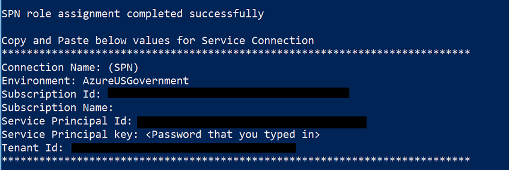

# Deploy an app in Azure Government with Azure Pipelines

This article helps you use Azure Pipelines to set up continuous integration (CI) and continuous deployment (CD) of your web app running in Azure Government. CI/CD automates the build of your code from a repo along with the deployment (release) of the built code artifacts to a service or set of services in Azure Government. In this tutorial, you will build a web app and deploy it to an Azure Governments app service. This build and release process is triggered by a change to a code file in the repo.

> [!NOTE]
> Azure Pipelines is not available as part of Azure Government. While this tutorial shows how to configure the CI/CD capabilities of Azure Pipelines in order to deploy an app to a service inside Azure Government, be aware that Azure Pipelines runs its pipelines outside of Azure Government. Research your organization's security and service policies before using it as part of your deployment tools. 

[Azure Pipelines](https://docs.microsoft.com/azure/devops/pipelines/get-started/?view=vsts) is used by teams to configure continuous deployment for applications hosted in Azure subscriptions. We can use this service for applications running in Azure Government by defining [service connections](https://docs.microsoft.com/azure/devops/pipelines/library/service-endpoints?view=vsts) for Azure Government. 

## Prerequisites

Before starting this tutorial, you must have the following:

+ [Create an organization in Azure DevOps](https://docs.microsoft.com/azure/devops/organizations/accounts/create-organization?view=vsts)
+ [Create and add a project to the Azure DevOps organization](https://docs.microsoft.com/azure/devops/organizations/projects/create-project?toc=%2Fazure%2Fdevops%2Fuser-guide%2Ftoc.json&%3Bbc=%2Fazure%2Fdevops%2Fuser-guide%2Fbreadcrumb%2Ftoc.json&view=vsts&tabs=new-nav)
+ Install and set up [Azure Powershell](https://docs.microsoft.com/powershell/azure/azurerm/install-azurerm-ps?view=azurermps-5.1.1)

If you don't have an active Azure Government subscription, create a [free account](https://azure.microsoft.com/overview/clouds/government/) before you begin.

## Create Azure Government app service 

[Create an App service in your Azure Government subscription](documentation-government-howto-deploy-webandmobile.md). 
The following steps will set up a CD process to deploy to this Web App. 

## Set up Build and Source control integration

Follow through one of the quickstarts below to set up a Build for your specific type of app: 

- [ASP.NET 4 app](https://docs.microsoft.com/azure/devops/pipelines/apps/aspnet/build-aspnet-4?view=vsts)
- [ASP.NET Core app](https://docs.microsoft.com/azure/devops/pipelines/languages/dotnet-core?view=vsts&tabs=yaml)
- [Node.js app with Gulp](https://docs.microsoft.com/azure/devops/pipelines/languages/javascript?view=vsts&tabs=yaml)

## Generate a service principal 

1. Download or copy and paste the [service principal creation](https://github.com/yujhongmicrosoft/spncreationn/blob/master/spncreation.ps1) powershell script into an IDE or editor. 
2. Open up the file and navigate to the `param` parameter. Replace the `$environmentName` variable with 
AzureUSGovernment." This sets the service principal to be created in Azure Government.
3. Open your Powershell window and run the following command. This command sets a policy that enables running local files. 

    ```Set-ExecutionPolicy -Scope Process -ExecutionPolicy Bypass```

    When you are asked whether you want to change the execution policy, enter "A" (for "Yes to All").

4. Navigate to the directory that has the edited script above. 
5. Edit the following command with the name of your script and run:
    `./<name of script file you saved> `
6. The "subscriptionName" parameter can be found by logging into your Azure Government subscription with `Connect-AzureRmAccount -EnvironmentName AzureUSGovernment` and then running `Get-AzureSubscription`. 
7. When prompted for the "password" parameter, enter your desired password. 
8. After providing your Azure Government subscription credentials, you should see the following: 

    > [!NOTE]
    > The Environment variable should be "AzureUSGovernment"
    > 
    > 

9. After the script has run, you should see your service connection values. Copy these values as we will need them when setting up our endpoint. 

    

## Configure the Azure Pipelines service connection

Follow the instructions in [Service connections for builds and releases](https://docs.microsoft.com/azure/devops/pipelines/library/service-endpoints) to set up the Azure Pipelines service connection. 

Make one change specific to Azure Government: In step #3 of [Service connections for builds and releases](https://docs.microsoft.com/azure/devops/pipelines/library/service-endpoints?view=vsts), click on "use the full version of the service connection catalog" and set **Environment** to **AzureUSGovernment**.

## Define a release process

Follow [Deploy a web app to Azure App Services](https://docs.microsoft.com/azure/devops/pipelines/apps/cd/deploy-webdeploy-webapps?view=vsts) instructions to set up your release pipeline and deploy to your application in Azure Government.

## Q&A

Q: Do I need a build agent?<br/>
A: You need at least one [agent](https://docs.microsoft.com/azure/devops/pipelines/agents/agents?view=vsts) to run your deployments. By default, the build and deployment processes are configured to use the [hosted agents](https://docs.microsoft.com/azure/devops/pipelines/agents/agents?view=vsts#microsoft-hosted-agents). Configuring a private agent would limit data sharing outside of Azure Government.

Q: I use Team Foundation Server on-premises. Can I configure CD on my server to target Azure Government?<br/>
A: Currently, Team Foundation Server cannot be used to deploy to an Azure Government Cloud.

## Next steps
* Subscribe to the [Azure Government blog](https://blogs.msdn.microsoft.com/azuregov/)
* Get help on Stack Overflow by using the "[azure-gov](https://stackoverflow.com/questions/tagged/azure-gov)" tag
* Give us feedback or request new features via the [Azure Government feedback forum](https://feedback.azure.com/forums/558487-azure-government)
