# Back up SQL Server databases on Azure VMs 

SQL Server databases are critical workloads that require a low recovery point objective (RPO) and long-term retention. You can back up SQL Server databases that are running on Azure VMs by using [Azure Backup](backup-overview.md). 

This tutorial shows you how to back up a SQL Server database that is running on an Azure VM to an Azure Backup Recovery Services vault. In this article, you learn how to:

> [!div class="checklist"]
> * Verify the prerequisites for backing up a SQL Server instance.
> * Create and configure a vault.
> * Discover databases and set up backups.
> * Set up auto-protection for databases.

> [!NOTE]
> This feature is currently in public preview.

## Before you start

- Make sure that you have a SQL Server instance running in Azure. You can quickly [create a SQL Server instance](../sql-database/sql-database-get-started-portal.md) in the Azure Marketplace.
- Review the public preview limitations.
- Review scenario support.
- [Review common questions](faq-backup-sql-server.md) about this scenario.

## Preview limitations

This public preview has a number of limitations.

- The VM that is running SQL Server requires internet connectivity to access Azure public IP addresses. 
- You can back up 2,000 SQL Server databases in a vault. If you have more, create another vault. 
- Backups of [distributed availability groups](https://docs.microsoft.com/sql/database-engine/availability-groups/windows/distributed-availability-groups?view=sql-server-2017) don't fully work.
- SQL Server Always On Failover Cluster Instances (FCIs) aren't supported for backup.
- Configure SQL Server backup in the portal. You can't currently configure backup with Azure PowerShell, CLI, or the REST APIs.
- Backup and restore operations for FCI mirror databases, database snapshots, and databases aren't supported.
- Databases with a large number of files can't be protected. The maximum number of files that are supported isn't deterministic. It depends on the number of files, and also depends on the path length of the files. 

Review [frequently asked questions](faq-backup-sql-server.md) about backing up SQL Server databases.
## Scenario support

**Support** | **Details**
--- | ---
**Supported deployments** | Marketplace Azure VMs and non-Marketplace (SQL Server manually installed) VMs are supported.
**Supported geos** | Australia South East (ASE); Brazil South (BRS); Canada Central (CNC); Canada East (CE); Central US (CUS); East Asia (EA); East Australia (AE); East US (EUS); East US 2 (EUS2); India Central (INC); India South (INS); Japan East (JPE); Japan West (JPW); Korea Central (KRC); Korea South (KRS); North Central US (NCUS); North Europe (NE); South Central US (SCUS); South East Asia (SEA); UK South (UKS); UK West (UKW); West Central US (WCUS); West Europe (WE); West US (WUS); West US 2 (WUS 2)
**Supported operating systems** | Windows Server 2016, Windows Server 2012 R2, Windows Server 2012   Linux isn't currently supported.
**Supported SQL Server versions** | SQL Server 2017, SQL Server 2016, SQL Server 2014, SQL Server 2012.   Enterprise, Standard, Web, Developer, Express.

## Prerequisites

Before you back up your SQL Server database, check the following conditions:

- Identify or [create a Recovery Services vault](backup-azure-sql-database.md#create-a-recovery-services-vault) in the same region or locale as the VM that is hosting the SQL Server instance.
- [Check the VM permissions](#fix-sql-sysadmin-permissions) that are needed to back up the SQL databases.
- Verify that the VM has [network connectivity](backup-azure-sql-database.md#establish-network-connectivity).
- Check that the SQL Server databases are named in accordance with the [naming guidelines for Azure Backup](backup-azure-sql-database.md).
- Verify that you don't have any other backup solutions enabled for the database. Disable all other SQL Server backups before you set up this scenario. You can enable Azure Backup for an Azure VM, along with Azure Backup for a SQL Server database that is running on the VM, without any conflict.

### Establish network connectivity

For all operations, the SQL Server VM virtual machine needs connectivity to Azure public IP addresses. VM operations (database discovery, configure backups, schedule backups, restore recovery points) fail without connectivity to the public IP addresses. Establish connectivity with one of these options:

- **Allow the Azure datacenter IP ranges**: Allow the [IP ranges](https://www.microsoft.com/download/details.aspx?id=41653) in the download. For access in a network security group (NSG), use the `Set-AzureNetworkSecurityRule` cmdlet.
- **Deploy an HTTP proxy server to route traffic**: When you back up a SQL Server database on an Azure VM, the backup extension on the VM uses the HTTPS APIs to send management commands to Azure Backup, and to send data to Azure Storage. The backup extension also uses Azure Active Directory (Azure AD) for authentication. Route the backup extension traffic for these three services through the HTTP proxy. The extension is the only component that's configured for access to the public internet.

Each option has advantages and disadvantages.

**Option** | **Advantages** | **Disadvantages**
--- | --- | ---
Allow IP ranges | No additional costs. | Complex to manage because the IP address ranges change over time.    Provides access to the whole of Azure, not just to Azure Storage.
Use an HTTP proxy   | Granular control in the proxy over the storage URLs is allowed.    Single point of internet access to VMs.    Not subject to Azure IP address changes. | Additional costs to run a VM with the proxy software. 

### Set VM permissions

Azure Backup does several things when you configure backup for a SQL Server database:

- Azure Backup adds the **AzureBackupWindowsWorkload** extension.
- Azure Backup creates the account **NT SERVICE\AzureWLBackupPluginSvc** to discover databases on the virtual machine. This account is used for backup and restore and requires SQL sysadmin permissions.
- Azure Backup leverages the **NT AUTHORITY\SYSTEM** account for database discovery and inquiry. This account must be a public login on SQL Server.

If you didn't create the SQL Server VM from the Azure Marketplace, you might receive a **UserErrorSQLNoSysadminMembership** error. If this error occurs, [follow these instructions](#fix-sql-sysadmin-permissions).

### Verify database naming guidelines for Azure Backup

Avoid the following for database names:

* Trailing/leading spaces
* Trailing exclamation point (!)
* Closing square bracket (])

We do have aliasing for Azure table unsupported characters, but we recommend that you avoid them. [Learn more](https://docs.microsoft.com/rest/api/storageservices/Understanding-the-Table-Service-Data-Model?redirectedfrom=MSDN).

[!INCLUDE [How to create a Recovery Services vault](../../includes/backup-create-rs-vault.md)]

## Discover SQL Server databases

Discover databases that are running on the VM. 

1. In the [Azure portal](https://portal.azure.com), open the Recovery Services vault that you use to back up the database.

1. On the **Recovery Services vault** dashboard, select **Backup**. 

   

1. In **Backup Goal**, set **Where is your workload running** to **Azure** (the default).

1. In **What do you want to backup**, select **SQL Server in Azure VM**.

    

1. In **Backup Goal** > **Discover DBs in VMs**, select **Start Discovery** to search for unprotected VMs in the subscription. It can take a while, depending on the number of unprotected virtual machines in the subscription.

    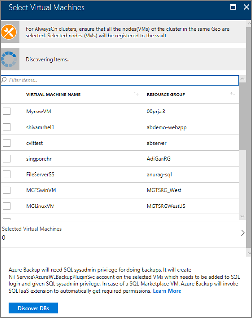

1. In the VM list, select the VM that is running the SQL Server database > **Discover DBs**.

1. Track database discovery in the **Notifications** area. It can take a while for the job to finish, depending on how many databases are on the VM. When the selected databases are discovered, a success message appears.

    

    - Unprotected VMs should appear in the list after discovery, listed by name and resource group.
    - If a VM isn't listed as you expect, check whether it's already backed up in a vault.
    - Multiple VMs can have the same name, but they'll belong to different resource groups. 

1. Select the VM that is running the SQL Server database > **Discover DBs**. 
1. Azure Backup discovers all SQL Server databases on the VM. During discovery, the following activity occurs in the background:

    - Azure Backup registers the VM with the vault for workload backup. All databases on the registered VM can be backed up only to this vault.
    - Azure Backup installs the **AzureBackupWindowsWorkload** extension on the VM. No agent is installed on the SQL database.
    - Azure Backup creates the service account **NT Service\AzureWLBackupPluginSvc** on the VM.
      - All backup and restore operations use the service account.
      - **NT Service\AzureWLBackupPluginSvc** needs SQL sysadmin permissions. All SQL Server VMs that are created in the Azure Marketplace come with the **SqlIaaSExtension** installed. The **AzureBackupWindowsWorkload** extension uses the **SQLIaaSExtension** to automatically get the required permissions.
    - If you didn't create the VM from the Marketplace, the VM doesn't have the **SqlIaaSExtension** installed, and the discovery operation fails with the **UserErrorSQLNoSysAdminMembership** error message. Follow the instructions in [#fix-sql-sysadmin-permissions] to fix this issue.

        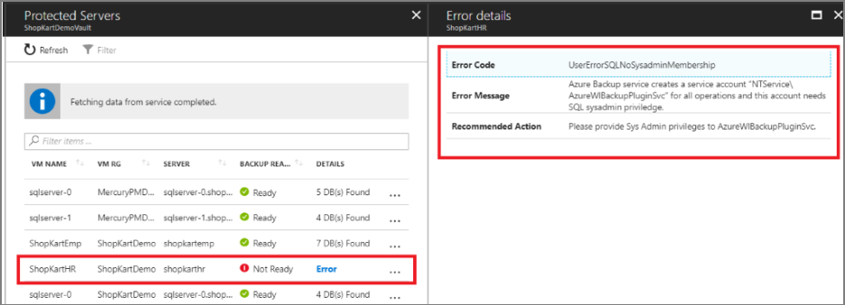

## Configure a backup policy 

To optimize backup loads, Azure Backup sets a maximum number of databases in one backup job to 50.

- To protect more than 50 databases, configure multiple backups.
- Alternately, you can enable auto-protection. Auto-protection protects existing databases in one go, and automatically protects new databases that are added to the instance of the availability group.

Configure backup as follows:

1. On the vault dashboard, select **Backup**. 

   

1. In **Backup Goal**, set **Where is your workload running?** to **Azure**.

1. In **What do you want to back up?**, select **SQL Server in Azure VM**.

    

    
1. In **Backup Goal**, select **Configure Backup**.

    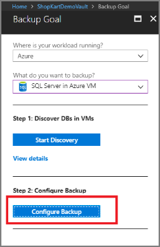

    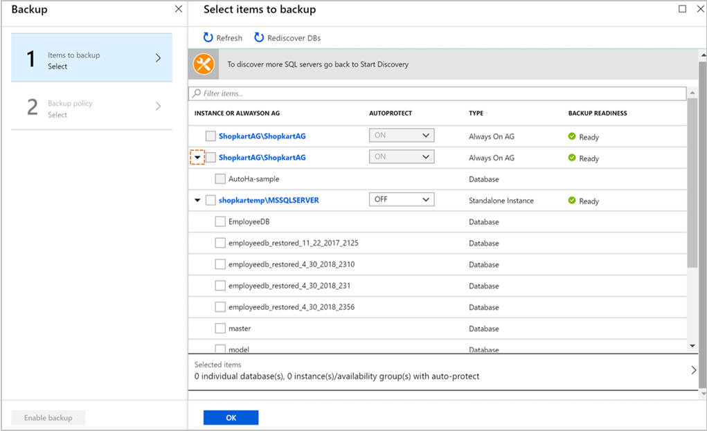

1. Select all the databases that you want to protect > **OK**.

    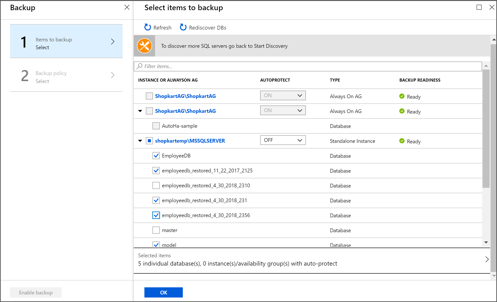

    - All SQL Server instances are shown (standalone and availability groups).
    - Select the down arrow to the left of the instance name or availability group to filter.

1. In the **Backup** menu, select **Backup policy**. 

    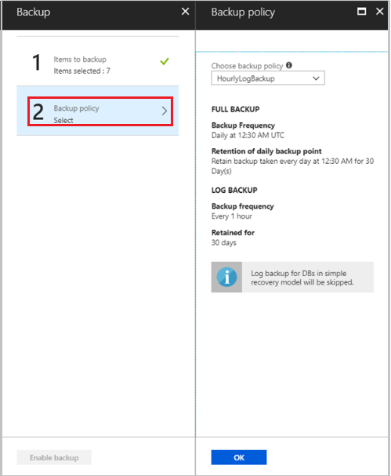

1. In **Choose backup policy**, select a policy, and then select **OK**.

    - Select the default policy: **HourlyLogBackup**.
    - Choose an existing backup policy that was previously created for SQL.
    - [Define a new policy](backup-azure-sql-database.md#configure-a-backup-policy) based on your RPO and retention range.
    - During Preview, you can't edit an existing Backup policy.
    
1. In the **Backup** menu, select **Enable backup**.

    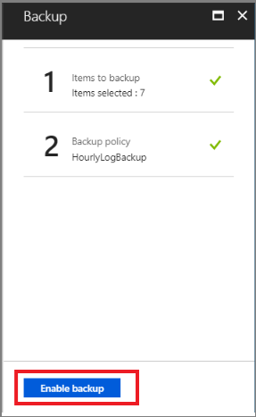

1. Track the configuration progress in the **Notifications** area of the portal.

    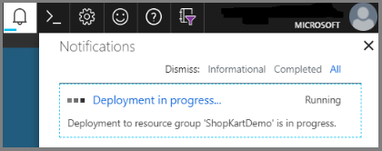

### Create a backup policy

A backup policy determines when backups are taken and how long they're retained. 

- A policy is created at the vault level.
- Multiple vaults can use the same backup policy, but you must apply the backup policy to each vault.
- When you create a backup policy, a daily full backup is the default.
- You can add a differential backup, but only if you configure full backups to occur weekly.
- [Learn about](backup-architecture.md#sql-server-backup-types) different types of backup policies.

To create a backup policy, follow these steps:

1. In the vault, select **Backup policies** > **Add**.
1. In the **Add** menu, select **SQL Server in Azure VM**. This defines the policy type.

   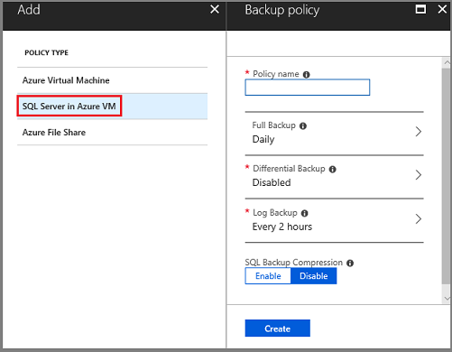

1. In **Policy name**, enter a name for the new policy. 
1. In **Full Backup policy**, select a **Backup Frequency**. Choose **Daily** or **Weekly**.

    - For **Daily**, select the hour and time zone for the backup to begin.
    - You must run a full backup. You can't turn off the **Full Backup** option.
    - Select **Full Backup** to view the policy. 
    - You can't create differential backups for daily full backups.
    - For **Weekly**, select the day of the week, hour, and time zone for the backup to begin.

     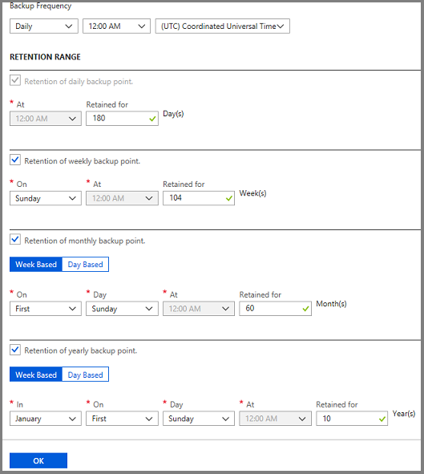  

1. In **Retention Range**, all options are selected by default. Clear any undesired retention range limits that you don't want to use, and set the intervals that you want to use. 

    - Recovery points are tagged for retention based on their retention range. For example, if you select a daily full backup, only one full backup is triggered each day.
    - The backup for a specific day is tagged and retained based on the weekly retention range and your weekly retention setting.
    - The monthly and yearly retention ranges behave in a similar way.

   

    

1. In the **Full Backup policy** menu, select **OK** to accept the settings.
1. To add a differential backup policy, select **Differential Backup**. 

   
   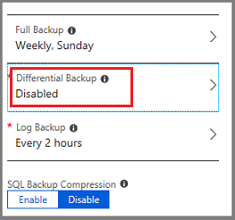

1. In **Differential Backup policy**, select **Enable** to open the frequency and retention controls. 

    - At most, you can trigger one differential backup per day.
    - Differential backups can be retained for a maximum of 180 days. If you need longer retention, you must use full backups.

1. Select **OK** to save the policy and return to the main **Backup policy** menu.

1. To add a transactional log backup policy, select **Log Backup**.
1. In **Log Backup**, select **Enable**, and then set the frequency and retention controls. Log backups can occur as often as every 15 minutes and can be retained for up to 35 days.
1. Select **OK** to save the policy and return to the main **Backup policy** menu.

    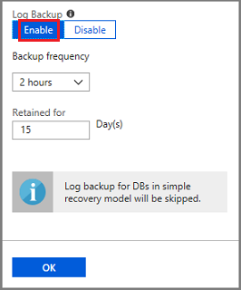

1. In the **Backup policy** menu, choose whether to enable **SQL Backup Compression**.
    - Compression is disabled by default.
    - On the back end, Azure Backup uses SQL native backup compression.

1. After you complete the edits to the backup policy, select **OK**.

## Enable auto-protection  

Enable auto-protection to automatically back up all existing databases, and databases that are added in the future, to a standalone SQL Server instance or to a SQL Server Always On availability group. 

- When you turn on auto-protection and select a policy, the existing protected databases will continue to use the previous policy.
- There's no limit on the number of databases you can select for auto-protection.

Follow these steps to enable auto-protection:

1. In **Items to backup**, select the instance for which you want to enable auto-protection.
1. Select the dropdown under **Autoprotect**, and set to **On**. Then select **OK**.

    

1. Backup is configured for all the databases together and can be tracked in **Backup Jobs**.

If you need to disable auto-protection, select the instance name under **Configure Backup**, and select **Disable Autoprotect** for the instance. All databases will continue to back up. However, future databases won't be automatically protected.

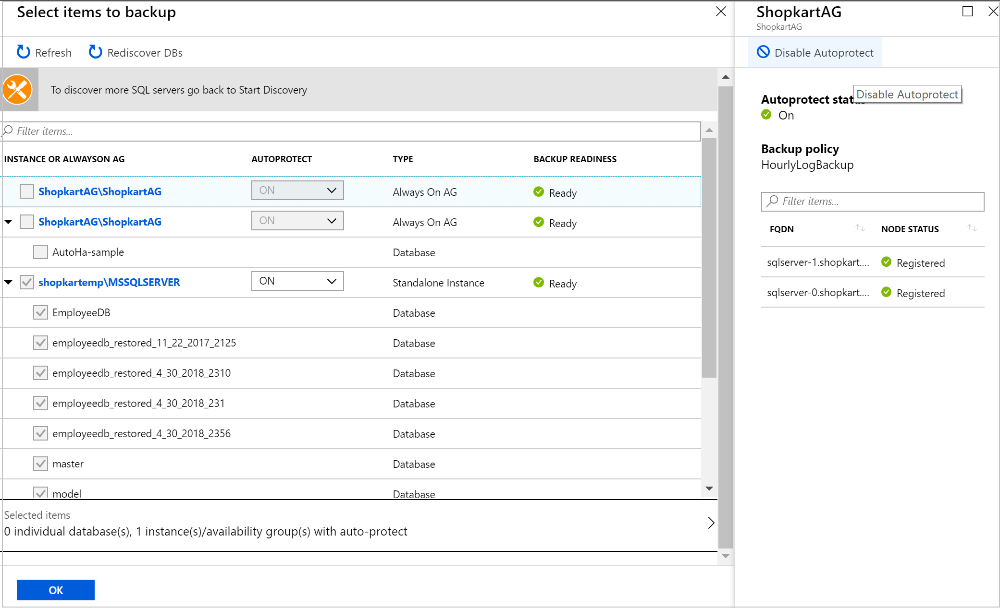

## Fix SQL sysadmin permissions

If you need to fix permissions because of a **UserErrorSQLNoSysadminMembership** error, follow these steps:

1. Use an account with SQL Server sysadmin permissions to sign in to SQL Server Management Studio (SSMS). Unless you need special permissions, Windows authentication should work.
1. On the SQL Server instance, open the **Security/Logins** folder.

    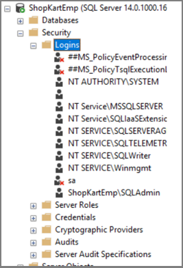

1. Right-click the **Logins** folder and select **New Login**. In **Login - New**, select **Search**.

    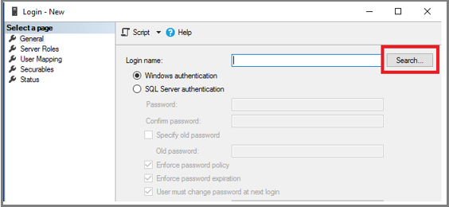

1. The Windows virtual service account **NT SERVICE\AzureWLBackupPluginSvc** was created during the virtual machine registration and SQL discovery phase. Enter the account name as shown in **Enter the object name to select**. Select **Check Names** to resolve the name. Select **OK**.

    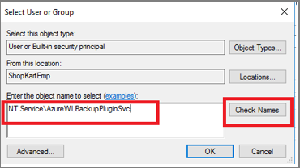

1. In **Server Roles**, make sure the **sysadmin** role is selected. Select **OK**. The required permissions should now exist.

    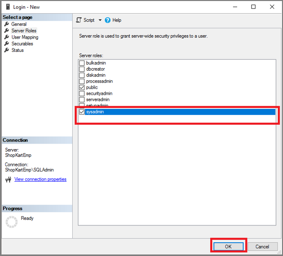

1. Associate the database with the Recovery Services vault. In the Azure portal, in the **Protected Servers** list, right-click the server that's in an error state > **Rediscover DBs**.

    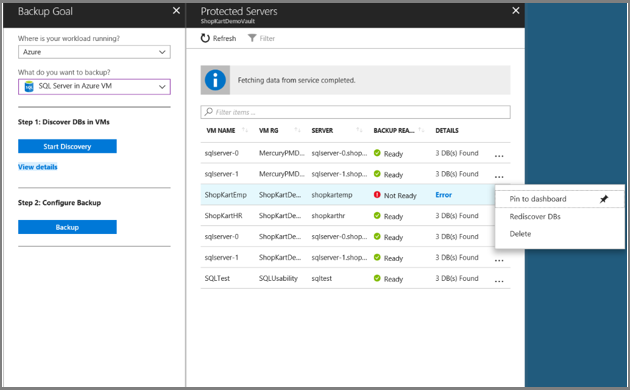

1. Check progress in the **Notifications** area. When the selected databases are found, a success message appears.

    

You can also enable [auto-protection](backup-azure-sql-database.md#enable-auto-protection) on the entire instance or Always On availability group. To enable it, select the **ON** option in the corresponding dropdown in the **AUTOPROTECT** column. The [auto-protection](backup-azure-sql-database.md#enable-auto-protection) feature enables protection on all the existing databases. It also automatically protects any new databases that will be added to that instance or the availability group in the future.  

   

## Next steps

- [Learn about](restore-sql-database-azure-vm.md) restoring backed up SQL Server databases.
- [Learn about](manage-monitor-sql-database-backup.md) managing backed up SQL Server databases.

