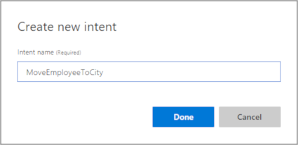
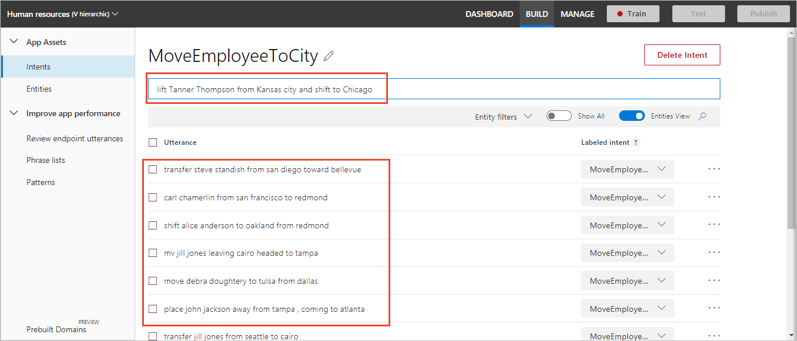
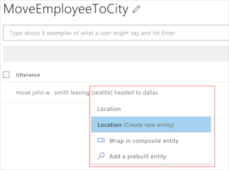
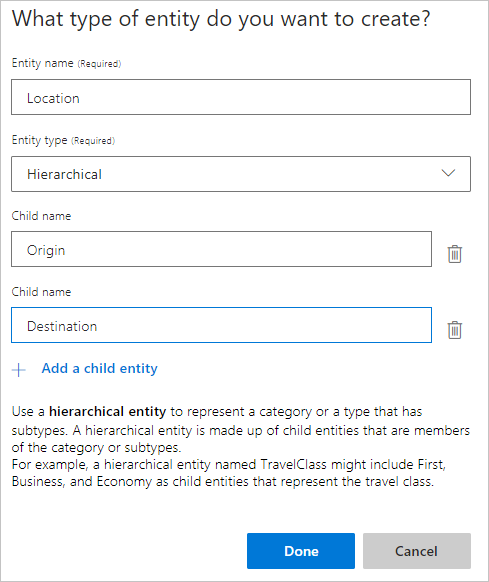
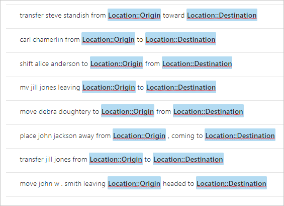

# Tutorial: Extract contextually related data from an utterance

In this tutorial, find related pieces of data based on context. For example, an origin and destination locations for a transfer from one city to another. Both pieces of data may be required and they are related to each other.  

**In this tutorial, you learn how to:**

> [!div class="checklist"]
> * Create new app
> * Add intent 
> * Add location hierarchical entity with origin and destination children
> * Train
> * Publish
> * Get intents and entities from endpoint

[!INCLUDE [LUIS Free account](../../../includes/cognitive-services-luis-free-key-short.md)]

## Hierarchical data

This app determines where an employee is to be moved from the origin city to the destination city. It uses the hierarchical entity to determine the locations within the utterance. 

The hierarchical entity is a good fit for this type of data because the two pieces of data, child locations:

* Are simple entities.
* Are related to each other in the context of the utterance.
* Use specific word choice to indicate each entity. Examples of these words include: from/to, leaving/headed to, away from/toward.
* Both children are frequently in the same utterance. 
* Need to be grouped and processed by client app as a unit of information.

## Create a new app

[!INCLUDE [Follow these steps to create a new LUIS app](../../../includes/cognitive-services-luis-create-new-app-steps.md)]

## Create an intent to move employees between cities

1. [!INCLUDE [Start in Build section](../../../includes/cognitive-services-luis-tutorial-build-section.md)]

1. Select **Create new intent**. 

1. Enter `MoveEmployeeToCity` in the pop-up dialog box then select **Done**. 

    

1. Add example utterances to the intent.

    |Example utterances|
    |--|
    |move John W. Smith leaving Seattle headed to Dallas|
    |transfer Jill Jones from Seattle to Cairo|
    |Place John Jackson away from Tampa, coming to Atlanta |
    |move Debra Doughtery to Tulsa from Dallas|
    |mv Jill Jones leaving Cairo headed to Tampa|
    |Shift Alice Anderson to Oakland from Redmond|
    |Carl Chamerlin from San Francisco to Redmond|
    |Transfer Steve Standish from San Diego toward Bellevue |
    |lift Tanner Thompson from Kansas city and shift to Chicago|

    [](./media/luis-quickstart-intent-and-hier-entity/hr-enter-utterances.png#lightbox)

## Create a location entity
LUIS needs to understand what a location is by labeling the origin and destination in the utterances. If you need to see the utterance in the token (raw) view, select the toggle in the bar above the utterances labeled **Entities View**. After you toggle the switch, the control is labeled **Tokens View**.

Consider the following utterance:

```json
move John W. Smith leaving Seattle headed to Dallas
```

The utterance has two locations specified, `Seattle` and `Dallas`. Both are grouped as children of a hierarchical entity, `Location`, because both pieces of data need to be extracted from the utterance to complete the request in the client application and they are related to each other. 
 
If only one child (origin or destination) of a hierarchical entity is present, it is still extracted. All children do not need to be found for just one, or some, to be extracted. 

1. In the utterance, `move John W. Smith leaving Seattle headed to Dallas`, select the word `Seattle`. A drop-down menu appears with a text box at the top. Enter the entity name `Location` in the text box then select **Create new entity** in the drop-down menu. 

    [](media/luis-quickstart-intent-and-hier-entity/tutorial-hierarichical-entity-labeling-1.png#lightbox)

1. In the pop-up window, select the **Hierarchical** entity type with `Origin` and `Destination` as the child entities. Select **Done**.

    

1. The label for `Seattle` is marked as `Location` because LUIS doesn't know if the term was the origin or destination, or neither. Select `Seattle`, then select **Location**, then follow the menu to the right and select `Origin`.

    [](media/luis-quickstart-intent-and-hier-entity/tutorial-hierarichical-entity-labeling-2.png#lightbox)

1. Label the other locations in all the other utterances. When all locations are marked, the utterances begin to look like a pattern. 

    [](media/luis-quickstart-intent-and-hier-entity/all-intents-marked-with-origin-and-destination-location.png#lightbox)

    The red underline indicates LUIS is not confident about the entity. Training resolves this. 

## Add example utterances to the None intent 

[!INCLUDE [Follow these steps to add the None intent to the app](../../../includes/cognitive-services-luis-create-the-none-intent.md)]

## Train the app so the changes to the intent can be tested 

[!INCLUDE [LUIS How to Train steps](../../../includes/cognitive-services-luis-tutorial-how-to-train.md)]

## Publish the app so the trained model is queryable from the endpoint

[!INCLUDE [LUIS How to Publish steps](../../../includes/cognitive-services-luis-tutorial-how-to-publish.md)]

## Get intent and entity prediction from endpoint

1. [!INCLUDE [LUIS How to get endpoint first step](../../../includes/cognitive-services-luis-tutorial-how-to-get-endpoint.md)]


1. Go to the end of the URL in the address bar and enter `Please move Carl Chamerlin from Tampa to Portland`. The last querystring parameter is `q`, the utterance **query**. This utterance is not the same as any of the labeled utterances so it is a good test and should return the `MoveEmployee` intent with the hierarchical entity extracted.

    ```json
    {
      "query": "Please move Carl Chamerlin from Tampa to Portland",
      "topScoringIntent": {
        "intent": "MoveEmployeeToCity",
        "score": 0.979823351
      },
      "intents": [
        {
          "intent": "MoveEmployeeToCity",
          "score": 0.979823351
        },
        {
          "intent": "None",
          "score": 0.0156363435
        }
      ],
      "entities": [
        {
          "entity": "portland",
          "type": "Location::Destination",
          "startIndex": 41,
          "endIndex": 48,
          "score": 0.6044041
        },
        {
          "entity": "tampa",
          "type": "Location::Origin",
          "startIndex": 32,
          "endIndex": 36,
          "score": 0.739491045
        }
      ]
    }
    ```
    
    The correct intent is predicted and the entities array has both the origin and destination values in the corresponding **entities** property.
    
## Clean up resources

[!INCLUDE [LUIS How to clean up resources](../../../includes/cognitive-services-luis-tutorial-how-to-clean-up-resources.md)]

## Related information

* [Hierarchical entity](luis-concept-entity-types.md) conceptual information
* [How to train](luis-how-to-train.md)
* [How to publish](luis-how-to-publish-app.md)
* [How to test in LUIS portal](luis-interactive-test.md)
* [Roles versus hierarchical entities](luis-concept-roles.md#roles-versus-hierarchical-entities)
* [Improve predictions with Patterns](luis-concept-patterns.md)

## Next steps

This tutorial created a new intent and added example utterances for the contextually learned data of origin and destination locations. Once the app is trained and published, a client-application can use that information to create a move ticket with the relevant information.

> [!div class="nextstepaction"] 
> [Learn how to add a composite entity](luis-tutorial-composite-entity.md) 
