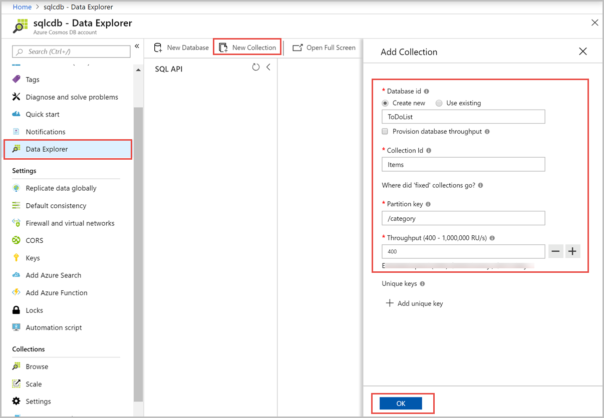
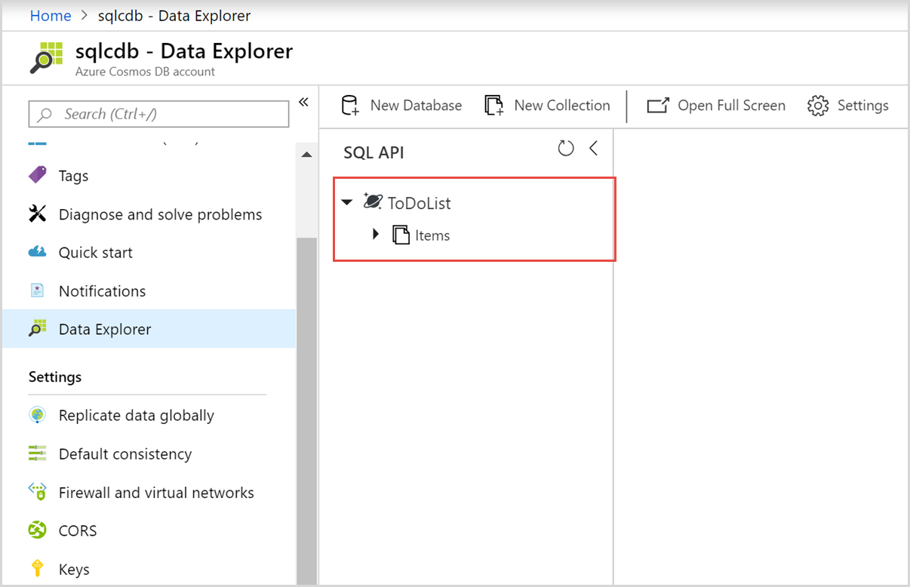
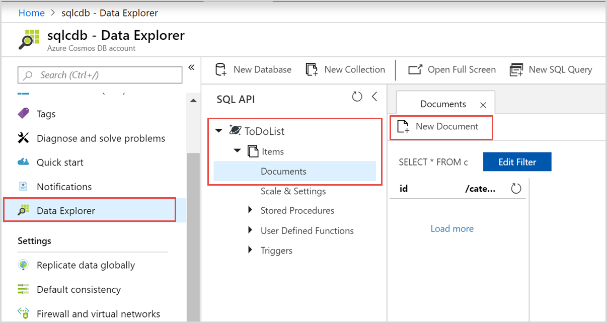
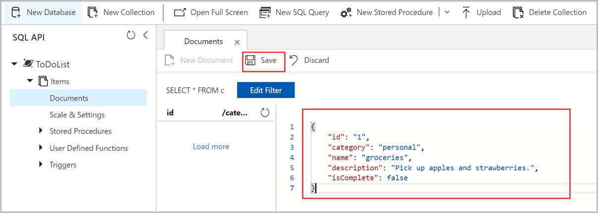
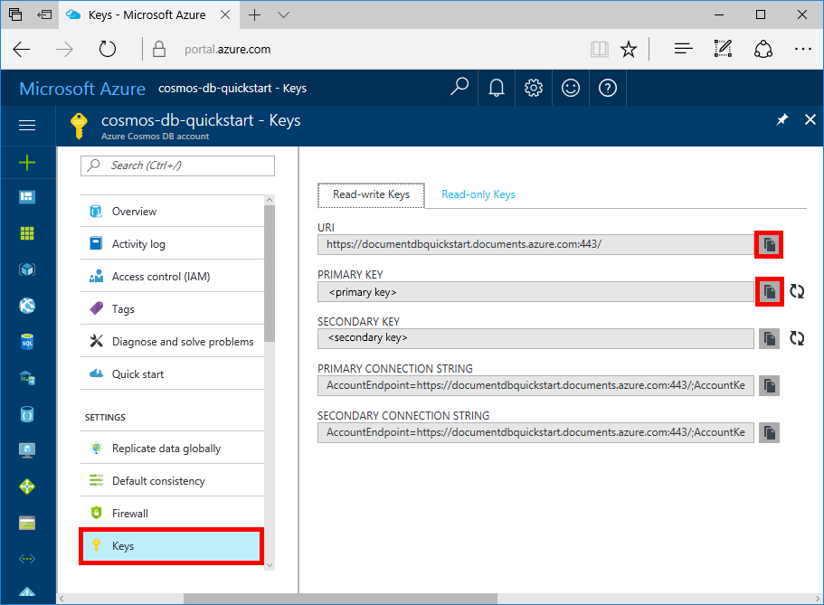
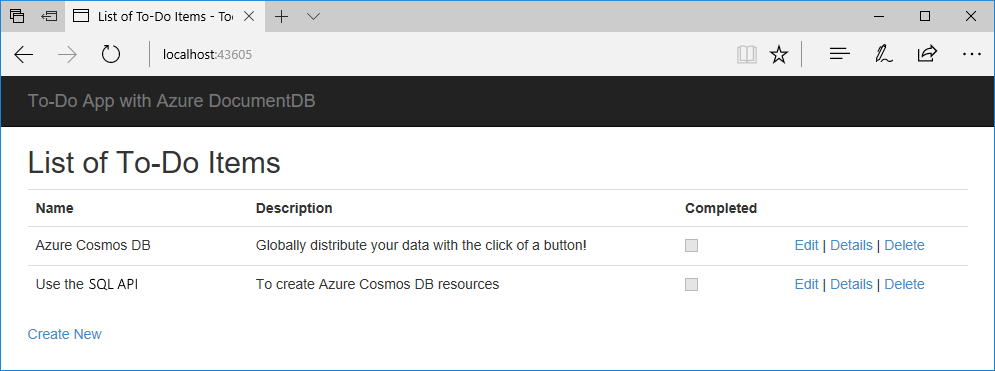

# Quickstart: Build a .NET web app using Azure Cosmos DB SQL API account

> [!div class="op_single_selector"]
> * [.NET](create-sql-api-dotnet.md)
> * [.NET (Preview)](create-sql-api-dotnet-preview.md)
> * [Java](create-sql-api-java.md)
> * [Node.js](create-sql-api-nodejs.md)
> * [Python](create-sql-api-python.md)
> * [Xamarin](create-sql-api-xamarin-dotnet.md)
>  
> 

Azure Cosmos DB is Microsoft’s globally distributed multi-model database service. You can quickly create and query document, key/value, and graph databases, all of which benefit from the global distribution and horizontal scale capabilities at the core of Azure Cosmos DB. 

This quickstart demonstrates how to create an Azure Cosmos DB [SQL API](sql-api-introduction.md) account, document database, collection, and add sample data to the collection by using the Azure portal. You'll then build and deploy a todo list web app built using the [SQL .NET SDK](sql-api-sdk-dotnet.md), to add more manage data within the collection. 

## Prerequisites

If you don’t already have Visual Studio 2017 installed, you can download and use the **free** [Visual Studio 2017 Community Edition](https://www.visualstudio.com/downloads/). Make sure that you enable **Azure development** during the Visual Studio setup.

[!INCLUDE [quickstarts-free-trial-note](../../includes/quickstarts-free-trial-note.md)] 
[!INCLUDE [cosmos-db-emulator-docdb-api](../../includes/cosmos-db-emulator-docdb-api.md)]  

<a id="create-account"></a>
## Create an account

[!INCLUDE [cosmos-db-create-dbaccount](../../includes/cosmos-db-create-dbaccount.md)]

<a id="create-collection-database"></a>
## Add a database and a collection

You can now use the Data Explorer tool in the Azure portal to create a database and collection. 

1. Click **Data Explorer** > **New Collection**. 
    
    The **Add Collection** area is displayed on the far right, you may need to scroll right to see it.

    

2. In the **Add collection** page, enter the settings for the new collection.

    Setting|Suggested value|Description
    ---|---|---
    **Database id**|ToDoList|Enter *ToDoList* as the name for the new database. Database names must contain from 1 through 255 characters, and they cannot contain `/, \\, #, ?`, or a trailing space.
    **Collection id**|Items|Enter *Items* as the name for your new collection. Collection IDs have the same character requirements as database names.
    **Partition key**| `<your_partition_key>`| Enter a partition key. The sample described in this article uses */category* as the partition key.
    **Throughput**|400 RU|Change the throughput to 400 request units per second (RU/s). If you want to reduce latency, you can scale up the throughput later. 
    
    In addition to the preceding settings, you can optionally add **Unique keys** for the collection. Let's leave the field empty in this example. Unique keys provide developers with the ability to add a layer of data integrity to the database. By creating a unique key policy while creating a collection, you ensure the uniqueness of one or more values per partition key. To learn more, refer to the [Unique keys in Azure Cosmos DB](unique-keys.md) article.
    
    Click **OK**.

    Data Explorer displays the new database and collection.

    

<a id="add-sample-data"></a>
## Add sample data

You can now add data to your new collection using Data Explorer.

1. In Data Explorer, the new database appears in the Collections pane. Expand the **Tasks** database, expand the **Items** collection, click **Documents**, and then click **New Documents**. 

   
  
2. Now add a document to the collection with the following structure.

     ```json
     {
         "id": "1",
         "category": "personal",
         "name": "groceries",
         "description": "Pick up apples and strawberries.",
         "isComplete": false
     }
     ```

3. Once you've added the json to the **Documents** tab, click **Save**.

    

4. Create and save one more document where you insert a unique value for the `id` property, and change the other properties as you see fit. Your new documents can have any structure you want as Azure Cosmos DB doesn't impose any schema on your data.

## Query your data

[!INCLUDE [cosmos-db-create-sql-api-query-data](../../includes/cosmos-db-create-sql-api-query-data.md)]

## Clone the sample application

Now let's switch to working with code. Let's clone a [SQL API app from GitHub](https://github.com/Azure-Samples/documentdb-dotnet-todo-app), set the connection string, and run it. You'll see how easy it is to work with data programmatically. 

1. Open a command prompt, create a new folder named git-samples, then close the command prompt.

    ```bash
    md "C:\git-samples"
    ```

2. Open a git terminal window, such as git bash, and use the `cd` command to change to the new folder to install the sample app.

    ```bash
    cd "C:\git-samples"
    ```

3. Run the following command to clone the sample repository. This command creates a copy of the sample app on your computer.

    ```bash
    git clone https://github.com/Azure-Samples/documentdb-dotnet-todo-app.git
    ```

4. Then open the todo solution file in Visual Studio. 

## Review the code

This step is optional. If you're interested in learning how the database resources are created in the code, you can review the following snippets. Otherwise, you can skip ahead to [Update your connection string](#update-your-connection-string). In this quickstart, you create a database and a collection by using Azure portal and add sample data by using the .NET sample. However, you can also create the database and the collection by using the .NET sample. 

The following snippets are all taken from the DocumentDBRepository.cs file.

* The DocumentClient is initialized as shown in the following code:

    ```csharp
    client = new DocumentClient(new Uri(ConfigurationManager.AppSettings["endpoint"]), ConfigurationManager.AppSettings["authKey"]);
    ```

* A new database is created by using the `CreateDatabaseAsync` method as shown in the following code:

    ```csharp
    await client.CreateDatabaseAsync(new Database { Id = DatabaseId });
    ```

* A new collection is created by using the `CreateDocumentCollectionAsync` as shown in the following code:

    ```csharp
    private static async Task CreateCollectionIfNotExistsAsync()
    {
        try
        {
           await client.ReadDocumentCollectionAsync(UriFactory.CreateDocumentCollectionUri(DatabaseId, CollectionId));
        }
        catch (DocumentClientException e)
        {
           if (e.StatusCode == System.Net.HttpStatusCode.NotFound)
           {
              await client.CreateDocumentCollectionAsync(
              UriFactory.CreateDatabaseUri(DatabaseId),
              new DocumentCollection
              {
                  Id = CollectionId
              },
              new RequestOptions { OfferThroughput = 400 });
           }
           else
           {
             throw;
           }
        }
    }
    ```

## Update your connection string

Now go back to the Azure portal to get your connection string information and copy it into the app.

1. In the [Azure portal](https://portal.azure.com/), in your Azure Cosmos DB account, in the left navigation select **Keys**, and then select **Read-write Keys**. You'll use the copy buttons on the right side of the screen to copy the URI and Primary Key into the web.config file in the next step.

    

2. In Visual Studio 2017, open the web.config file. 

3. Copy your URI value from the portal (using the copy button) and make it the value of the endpoint key in web.config. 

    `<add key="endpoint" value="FILLME" />`

4. Then copy your PRIMARY KEY value from the portal and make it the value of the authKey in web.config. 

    `<add key="authKey" value="FILLME" />`
    
5. Then update the database and collection values to match the name of the database you have created earlier. You've now updated your app with all the info it needs to communicate with Azure Cosmos DB. 

   ```csharp
   <add key="database" value="ToDoList"/>
   <add key="collection" value="Items"/>
   ```
 
## Run the web app
1. In Visual Studio, right-click on the project in **Solution Explorer** and then select **Manage NuGet Packages**. 

2. In the NuGet **Browse** box, type *DocumentDB*.

3. From the results, install the **Microsoft.Azure.DocumentDB** library. This installs the Microsoft.Azure.DocumentDB package as well as all dependencies.

4. Select CTRL + F5 to run the application. Your app displays in your browser. 

5. Select **Create New** in the browser and create a few new tasks in your to-do app.

   

You can now go back to Data Explorer and see query, modify, and work with this new data. 

## Review SLAs in the Azure portal

[!INCLUDE [cosmosdb-tutorial-review-slas](../../includes/cosmos-db-tutorial-review-slas.md)]

## Clean up resources

[!INCLUDE [cosmosdb-delete-resource-group](../../includes/cosmos-db-delete-resource-group.md)]

## Next steps

In this quickstart, you've learned how to create an Azure Cosmos DB account, create a collection using the Data Explorer, and run a web app. You can now import additional data to your Cosmos DB account. 

> [!div class="nextstepaction"]
> [Import data into Azure Cosmos DB](import-data.md)


