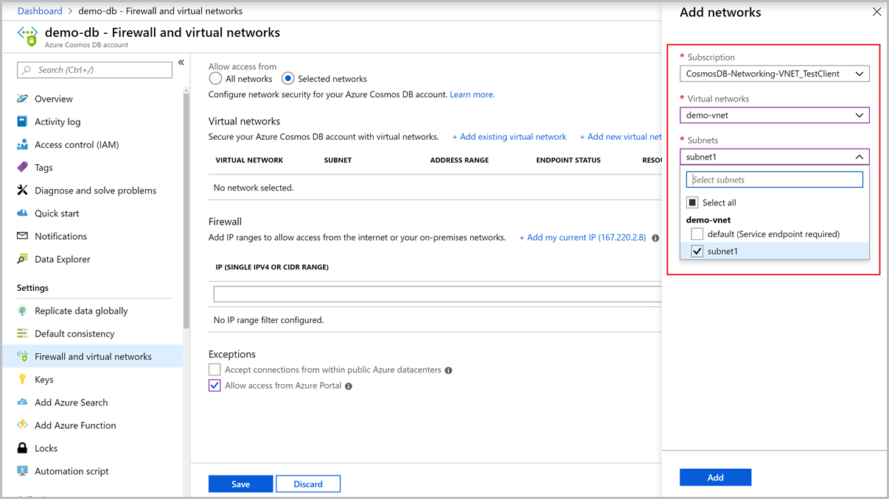
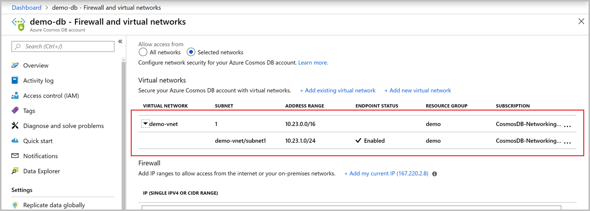
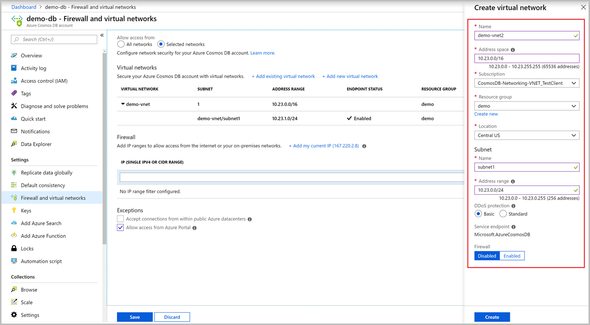

# Configure access from virtual networks (VNet)

You can configure Azure Cosmos DB accounts to allow access from only a specific subnet of an Azure virtual network. To limit access to an Azure Cosmos DB account with connections from a subnet in a virtual network:
 
1. Enable the subnet to send the subnet and virtual network identity to Azure Cosmos DB. You can achieve this by enabling a service endpoint for Azure Cosmos DB on the specific subnet.

1. Add a rule in the Azure Cosmos DB account to specify the subnet as a source from which the account can be accessed.

> [!NOTE]
> When a service endpoint for your Azure Cosmos DB account is enabled on a subnet, the source of the traffic that reaches Azure Cosmos DB switches from a public IP to a virtual network and subnet. The traffic switching applies for any Azure Cosmos DB account that's accessed from this subnet. If your Azure Cosmos DB accounts have an IP-based firewall to allow this subnet, requests from the service-enabled subnet no longer match the IP firewall rules, and they're rejected. 
>
> To learn more, see the steps outlined in the [Migrating from an IP firewall rule to a virtual network access control list](#migrate-from-firewall-to-vnet) section of this article. 

The following sections describe how to configure a virtual network service endpoint for an Azure Cosmos DB account.

## <a id="configure-using-portal"></a>Configure a service endpoint by using the Azure portal

### Configure a service endpoint for an existing Azure virtual network and subnet

1. From the **All resources** blade, find the Azure Cosmos DB account that you want to secure.

1. Select **Firewalls and virtual networks** from the settings menu, and choose to allow access from **Selected networks**.

1. To grant access to an existing virtual network's subnet, under **Virtual networks**, select **Add existing Azure virtual network**.

1. Select the **Subscription** from which you want to add an Azure virtual network. Select the Azure **Virtual networks** and **Subnets** that you want to provide access to your Azure Cosmos DB account. Next, select **Enable** to enable selected networks with service endpoints for "Microsoft.AzureCosmosDB". When it’s complete, select **Add**. 

   


1. After the Azure Cosmos DB account is enabled for access from a virtual network, it will allow traffic from only this chosen subnet. The virtual network and subnet that you added should appear as shown in the following screenshot:

   

> [!NOTE]
> To enable virtual network service endpoints, you need the following subscription permissions:
>   * Subscription with virtual network: Network contributor
>   * Subscription with Azure Cosmos DB account: DocumentDB account contributor
>   * If your virtual network and Azure Cosmos DB account are in different subscriptions, make sure that the subscription that has virtual network also has `Microsoft.DocumentDB` resource provider registered. To register a resource provider, see [Azure resource providers and types](../azure-resource-manager/resource-manager-supported-services.md) article. 

Here are the directions for registering subscription with resource provider.

### Configure a service endpoint for a new Azure virtual network and subnet

1. From the **All resources** blade, find the Azure Cosmos DB account that you want to secure.  

1. Select **Firewalls and Azure virtual networks** from the settings menu, and choose to allow access from **Selected networks**.  

1. To grant access to a new Azure virtual network, under **Virtual networks**, select **Add new virtual network**.  

1. Provide the details required to create a new virtual network, and then select **Create**. The subnet will be created with a service endpoint for "Microsoft.AzureCosmosDB" enabled.

   

If your Azure Cosmos DB account is used by other Azure services like Azure Search, or is accessed from Stream analytics or Power BI, you allow access by selecting **Accept connections from within public Azure datacenters**.

To ensure that you have access to Azure Cosmos DB metrics from the portal, you need to enable **Allow access from Azure portal** options. To learn more about these options, see the [Configure an IP firewall](how-to-configure-firewall.md) article. After you enable access, select **Save** to save the settings.

## <a id="remove-vnet-or-subnet"></a>Remove a virtual network or subnet 

1. From the **All resources** blade, find the Azure Cosmos DB account for which you assigned service endpoints.  

2. Select **Firewalls and virtual networks** from the settings menu.  

3. To remove a virtual network or subnet rule, select **...** next to the virtual network or subnet, and select **Remove**.

   

4.	Select **Save** to apply your changes.

## <a id="configure-using-powershell"></a>Configure a service endpoint by using Azure PowerShell

> [!NOTE]
> When you're using PowerShell or the Azure CLI, be sure to specify the complete list of IP filters and virtual network ACLs in parameters, not just the ones that need to be added.

Use the following steps to configure a service endpoint to an Azure Cosmos DB account by using Azure PowerShell:  

1. Install [Azure PowerShell](https://docs.microsoft.com/powershell/azure/azurerm/install-azurerm-ps) and [sign in](https://docs.microsoft.com/powershell/azure/authenticate-azureps).  

1. Enable the service endpoint for an existing subnet of a virtual network.  

   ```powershell
   $rgname = "<Resource group name>"
   $vnName = "<Virtual network name>"
   $sname = "<Subnet name>"
   $subnetPrefix = "<Subnet address range>"

   Get-AzureRmVirtualNetwork `
    -ResourceGroupName $rgname `
    -Name $vnName | Set-AzureRmVirtualNetworkSubnetConfig `
    -Name $sname  `
    -AddressPrefix $subnetPrefix `
    -ServiceEndpoint "Microsoft.AzureCosmosDB" | Set-AzureRmVirtualNetwork
   ```

1. Get virtual network information.

   ```powershell
   $vnProp = Get-AzureRmVirtualNetwork `
     -Name $vnName `
     -ResourceGroupName $rgName
   ```

1. Get properties of the Azure Cosmos DB account by running the following cmdlet:  

   ```powershell
   $apiVersion = "2015-04-08"
   $acctName = "<Azure Cosmos DB account name>"

   $cosmosDBConfiguration = Get-AzureRmResource `
     -ResourceType "Microsoft.DocumentDB/databaseAccounts" `
     -ApiVersion $apiVersion `
     -ResourceGroupName $rgName `
     -Name $acctName
   ```

1. Initialize the variables for use later. Set up all the variables from the existing account definition.

   ```powershell
   $locations = @()

   foreach ($readLocation in $cosmosDBConfiguration.Properties.readLocations) {
      $locations += , @{
         locationName     = $readLocation.locationName;
         failoverPriority = $readLocation.failoverPriority;
      }
   }

   $virtualNetworkRules = @(@{
      id = "$($vnProp.Id)/subnets/$sname";
   })

   if ($cosmosDBConfiguration.Properties.isVirtualNetworkFilterEnabled) {
      $virtualNetworkRules = $cosmosDBConfiguration.Properties.virtualNetworkRules + $virtualNetworkRules
   }
   ```

1. Update Azure Cosmos DB account properties with the new configuration by running the following cmdlets: 

   ```powershell
   $cosmosDBProperties = @{
      databaseAccountOfferType      = $cosmosDBConfiguration.Properties.databaseAccountOfferType;
      consistencyPolicy             = $cosmosDBConfiguration.Properties.consistencyPolicy;
      ipRangeFilter                 = $cosmosDBConfiguration.Properties.ipRangeFilter;
      locations                     = $locations;
      virtualNetworkRules           = $virtualNetworkRules;
      isVirtualNetworkFilterEnabled = $True;
   }

   Set-AzureRmResource `
     -ResourceType "Microsoft.DocumentDB/databaseAccounts" `
     -ApiVersion $apiVersion `
     -ResourceGroupName $rgName `
     -Name $acctName `
     -Properties $CosmosDBProperties
   ```

1. Run the following command to verify that your Azure Cosmos DB account is updated with the virtual network service endpoint that you configured in the previous step:

   ```powershell
   $UpdatedcosmosDBConfiguration = Get-AzureRmResource `
     -ResourceType "Microsoft.DocumentDB/databaseAccounts" `
     -ApiVersion $apiVersion `
     -ResourceGroupName $rgName `
     -Name $acctName

   $UpdatedcosmosDBConfiguration.Properties
   ```

## <a id="configure-using-cli"></a>Configure a service endpoint by using the Azure CLI 

1. Enable the service endpoint for a subnet in a virtual network.

1. Update the existing Azure Cosmos DB account with subnet access control lists (ACLs).

   ```azurecli-interactive

   name="<Azure Cosmos DB account name>"
   resourceGroupName="<Resource group name>"

   az cosmosdb update \
    --name $name \
    --resource-group $resourceGroupName \
    --enable-virtual-network true \
    --virtual-network-rules "/subscriptions/testsub/resourceGroups/testRG/providers/Microsoft.Network/virtualNetworks/testvnet/subnets/frontend"
   ```

1. Create a new Azure Cosmos DB account with subnet ACLs.

   ```azurecli-interactive
   az cosmosdb create \
    --name $name \
    --kind GlobalDocumentDB \
    --resource-group $resourceGroupName \
    --max-interval 10 \
    --max-staleness-prefix 200 \
    --enable-virtual-network true \
    --virtual-network-rules "/subscriptions/testsub/resourceGroups/testRG/providers/Microsoft.Network/virtualNetworks/testvnet/subnets/default"
   ```

## <a id="migrate-from-firewall-to-vnet"></a>Migrating from an IP firewall rule to a virtual network ACL 

Use the following steps only for Azure Cosmos DB accounts with existing IP firewall rules that allow a subnet, when you want to use virtual network and subnet-based ACLs instead of an IP firewall rule.

After a service endpoint for an Azure Cosmos DB account is turned on for a subnet, the requests are sent with a source that contains virtual network and subnet information instead of a public IP. These requests don't match an IP filter. This source switch happens for all Azure Cosmos DB accounts accessed from the subnet with a service endpoint enabled. To prevent downtime, use the following steps:

1. Get properties of the Azure Cosmos DB account by running the following cmdlet:

   ```powershell
   $apiVersion = "2015-04-08"
   $acctName = "<Azure Cosmos DB account name>"

   $cosmosDBConfiguration = Get-AzureRmResource `
     -ResourceType "Microsoft.DocumentDB/databaseAccounts" `
     -ApiVersion $apiVersion `
     -ResourceGroupName $rgName `
     -Name $acctName
   ```

1. Initialize the variables to use them later. Set up all the variables from the existing account definition. Add the virtual network ACL to all Azure Cosmos DB accounts being accessed from the subnet with `ignoreMissingVNetServiceEndpoint` flag.

   ```powershell
   $locations = @()

   foreach ($readLocation in $cosmosDBConfiguration.Properties.readLocations) {
      $locations += , @{
         locationName     = $readLocation.locationName;
         failoverPriority = $readLocation.failoverPriority;
      }
   }

   $subnetID = "Subnet ARM URL" e.g "/subscriptions/f7ddba26-ab7b-4a36-a2fa-7d01778da30b/resourceGroups/testrg/providers/Microsoft.Network/virtualNetworks/testvnet/subnets/subnet1"

   $virtualNetworkRules = @(@{
      id = $subnetID;
      ignoreMissingVNetServiceEndpoint = "True";
   })

   if ($cosmosDBConfiguration.Properties.isVirtualNetworkFilterEnabled) {
      $virtualNetworkRules = $cosmosDBConfiguration.Properties.virtualNetworkRules + $virtualNetworkRules
   }
   ```

1. Update Azure Cosmos DB account properties with the new configuration by running the following cmdlets:

   ```powershell
   $cosmosDBProperties = @{
      databaseAccountOfferType      = $cosmosDBConfiguration.Properties.databaseAccountOfferType;
      consistencyPolicy             = $cosmosDBConfiguration.Properties.consistencyPolicy;
      ipRangeFilter                 = $cosmosDBConfiguration.Properties.ipRangeFilter;
      locations                     = $locations;
      virtualNetworkRules           = $virtualNetworkRules;
      isVirtualNetworkFilterEnabled = $True;
   }

   Set-AzureRmResource `
      -ResourceType "Microsoft.DocumentDB/databaseAccounts" `
      -ApiVersion $apiVersion `
      -ResourceGroupName $rgName `
      -Name $acctName `
      -Properties $CosmosDBProperties
   ```

1. Repeat steps 1-3 for all Azure Cosmos DB accounts that you access from the subnet.

1.	Wait 15 minutes, and then update the subnet to enable the service endpoint.

1.	Enable the service endpoint for an existing subnet of a virtual network.

    ```powershell
    $rgname= "<Resource group name>"
    $vnName = "<virtual network name>"
    $sname = "<Subnet name>"
    $subnetPrefix = "<Subnet address range>"

    Get-AzureRmVirtualNetwork `
       -ResourceGroupName $rgname `
       -Name $vnName | Set-AzureRmVirtualNetworkSubnetConfig `
       -Name $sname `
       -AddressPrefix $subnetPrefix `
       -ServiceEndpoint "Microsoft.AzureCosmosDB" | Set-AzureRmVirtualNetwork
    ```

1. Remove the IP firewall rule for the subnet.

## Next steps

* To configure a firewall for Azure Cosmos DB, see the [Firewall support](firewall-support.md) article.
