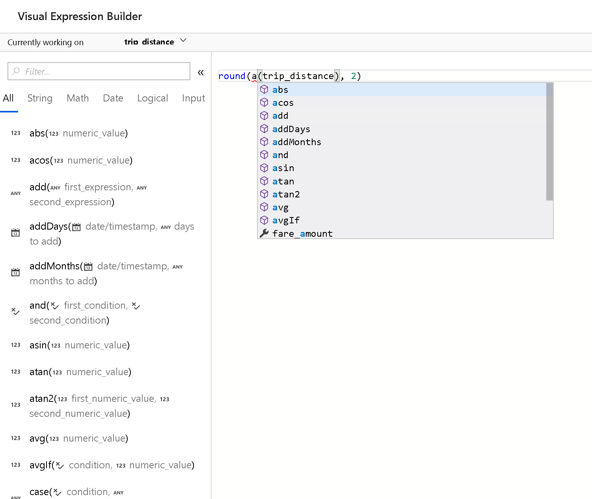
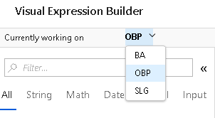
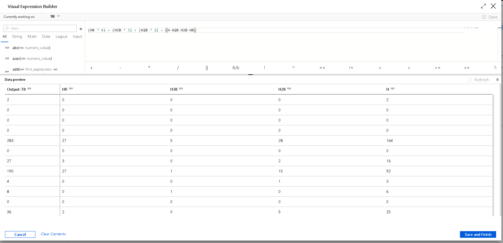
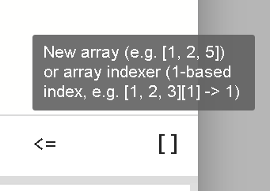

# Mapping Data Flow Expression Builder

[!INCLUDE [notes](../../includes/data-factory-data-flow-preview.md)]

In Azure Data Factory Mapping Data Flow, you'll find expression boxes where you can enter expressions for data transformation. Use columns, fields, variables, parameters, functions from your data flow in these boxes. To build the expression, use the Expression Builder, which is launched by clicking in the expression text box inside the transformation. You'll also sometimes see "Computed Column" options when selecting columns for transformation. When you click that, you'll also see the Expression Builder launched.


The Expression Builder tool defaults to the text editor option. the auto-complete feature reads from the entire Azure Data Factory Data Flow object model with syntax checking and highlighting.



## Currently Working on Field



At the top left of the Expression Builder UI, you will see a field called "Currently Working On" with the name of the field that you are currently working on. The expression that you build in the UI will be applied just to that currently working field. If you wish to transform another field, save your current work and use this drop-down to select another field and build an expression for the other fields.

## Data Preview in Debug mode



When you are working on your expressions, you can optionally switch on Debug mode from the Azure Data Factory Data Flow design surface, enabling live in-progress preview of your data results from the expression that you are building. Real-time live debugging is enabled for your expressions.


## Comments

Add comments to your expressions using single line and multi-line comment syntax:


## Regular Expressions

The Azure Data Factory Data Flow expression language, [full reference documentation here](https://aka.ms/dataflowexpressions), enables functions that include regular expression syntax. When using regular expression functions, the Expression Builder will try to interpret backslash (\) as an escape character sequence. When using backslashes in your regular expression, either enclose the entire regex in ticks ` ` or use a double backslash.

Example using ticks

```
regex_replace('100 and 200', `(\d+)`, 'digits')
```

or using double slash

```
regex_replace('100 and 200', '(\\d+)', 'digits')
```

## Addressing array indexes

With expression functions that return arrays, use square brackets [] to address specific indexes inside that return array object. The array is ones-based.



## Handling names with special characters

When you have column names that include special characters or spaces, surround the name with curly braces.
* ```{[dbo].this_is my complex name$$$}```

## Next steps

[Begin building data transformation expressions](data-flow-expression-functions.md)
