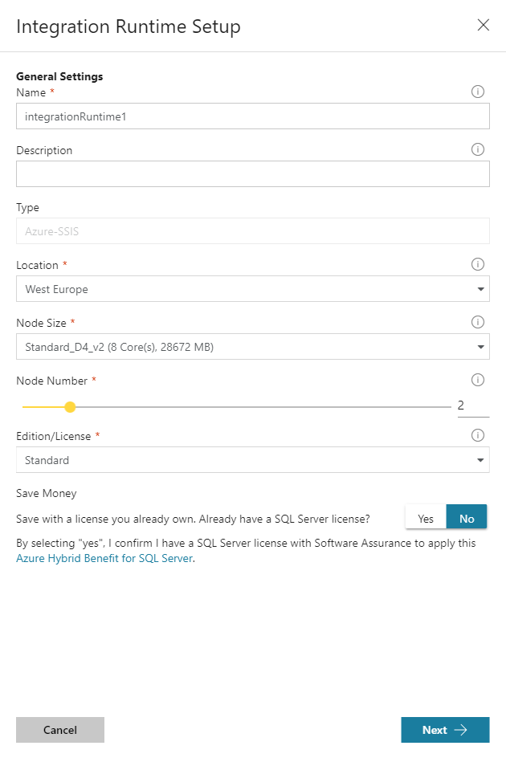
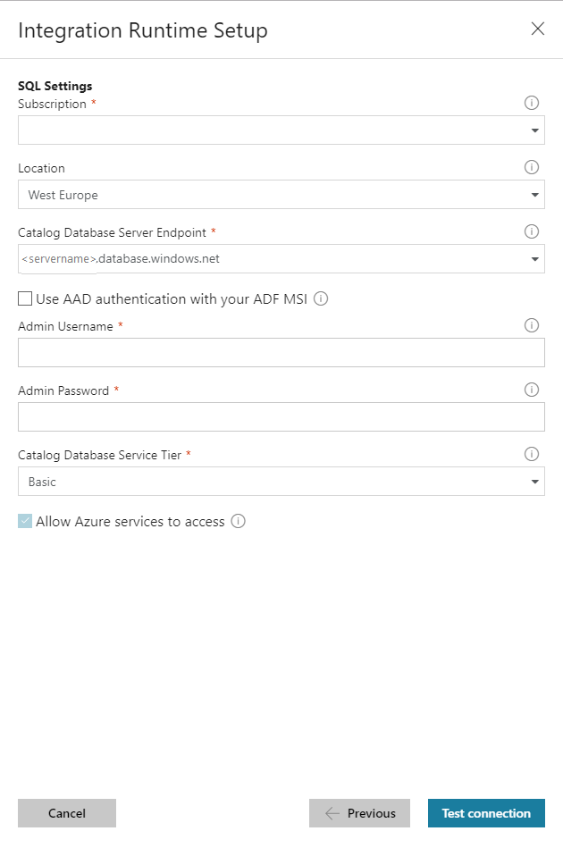
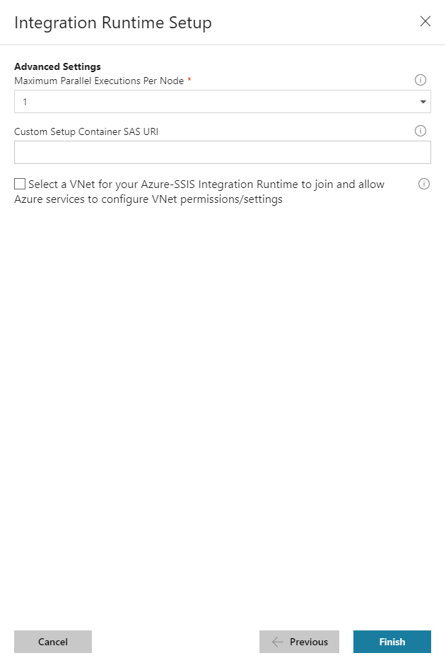
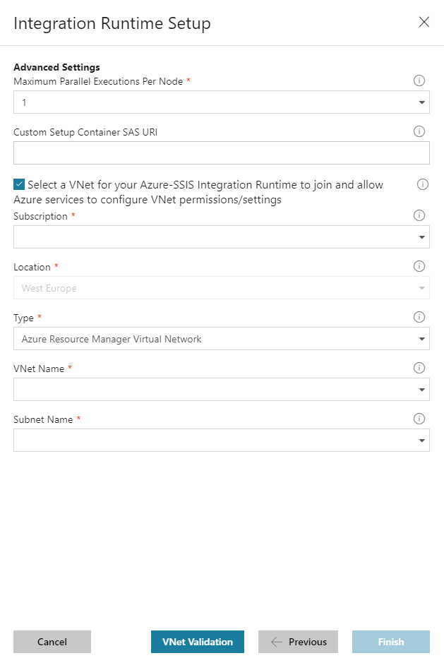

# Create Azure-SSIS Integration Runtime in Azure Data Factory
This article provides steps for provisioning Azure-SSIS Integration Runtime (IR) in Azure Data Factory (ADF). Then, you can use SQL Server Data Tools (SSDT) or SQL Server Management Studio (SSMS) to deploy and run SQL Server Integration Services (SSIS) packages on this integration runtime in Azure.

The [Tutorial: Deploy SSIS packages to Azure](tutorial-create-azure-ssis-runtime-portal.md) shows you how to create Azure-SSIS IR by using Azure SQL Database server to host SSIS catalog database (SSISDB). This article expands on the tutorial and shows you how to do the following things:

- Optionally use Azure SQL Database server with virtual network service endpoints/Managed Instance to host SSISDB. For guidance in choosing the type of database server to host SSISDB, see [Compare Azure SQL Database single databases/elastic pools and Managed Instance](create-azure-ssis-integration-runtime.md#compare-sql-database-single-databaseelastic-pool-and-sql-database-managed-instance). As a prerequisite, you  need to join your Azure-SSIS IR to a virtual network and configure virtual network permissions/settings as necessary. See [Join Azure-SSIS IR to a virtual network](https://docs.microsoft.com/azure/data-factory/join-azure-ssis-integration-runtime-virtual-network).

- Optionally use Azure Active Directory (AAD) authentication with the managed identity for your ADF to connect to the database server. As a prerequisite, you will need to add the managed identity for your ADF as a contained database user capable of creating SSISDB in your Azure SQL Database server/Managed Instance, see [Enable AAD authentication for Azure-SSIS IR](https://docs.microsoft.com/azure/data-factory/enable-aad-authentication-azure-ssis-ir).

## Overview
This article shows different ways of provisioning Azure-SSIS IR:

- [Azure portal](#azure-portal)
- [Azure PowerShell](#azure-powershell)
- [Azure Resource Manager template](#azure-resource-manager-template)

When you create Azure-SSIS IR, ADF service connects to your Azure SQL Database server/Managed Instance to prepare SSISDB. It also configures permissions/settings for your virtual network, if specified, and joins your Azure-SSIS IR to the virtual network.

When you provision Azure-SSIS IR, Azure Feature Pack for SSIS and Access Redistributable are also installed. These components provide connectivity to Excel/Access files and various Azure data sources, in addition to the data sources supported by built-in components. You can also install additional components. For more info, see [Custom setup for the Azure-SSIS integration runtime](how-to-configure-azure-ssis-ir-custom-setup.md).

## Prerequisites

[!INCLUDE [updated-for-az](../../includes/updated-for-az.md)]

- **Azure subscription**. If you do not already have a subscription, you can create a [free trial](https://azure.microsoft.com/pricing/free-trial/) account.

- **Azure SQL Database server or Managed Instance**. If you do not already have a database server, you can create one in Azure portal before you get started. This server will host SSISDB. We recommend that you create the database server in the same Azure region as your integration runtime. This configuration lets your integration runtime write execution logs to SSISDB without crossing Azure regions. Based on the selected database server, SSISDB can be created on your behalf as a single database, part of an elastic pool, or in your Managed Instance and accessible in public network or by joining a virtual network. For a list of supported pricing tiers for Azure SQL Database, see [SQL Database resource limits](../sql-database/sql-database-resource-limits.md).

    Make sure that your Azure SQL Database server/Managed Instance does not already have an SSISDB. The provisioning of Azure-SSIS IR does not support using an existing SSISDB.

- **Azure Resource Manager virtual network (optional)**. You must have an Azure Resource Manager virtual network if at least one of the following conditions is true:
    - You are hosting SSISDB in Azure SQL Database server with virtual network service endpoints or in Managed Instance that is inside a virtual network.
    - You want to connect to on-premises data stores from SSIS packages running on your Azure-SSIS IR.

- **Azure PowerShell**. Follow the instructions on [How to install and configure Azure PowerShell](/powershell/azure/install-az-ps), if you want to run a PowerShell script to provision Azure-SSIS IR.

### Region support
For a list of Azure regions, in which ADF and Azure-SSIS IR are currently available, see [ADF + SSIS IR availability by region](https://azure.microsoft.com/global-infrastructure/services/?products=data-factory&regions=all).

### Compare SQL Database single database/elastic pool and SQL Database Managed Instance

The following table compares certain features of Azure SQL Database server and Managed Instance as they relate to Azure-SSIR IR:

| Feature | single database/elastic pool| Managed Instance |
|---------|--------------|------------------|
| **Scheduling** | SQL Server Agent is not available.<br/><br/>See [Schedule a package execution in ADF pipeline](https://docs.microsoft.com/sql/integration-services/lift-shift/ssis-azure-schedule-packages?view=sql-server-2017#activity).| Managed Instance Agent is available. |
| **Authentication** | You can create SSISDB with a contained database user representing any AAD group with the managed identity of your ADF as a member in the **db_owner** role.<br/><br/>See [Enable Azure AD authentication to create SSISDB in Azure SQL Database server](enable-aad-authentication-azure-ssis-ir.md#enable-azure-ad-on-azure-sql-database). | You can create SSISDB with a contained database user representing the managed identity of your ADF. <br/><br/>See [Enable Azure AD authentication to create SSISDB in Azure SQL Database Managed Instance](enable-aad-authentication-azure-ssis-ir.md#enable-azure-ad-on-azure-sql-database-managed-instance). |
| **Service tier** | When you create Azure-SSIS IR with your Azure SQL Database server, you can select the service tier for SSISDB. There are multiple service tiers. | When you create Azure-SSIS IR with your Managed Instance, you cannot select the service tier for SSISDB. All databases in your Managed Instance share the same resource allocated to that instance. |
| **Virtual network** | Supports only Azure Resource Manager virtual networks for your Azure-SSIS IR to join if you use Azure SQL Database server with virtual network service endpoints or require access to on-premises data stores. | Supports only Azure Resource Manager virtual networks for your Azure-SSIS IR to join. The virtual network is always required.<br/><br/>If you join your Azure-SSIS IR to the same virtual network as your Managed Instance, make sure that your Azure-SSIS IR is in a different subnet than your Managed Instance. If you join your Azure-SSIS IR to a different virtual network than your Managed Instance, we recommend either a virtual network peering or virtual network to virtual network connection. See [Connect your application to Azure SQL Database Managed Instance](../sql-database/sql-database-managed-instance-connect-app.md). |
| **Distributed transactions** | Supported through Elastic Transactions. Microsoft Distributed Transaction Coordinator (MSDTC) transactions are not supported. If your SSIS packages use MSDTC to coordinate distributed transactions, consider migrating to Elastic Transactions for Azure SQL Database. For more info, see [Distributed transactions across cloud databases](../sql-database/sql-database-elastic-transactions-overview.md). | Not supported. |
| | | |

## Azure portal

In this section, you use Azure portal, specifically ADF User Interface (UI)/app, to create Azure-SSIS IR.

### Create a data factory

1. Launch **Microsoft Edge** or **Google Chrome** web browser. Currently, Data Factory UI is supported only in Microsoft Edge and Google Chrome web browsers.
1. Log in to the [Azure portal](https://portal.azure.com/).
1. Click **New** on the left menu, click **Data + Analytics**, and click **Data Factory**.

   

1. In the **New data factory** page, enter **MyAzureSsisDataFactory** for the **name**.

   

   The name of the Azure data factory must be **globally unique**. If you receive the following error, change the name of the data factory (for example, yournameMyAzureSsisDataFactory) and try creating again. See [Data Factory - Naming Rules](naming-rules.md) article for naming rules for Data Factory artifacts.

   `Data factory name “MyAzureSsisDataFactory” is not available`

1. Select your Azure **subscription** in which you want to create the data factory.
1. For the **Resource Group**, do one of the following steps:

   - Select **Use existing**, and select an existing resource group from the drop-down list.
   - Select **Create new**, and enter the name of a resource group.

   To learn about resource groups, see [Using resource groups to manage your Azure resources](../azure-resource-manager/resource-group-overview.md).

1. Select **V2** for the **version**.
1. Select the **location** for the data factory. Only locations that are supported for creation of data factories are shown in the list.
1. Select **Pin to dashboard**.
1. Click **Create**.
1. On the dashboard, you see the following tile with status: **Deploying data factory**.

    

1. After the creation is complete, you see the **Data Factory** page as shown in the image.

    

1. Click **Author & Monitor** to launch the Data Factory User Interface (UI) in a separate tab.

### Provision an Azure SSIS integration runtime
1. In the get started page, click **Configure SSIS Integration Runtime** tile.

   

1. On the **General Settings** page of **Integration Runtime Setup**, complete the following steps:

   

    a. For **Name**, enter the name of your integration runtime.

    b. For **Description**, enter the description of your integration runtime.

    c. For **Location**, select the location of your integration runtime. Only supported locations are displayed. We recommend that you select the same location of your database server to host SSISDB.

    d. For **Node Size**, select the size of node in your integration runtime cluster. Only supported node sizes are displayed. Select a large node size (scale up), if you want to run many compute/memory –intensive packages.

    e. For **Node Number**, select the number of nodes in your integration runtime cluster. Only supported node numbers are displayed. Select a large cluster with many nodes (scale out), if you want to run many packages in parallel.

    f. For **Edition/License**, select SQL Server edition/license for your integration runtime: Standard or Enterprise. Select Enterprise, if you want to use advanced/premium features on your integration runtime.

    g. For **Save Money**, select Azure Hybrid Benefit (AHB) option for your integration runtime: Yes or No. Select Yes, if you want to bring your own SQL Server license with Software Assurance to benefit from cost savings with hybrid use.

    h. Click **Next**.

1. On the **SQL Settings** page, complete the following steps:

   

    a. For **Subscription**, select the Azure subscription that has your database server to host SSISDB.

    b. For **Location**, select the location of your database server to host SSISDB. We recommend that you select the same location of your integration runtime.

    c. For **Catalog Database Server Endpoint**, select the endpoint of your database server to host SSISDB. Based on the selected database server, SSISDB can be created on your behalf as a single database, part of an elastic pool, or in a Managed Instance and accessible in public network or by joining a virtual network.

    d. On **Use AAD authentication...** checkbox, select the authentication method for your database server to host SSISDB: SQL or Azure Active Directory (AAD) with the managed identity for your Azure Data Factory. If you check it, you need to add the managed identity for your ADF into an AAD group with access permissions to the database server, see [Enable AAD authentication for Azure-SSIS IR](https://docs.microsoft.com/azure/data-factory/enable-aad-authentication-azure-ssis-ir).

    e. For **Admin Username**, enter SQL authentication username for your database server to host SSISDB.

    f. For **Admin Password**, enter SQL authentication password for your database server to host SSISDB.

    g. For **Catalog Database Service Tier**, select the service tier for your database server to host SSISDB: Basic/Standard/Premium tier or elastic pool name.

    h. Click **Test Connection** and if successful, click **Next**.

1.  On the **Advanced Settings** page, complete the following steps:

    

    a. For **Maximum Parallel Executions Per Node**, select the maximum number of packages to execute concurrently per node in your integration runtime cluster. Only supported package numbers are displayed. Select a low number, if you want to use more than one core to run a single large/heavy-weight package that is compute/memory -intensive. Select a high number, if you want to run one or more small/light-weight packages in a single core.

    b. For **Custom Setup Container SAS URI**, optionally enter Shared Access Signature (SAS) Uniform Resource Identifier (URI) of your Azure Storage Blob container where your setup script and its associated files are stored, see [Custom setup for Azure-SSIS IR](https://docs.microsoft.com/azure/data-factory/how-to-configure-azure-ssis-ir-custom-setup).

1. On **Select a virtual network...** checkbox, select whether you want to join your integration runtime to a virtual network. Check it if you use Azure SQL Database with virtual network service endpoints/Managed Instance to host SSISDB or require access to on-premises data; that is, you have on-premises data sources/destinations in your SSIS packages, see [Join Azure-SSIS IR to a virtual network](https://docs.microsoft.com/azure/data-factory/join-azure-ssis-integration-runtime-virtual-network). If you check it, complete the following steps:

   

    a. For **Subscription**, select the Azure subscription that has your virtual network.

    b. For **Location**, the same location of your integration runtime is selected.

    c. For **Type**, select the type of your virtual network: Classic or Azure Resource Manager. We recommend that you select Azure Resource Manager virtual network, since Classic virtual network will be deprecated soon.

    d. For **VNet Name**, select the name of your virtual network. This virtual network should be the same virtual network used for Azure SQL Database with virtual network service endpoints/Managed Instance to host SSISDB and or the one connected to your on-premises network.

    e. For **Subnet Name**, select the name of subnet for your virtual network. This should be a different subnet than the one used for Managed Instance to host SSISDB.

1. Click **VNet Validation** and if successful, click **Finish** to start the creation of your Azure-SSIS integration runtime.

    > [!IMPORTANT]
    > - This process takes approximately 20 to 30 minutes to complete
    > - The Data Factory service connects to your Azure SQL Database to prepare the SSIS Catalog database (SSISDB). It also configures permissions and settings for your virtual network, if specified, and joins the new instance of Azure-SSIS integration runtime to the virtual network.

1. In the **Connections** window, switch to **Integration Runtimes** if needed. Click **Refresh** to refresh the status.

   

1. Use the links under **Actions** column to stop/start, edit, or delete the integration runtime. Use the last link to view JSON code for the integration runtime. The edit and delete buttons are enabled only when the IR is stopped.

   

### Azure SSIS integration runtimes in the portal
1. In the Azure Data Factory UI, switch to the **Edit** tab, click **Connections**, and then switch to **Integration Runtimes** tab to view existing integration runtimes in your data factory.

   

1. Click **New** to create a new Azure-SSIS IR.

   

1. To create an Azure-SSIS integration runtime, click **New** as shown in the image.
1. In the Integration Runtime Setup window, select **Lift-and-shift existing SSIS packages to execute in Azure**, and then click **Next**.

   

1. See the [Provision an Azure SSIS integration runtime](#provision-an-azure-ssis-integration-runtime) section for the remaining steps to set up an Azure-SSIS IR.

## Azure PowerShell
In this section, you use the Azure PowerShell to create an Azure-SSIS IR.

### Create variables
Define variables for use in the script in this tutorial:

```powershell
### Azure Data Factory information
# If your input contains a PSH special character, e.g. "$", precede it with the escape character "`" like "`$"
$SubscriptionName = "[your Azure subscription name]"
$ResourceGroupName = "[your Azure resource group name]"
$DataFactoryName = "[your data factory name]"
# For supported regions, see https://azure.microsoft.com/global-infrastructure/services/?products=data-factory&regions=all
$DataFactoryLocation = "EastUS"

### Azure-SSIS integration runtime information - This is a Data Factory compute resource for running SSIS packages
$AzureSSISName = "[specify a name for your Azure-SSIS IR]"
$AzureSSISDescription = "[specify a description for your Azure-SSIS IR]"
# For supported regions, see https://azure.microsoft.com/global-infrastructure/services/?products=data-factory&regions=all
$AzureSSISLocation = "EastUS"
# For supported node sizes, see https://azure.microsoft.com/pricing/details/data-factory/ssis/
$AzureSSISNodeSize = "Standard_D8_v3"
# 1-10 nodes are currently supported
$AzureSSISNodeNumber = 2
# Azure-SSIS IR edition/license info: Standard or Enterprise
$AzureSSISEdition = "Standard" # Standard by default, while Enterprise lets you use advanced/premium features on your Azure-SSIS IR
# Azure-SSIS IR hybrid usage info: LicenseIncluded or BasePrice
$AzureSSISLicenseType = "LicenseIncluded" # LicenseIncluded by default, while BasePrice lets you bring your own on-premises SQL Server license with Software Assurance to earn cost savings from Azure Hybrid Benefit (AHB) option
# For a Standard_D1_v2 node, up to 4 parallel executions per node are supported, but for other nodes, up to (2 x number of cores) are currently supported
$AzureSSISMaxParallelExecutionsPerNode = 8
# Custom setup info
$SetupScriptContainerSasUri = "" # OPTIONAL to provide SAS URI of blob container where your custom setup script and its associated files are stored
# Virtual network info: Classic or Azure Resource Manager
$VnetId = "[your virtual network resource ID or leave it empty]" # REQUIRED if you use Azure SQL Database with virtual network service endpoints/Managed Instance/on-premises data, Azure Resource Manager virtual network is recommended, Classic virtual network will be deprecated soon
$SubnetName = "[your subnet name or leave it empty]" # WARNING: Please use the same subnet as the one used with your Azure SQL Database with virtual network service endpoints or a different subnet than the one used for your Managed Instance

### SSISDB info
$SSISDBServerEndpoint = "[your Azure SQL Database server name or Managed Instance name.DNS prefix].database.windows.net" # WARNING: Please ensure that there is no existing SSISDB, so we can prepare and manage one on your behalf
# Authentication info: SQL or Azure Active Directory (AAD)
$SSISDBServerAdminUserName = "[your server admin username for SQL authentication or leave it empty for AAD authentication]"
$SSISDBServerAdminPassword = "[your server admin password for SQL authentication or leave it empty for AAD authentication]"
$SSISDBPricingTier = "[Basic|S0|S1|S2|S3|S4|S6|S7|S9|S12|P1|P2|P4|P6|P11|P15|…|ELASTIC_POOL(name = <elastic_pool_name>) for Azure SQL Database or leave it empty for Managed Instance]"
```

### Log in and select subscription
Add the following code the script to log in and select your Azure subscription:

```powershell
Connect-AzAccount
Select-AzSubscription -SubscriptionName $SubscriptionName
```

### Validate the connection to database
Add the following script to validate your Azure SQL Database server endpoint.

```powershell
# Validate only when you do not use VNet nor AAD authentication
if([string]::IsNullOrEmpty($VnetId) -and [string]::IsNullOrEmpty($SubnetName))
{
    if(![string]::IsNullOrEmpty($SSISDBServerAdminUserName) -and ![string]::IsNullOrEmpty($SSISDBServerAdminPassword))
    {
        $SSISDBConnectionString = "Data Source=" + $SSISDBServerEndpoint + ";User ID=" + $SSISDBServerAdminUserName + ";Password=" + $SSISDBServerAdminPassword
        $sqlConnection = New-Object System.Data.SqlClient.SqlConnection $SSISDBConnectionString;
        Try
        {
            $sqlConnection.Open();
        }
        Catch [System.Data.SqlClient.SqlException]
        {
            Write-Warning "Cannot connect to your Azure SQL Database server, exception: $_";
            Write-Warning "Please make sure the server you specified has already been created. Do you want to proceed? [Y/N]"
            $yn = Read-Host
            if(!($yn -ieq "Y"))
            {
                Return;
            }
        }
    }
}
```

### Configure virtual network
Add the following script to automatically configure virtual network permissions/settings for your Azure-SSIS integration runtime to join.

```powershell
# Make sure to run this script against the subscription to which the virtual network belongs
if(![string]::IsNullOrEmpty($VnetId) -and ![string]::IsNullOrEmpty($SubnetName))
{
    # Register to the Azure Batch resource provider
    $BatchApplicationId = "ddbf3205-c6bd-46ae-8127-60eb93363864"
    $BatchObjectId = (Get-AzADServicePrincipal -ServicePrincipalName $BatchApplicationId).Id
    Register-AzResourceProvider -ProviderNamespace Microsoft.Batch
    while(!(Get-AzResourceProvider -ProviderNamespace "Microsoft.Batch").RegistrationState.Contains("Registered"))
    {
    Start-Sleep -s 10
    }
    if($VnetId -match "/providers/Microsoft.ClassicNetwork/")
    {
        # Assign the VM contributor role to Microsoft.Batch
        New-AzRoleAssignment -ObjectId $BatchObjectId -RoleDefinitionName "Classic Virtual Machine Contributor" -Scope $VnetId
    }
}
```

### Create a resource group
Create an [Azure resource group](../azure-resource-manager/resource-group-overview.md) using the [New-AzResourceGroup](/powershell/module/az.resources/new-azresourcegroup) command. A resource group is a logical container into which Azure resources are deployed and managed as a group.

```powershell
New-AzResourceGroup -Location $DataFactoryLocation -Name $ResourceGroupName
```

### Create a data factory
Run the following command to create a data factory.

```powershell
Set-AzDataFactoryV2 -ResourceGroupName $ResourceGroupName `
                         -Location $DataFactoryLocation `
                         -Name $DataFactoryName
```

### Create an integration runtime
Run the following commands to create an Azure-SSIS integration runtime that runs SSIS packages in Azure.

If you do not use Azure SQL Database with virtual network service endpoints/Managed Instance to host SSISDB nor require access to on-premises data, you can omit VNetId and Subnet parameters or pass empty values for them. Otherwise, you cannot omit them and must pass valid values from your virtual network configuration, see [Join Azure-SSIS IR to a virtual network](https://docs.microsoft.com/azure/data-factory/join-azure-ssis-integration-runtime-virtual-network).

If you use Managed Instance to host SSISDB, you can omit CatalogPricingTier parameter or pass an empty value for it. Otherwise, you cannot omit it and must pass a valid value from the list of supported pricing tiers for Azure SQL Database, see [SQL Database resource limits](../sql-database/sql-database-resource-limits.md).

If you use Azure Active Directory (AAD) authentication with the managed identity for your Azure Data Factory to connect to the database server, you can omit CatalogAdminCredential parameter, but you must add the managed identity for your ADF into an AAD group with access permissions to the database server, see [Enable AAD authentication for Azure-SSIS IR](https://docs.microsoft.com/azure/data-factory/enable-aad-authentication-azure-ssis-ir). Otherwise, you cannot omit it and must pass a valid object formed from your server admin username and password for SQL authentication.

```powershell
Set-AzDataFactoryV2IntegrationRuntime -ResourceGroupName $ResourceGroupName `
                                           -DataFactoryName $DataFactoryName `
                                           -Name $AzureSSISName `
                                           -Description $AzureSSISDescription `
                                           -Type Managed `
                                           -Location $AzureSSISLocation `
                                           -NodeSize $AzureSSISNodeSize `
                                           -NodeCount $AzureSSISNodeNumber `
                                           -Edition $AzureSSISEdition `
                                           -LicenseType $AzureSSISLicenseType `
                                           -MaxParallelExecutionsPerNode $AzureSSISMaxParallelExecutionsPerNode `
                                           -VnetId $VnetId `
                                           -Subnet $SubnetName `
                                           -CatalogServerEndpoint $SSISDBServerEndpoint `
                                           -CatalogPricingTier $SSISDBPricingTier

# Add SetupScriptContainerSasUri parameter when you use custom setup
if(![string]::IsNullOrEmpty($SetupScriptContainerSasUri))
{
    Set-AzDataFactoryV2IntegrationRuntime -ResourceGroupName $ResourceGroupName `
                                               -DataFactoryName $DataFactoryName `
                                               -Name $AzureSSISName `
                                               -SetupScriptContainerSasUri $SetupScriptContainerSasUri
}

# Add CatalogAdminCredential parameter when you do not use AAD authentication
if(![string]::IsNullOrEmpty($SSISDBServerAdminUserName) –and ![string]::IsNullOrEmpty($SSISDBServerAdminPassword))
{
    $secpasswd = ConvertTo-SecureString $SSISDBServerAdminPassword -AsPlainText -Force
    $serverCreds = New-Object System.Management.Automation.PSCredential($SSISDBServerAdminUserName, $secpasswd)

    Set-AzDataFactoryV2IntegrationRuntime -ResourceGroupName $ResourceGroupName `
                                               -DataFactoryName $DataFactoryName `
                                               -Name $AzureSSISName `
                                               -CatalogAdminCredential $serverCreds
}
```

### Start integration runtime
Run the following command to start the Azure-SSIS integration runtime:

```powershell
write-host("##### Starting #####")
Start-AzDataFactoryV2IntegrationRuntime -ResourceGroupName $ResourceGroupName `
                                             -DataFactoryName $DataFactoryName `
                                             -Name $AzureSSISName `
                                             -Force

write-host("##### Completed #####")
write-host("If any cmdlet is unsuccessful, please consider using -Debug option for diagnostics.")
```

This command takes from **20 to 30 minutes** to complete.

### Full script
Here is the full script that creates an Azure-SSIS integration runtime.

```powershell
### Azure Data Factory information
# If your input contains a PSH special character, e.g. "$", precede it with the escape character "`" like "`$"
$SubscriptionName = "[your Azure subscription name]"
$ResourceGroupName = "[your Azure resource group name]"
$DataFactoryName = "[your data factory name]"
# For supported regions, see https://azure.microsoft.com/global-infrastructure/services/?products=data-factory&regions=all
$DataFactoryLocation = "EastUS"

### Azure-SSIS integration runtime information - This is a Data Factory compute resource for running SSIS packages
$AzureSSISName = "[specify a name for your Azure-SSIS IR]"
$AzureSSISDescription = "[specify a description for your Azure-SSIS IR]"
# For supported regions, see https://azure.microsoft.com/global-infrastructure/services/?products=data-factory&regions=all
$AzureSSISLocation = "EastUS"
# For supported node sizes, see https://azure.microsoft.com/pricing/details/data-factory/ssis/
$AzureSSISNodeSize = "Standard_D8_v3"
# 1-10 nodes are currently supported
$AzureSSISNodeNumber = 2
# Azure-SSIS IR edition/license info: Standard or Enterprise
$AzureSSISEdition = "Standard" # Standard by default, while Enterprise lets you use advanced/premium features on your Azure-SSIS IR
# Azure-SSIS IR hybrid usage info: LicenseIncluded or BasePrice
$AzureSSISLicenseType = "LicenseIncluded" # LicenseIncluded by default, while BasePrice lets you bring your own on-premises SQL Server license with Software Assurance to earn cost savings from Azure Hybrid Benefit (AHB) option
# For a Standard_D1_v2 node, up to 4 parallel executions per node are supported, but for other nodes, up to (2 x number of cores) are currently supported
$AzureSSISMaxParallelExecutionsPerNode = 8
# Custom setup info
$SetupScriptContainerSasUri = "" # OPTIONAL to provide SAS URI of blob container where your custom setup script and its associated files are stored
# Virtual network info: Classic or Azure Resource Manager
$VnetId = "[your virtual network resource ID or leave it empty]" # REQUIRED if you use Azure SQL Database with virtual network service endpoints/Managed Instance/on-premises data, Azure Resource Manager virtual network is recommended, Classic virtual network will be deprecated soon
$SubnetName = "[your subnet name or leave it empty]" # WARNING: Please use the same subnet as the one used with your Azure SQL Database with virtual network service endpoints or a different subnet than the one used for your Managed Instance

### SSISDB info
$SSISDBServerEndpoint = "[your Azure SQL Database server name or Managed Instance name.DNS prefix].database.windows.net" # WARNING: Please ensure that there is no existing SSISDB, so we can prepare and manage one on your behalf
# Authentication info: SQL or Azure Active Directory (AAD)
$SSISDBServerAdminUserName = "[your server admin username for SQL authentication or leave it empty for AAD authentication]"
$SSISDBServerAdminPassword = "[your server admin password for SQL authentication or leave it empty for AAD authentication]"
$SSISDBPricingTier = "[Basic|S0|S1|S2|S3|S4|S6|S7|S9|S12|P1|P2|P4|P6|P11|P15|…|ELASTIC_POOL(name = <elastic_pool_name>) for Azure SQL Database or leave it empty for Managed Instance]"

### Log in and select subscription
Connect-AzAccount
Select-AzSubscription -SubscriptionName $SubscriptionName

### Validate the connection to database
# Validate only when you do not use VNet nor AAD authentication
if([string]::IsNullOrEmpty($VnetId) -and [string]::IsNullOrEmpty($SubnetName))
{
    if(![string]::IsNullOrEmpty($SSISDBServerAdminUserName) -and ![string]::IsNullOrEmpty($SSISDBServerAdminPassword))
    {
        $SSISDBConnectionString = "Data Source=" + $SSISDBServerEndpoint + ";User ID=" + $SSISDBServerAdminUserName + ";Password=" + $SSISDBServerAdminPassword
        $sqlConnection = New-Object System.Data.SqlClient.SqlConnection $SSISDBConnectionString;
        Try
        {
            $sqlConnection.Open();
        }
        Catch [System.Data.SqlClient.SqlException]
        {
            Write-Warning "Cannot connect to your Azure SQL Database server, exception: $_";
            Write-Warning "Please make sure the server you specified has already been created. Do you want to proceed? [Y/N]"
            $yn = Read-Host
            if(!($yn -ieq "Y"))
            {
                Return;
            }
        }
    }
}

### Configure virtual network
# Make sure to run this script against the subscription to which the virtual network belongs
if(![string]::IsNullOrEmpty($VnetId) -and ![string]::IsNullOrEmpty($SubnetName))
{
    # Register to the Azure Batch resource provider
    $BatchApplicationId = "ddbf3205-c6bd-46ae-8127-60eb93363864"
    $BatchObjectId = (Get-AzADServicePrincipal -ServicePrincipalName $BatchApplicationId).Id
    Register-AzResourceProvider -ProviderNamespace Microsoft.Batch
    while(!(Get-AzResourceProvider -ProviderNamespace "Microsoft.Batch").RegistrationState.Contains("Registered"))
    {
    Start-Sleep -s 10
    }
    if($VnetId -match "/providers/Microsoft.ClassicNetwork/")
    {
        # Assign the VM contributor role to Microsoft.Batch
        New-AzRoleAssignment -ObjectId $BatchObjectId -RoleDefinitionName "Classic Virtual Machine Contributor" -Scope $VnetId
    }
}

### Create a data factory
Set-AzDataFactoryV2 -ResourceGroupName $ResourceGroupName `
                         -Location $DataFactoryLocation `
                         -Name $DataFactoryName

### Create an integration runtime
Set-AzDataFactoryV2IntegrationRuntime -ResourceGroupName $ResourceGroupName `
                                           -DataFactoryName $DataFactoryName `
                                           -Name $AzureSSISName `
                                           -Description $AzureSSISDescription `
                                           -Type Managed `
                                           -Location $AzureSSISLocation `
                                           -NodeSize $AzureSSISNodeSize `
                                           -NodeCount $AzureSSISNodeNumber `
                                           -Edition $AzureSSISEdition `
                                           -LicenseType $AzureSSISLicenseType `
                                           -MaxParallelExecutionsPerNode $AzureSSISMaxParallelExecutionsPerNode `
                                           -VnetId $VnetId `
                                           -Subnet $SubnetName `
                                           -CatalogServerEndpoint $SSISDBServerEndpoint `
                                           -CatalogPricingTier $SSISDBPricingTier

# Add SetupScriptContainerSasUri parameter when you use custom setup
if(![string]::IsNullOrEmpty($SetupScriptContainerSasUri))
{
    Set-AzDataFactoryV2IntegrationRuntime -ResourceGroupName $ResourceGroupName `
                                               -DataFactoryName $DataFactoryName `
                                               -Name $AzureSSISName `
                                               -SetupScriptContainerSasUri $SetupScriptContainerSasUri
}

# Add CatalogAdminCredential parameter when you do not use AAD authentication
if(![string]::IsNullOrEmpty($SSISDBServerAdminUserName) –and ![string]::IsNullOrEmpty($SSISDBServerAdminPassword))
{
    $secpasswd = ConvertTo-SecureString $SSISDBServerAdminPassword -AsPlainText -Force
    $serverCreds = New-Object System.Management.Automation.PSCredential($SSISDBServerAdminUserName, $secpasswd)

    Set-AzDataFactoryV2IntegrationRuntime -ResourceGroupName $ResourceGroupName `
                                               -DataFactoryName $DataFactoryName `
                                               -Name $AzureSSISName `
                                               -CatalogAdminCredential $serverCreds
}

### Start integration runtime
write-host("##### Starting your Azure-SSIS integration runtime. This command takes 20 to 30 minutes to complete. #####")
Start-AzDataFactoryV2IntegrationRuntime -ResourceGroupName $ResourceGroupName `
                                             -DataFactoryName $DataFactoryName `
                                             -Name $AzureSSISName `
                                             -Force

write-host("##### Completed #####")
write-host("If any cmdlet is unsuccessful, please consider using -Debug option for diagnostics.")
```

## Azure Resource Manager template
In this section, you use the Azure Resource Manager template to create Azure-SSIS integration runtime. Here is a sample walkthrough:

1. Create a JSON file with the following Azure Resource Manager template. Replace values in the angled brackets (place holders) with your own values.

    ```json
    {
    	"contentVersion": "1.0.0.0",
    	"$schema": "https://schema.management.azure.com/schemas/2015-01-01/deploymentTemplate.json#",
    	"parameters": {},
    	"variables": {},
    	"resources": [{
    		"name": "<Specify a name for your data factory>",
    		"apiVersion": "2018-06-01",
    		"type": "Microsoft.DataFactory/factories",
    		"location": "East US",
    		"properties": {},
    		"resources": [{
    			"type": "integrationruntimes",
    			"name": "<Specify a name for your Azure-SSIS IR>",
    			"dependsOn": [ "<The name of the data factory you specified at the beginning>" ],
    			"apiVersion": "2018-06-01",
    			"properties": {
    				"type": "Managed",
    				"typeProperties": {
    					"computeProperties": {
    						"location": "East US",
    						"nodeSize": "Standard_D8_v3",
    						"numberOfNodes": 1,
    						"maxParallelExecutionsPerNode": 8
    					},
    					"ssisProperties": {
    						"catalogInfo": {
    							"catalogServerEndpoint": "<Azure SQL Database server name>.database.windows.net",
    							"catalogAdminUserName": "<Azure SQL Database server admin username>",
    							"catalogAdminPassword": {
    								"type": "SecureString",
    								"value": "<Azure SQL Database server admin password>"
    							},
    							"catalogPricingTier": "Basic"
    						}
    					}
    				}
    			}
    		}]
    	}]
    }
    ```
    
1. To deploy the Azure Resource Manager template, run New-AzResourceGroupDeployment command as shown in the following example, where ADFTutorialResourceGroup is the name of your resource group and ADFTutorialARM.json is the file that contains JSON definition for your data factory and Azure-SSIS IR.

    ```powershell
    New-AzResourceGroupDeployment -Name MyARMDeployment -ResourceGroupName ADFTutorialResourceGroup -TemplateFile ADFTutorialARM.json
    ```

    This command creates your data factory and Azure-SSIS IR in it, but it does not start the IR.

1. To start your Azure-SSIS IR, run Start-AzDataFactoryV2IntegrationRuntime command:

    ```powershell
    Start-AzDataFactoryV2IntegrationRuntime -ResourceGroupName "<Resource Group Name>" `
                                                 -DataFactoryName "<Data Factory Name>" `
                                                 -Name "<Azure SSIS IR Name>" `
                                                 -Force
    ```

## Deploy SSIS packages
Now, use SQL Server Data Tools (SSDT) or SQL Server Management Studio (SSMS) to deploy your SSIS packages to Azure. Connect to your database server that hosts the SSIS catalog (SSISDB). The name of database server is in the format: &lt;Azure SQL Database server name&gt;.database.windows.net or &lt;Managed Instance name.DNS prefix&gt;.database.windows.net. See [Deploy packages](/sql/integration-services/packages/deploy-integration-services-ssis-projects-and-packages#deploy-packages-to-integration-services-server) article for instructions.

## Next steps
See the other Azure-SSIS IR topics in this documentation:

- [Azure-SSIS Integration Runtime](concepts-integration-runtime.md#azure-ssis-integration-runtime). This article provides conceptual information about integration runtimes in general including the Azure-SSIS IR.
- [Tutorial: deploy SSIS packages to Azure](tutorial-create-azure-ssis-runtime-portal.md). This article provides step-by-step instructions to create an Azure-SSIS IR and uses an Azure SQL database to host the SSIS catalog.
- [Monitor an Azure-SSIS IR](monitor-integration-runtime.md#azure-ssis-integration-runtime). This article shows you how to retrieve information about an Azure-SSIS IR and descriptions of statuses in the returned information.
- [Manage an Azure-SSIS IR](manage-azure-ssis-integration-runtime.md). This article shows you how to stop, start, or remove an Azure-SSIS IR. It also shows you how to scale out your Azure-SSIS IR by adding more nodes to the IR.
- [Join an Azure-SSIS IR to a virtual network](join-azure-ssis-integration-runtime-virtual-network.md). This article provides conceptual information about joining your Azure-SSIS IR to an Azure virtual network. It also provides steps to use Azure portal to configure virtual network so that Azure-SSIS IR can join the virtual network.
