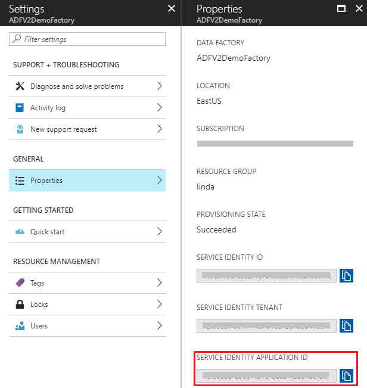

# Managed identity for Data Factory

This article helps you understand what is managed identity for Data Factory (formerly known as Managed Service Identity/MSI) and how it works.

[!INCLUDE [updated-for-az](../../includes/updated-for-az.md)]

## Overview

When creating a data factory, a managed identity can be created along with factory creation. The managed identity is a managed application registered to Azure Activity Directory, and represents this specific data factory.

Managed identity for Data Factory benefits the following features:

- [Store credential in Azure Key Vault](store-credentials-in-key-vault.md), in which case data factory managed identity is used for Azure Key Vault authentication.
- Connectors including [Azure Blob storage](connector-azure-blob-storage.md), [Azure Data Lake Storage Gen1](connector-azure-data-lake-store.md), [Azure Data Lake Storage Gen2](connector-azure-data-lake-storage.md), [Azure SQL Database](connector-azure-sql-database.md), and [Azure SQL Data Warehouse](connector-azure-sql-data-warehouse.md).
- [Web activity](control-flow-web-activity.md).

## Generate managed identity

Managed identity for Data Factory is generated as follows:

- When creating data factory through **Azure portal or PowerShell**, managed identity will always be created automatically.
- When creating data factory through **SDK**, managed identity will be created only if you specify "Identity = new FactoryIdentity()" in the factory object for creation. See example in [.NET quickstart - create data factory](quickstart-create-data-factory-dot-net.md#create-a-data-factory).
- When creating data factory through **REST API**, managed identity will be created only if you specify "identity" section in request body. See example in [REST quickstart - create data factory](quickstart-create-data-factory-rest-api.md#create-a-data-factory).

If you find your data factory doesn't have a managed identity associated following [retrieve managed identity](#retrieve-managed-identity) instruction, you can explicitly generate one by updating the data factory with identity initiator programmatically:

- [Generate managed identity using PowerShell](#generate-managed-identity-using-powershell)
- [Generate managed identity using REST API](#generate-managed-identity-using-rest-api)
- Generate managed identity using an Azure Resource Manager template
- [Generate managed identity using SDK](#generate-managed-identity-using-sdk)

>[!NOTE]
>- Managed identity cannot be modified. Updating a data factory which already have a managed identity won't have any impact, the managed identity is kept unchanged.
>- If you update a data factory which already have a managed identity without specifying "identity" parameter in the factory object or without specifying "identity" section in REST request body, you will get an error.
>- When you delete a data factory, the associated managed identity will be deleted along.

### Generate managed identity using PowerShell

Call **Set-AzDataFactoryV2** command again, then you see "Identity" fields being newly generated:

```powershell
PS C:\WINDOWS\system32> Set-AzDataFactoryV2 -ResourceGroupName <resourceGroupName> -Name <dataFactoryName> -Location <region>

DataFactoryName   : ADFV2DemoFactory
DataFactoryId     : /subscriptions/<subsID>/resourceGroups/<resourceGroupName>/providers/Microsoft.DataFactory/factories/ADFV2DemoFactory
ResourceGroupName : <resourceGroupName>
Location          : East US
Tags              : {}
Identity          : Microsoft.Azure.Management.DataFactory.Models.FactoryIdentity
ProvisioningState : Succeeded
```

### Generate managed identity using REST API

Call below API with "identity" section in the request body:

```
PATCH https://management.azure.com/subscriptions/<subsID>/resourceGroups/<resourceGroupName>/providers/Microsoft.DataFactory/factories/<data factory name>?api-version=2018-06-01
```

**Request body**: add "identity": { "type": "SystemAssigned" }.

```json
{
    "name": "<dataFactoryName>",
    "location": "<region>",
    "properties": {},
    "identity": {
        "type": "SystemAssigned"
    }
}
```

**Response**: managed identity is created automatically, and "identity" section is populated accordingly.

```json
{
    "name": "<dataFactoryName>",
    "tags": {},
    "properties": {
        "provisioningState": "Succeeded",
        "loggingStorageAccountKey": "**********",
        "createTime": "2017-09-26T04:10:01.1135678Z",
        "version": "2018-06-01"
    },
    "identity": {
        "type": "SystemAssigned",
        "principalId": "765ad4ab-XXXX-XXXX-XXXX-51ed985819dc",
        "tenantId": "72f988bf-XXXX-XXXX-XXXX-2d7cd011db47"
    },
    "id": "/subscriptions/<subscriptionId>/resourceGroups/<resourceGroupName>/providers/Microsoft.DataFactory/factories/ADFV2DemoFactory",
    "type": "Microsoft.DataFactory/factories",
    "location": "<region>"
}
```

### Generate managed identity using an Azure Resource Manager template

**Template**: add "identity": { "type": "SystemAssigned" }.

```json
{
    "contentVersion": "1.0.0.0",
    "$schema": "https://schema.management.azure.com/schemas/2015-01-01/deploymentTemplate.json#",
    "resources": [{
        "name": "<dataFactoryName>",
        "apiVersion": "2018-06-01",
        "type": "Microsoft.DataFactory/factories",
        "location": "<region>",
        "identity": {
			"type": "SystemAssigned"
		}
    }]
}
```

### Generate managed identity using SDK

Call the data factory create_or_update function with Identity=new FactoryIdentity(). Sample code using .NET:

```csharp
Factory dataFactory = new Factory
{
    Location = <region>,
    Identity = new FactoryIdentity()
};
client.Factories.CreateOrUpdate(resourceGroup, dataFactoryName, dataFactory);
```

## Retrieve managed identity

You can retrieve the managed identity from Azure portal or programmatically. The following sections show some samples.

>[!TIP]
> If you don't see the managed identity, [generate managed identity](#generate-managed-identity) by updating your factory.

### Retrieve managed identity using Azure portal

You can find the managed identity information from Azure portal -> your data factory -> Settings -> Properties:

- SERVICE IDENTITY ID
- SERVICE IDENTITY TENANT
- **SERVICE IDENTITY APPLICATION ID** > copy this value



### Retrieve managed identity using PowerShell

The managed identity principal ID and tenant ID will be returned when you get a specific data factory as follows:

```powershell
PS C:\WINDOWS\system32> (Get-AzDataFactoryV2 -ResourceGroupName <resourceGroupName> -Name <dataFactoryName>).Identity

PrincipalId                          TenantId
-----------                          --------
765ad4ab-XXXX-XXXX-XXXX-51ed985819dc 72f988bf-XXXX-XXXX-XXXX-2d7cd011db47
```

Copy the principal ID, then run below Azure Active Directory command with principal ID as parameter to get the **ApplicationId**, which you use to grant access:

```powershell
PS C:\WINDOWS\system32> Get-AzADServicePrincipal -ObjectId 765ad4ab-XXXX-XXXX-XXXX-51ed985819dc

ServicePrincipalNames : {76f668b3-XXXX-XXXX-XXXX-1b3348c75e02, https://identity.azure.net/P86P8g6nt1QxfPJx22om8MOooMf/Ag0Qf/nnREppHkU=}
ApplicationId         : 76f668b3-XXXX-XXXX-XXXX-1b3348c75e02
DisplayName           : ADFV2DemoFactory
Id                    : 765ad4ab-XXXX-XXXX-XXXX-51ed985819dc
Type                  : ServicePrincipal
```

## Next steps
See the following topics which introduce when and how to use data factory managed identity:

- [Store credential in Azure Key Vault](store-credentials-in-key-vault.md)
- [Copy data from/to Azure Data Lake Store using managed identities for Azure resources authentication](connector-azure-data-lake-store.md)

See [Managed Identities for Azure Resources Overview](/azure/active-directory/managed-identities-azure-resources/overview) for more background on managed identities for Azure resources, which data factory managed identity is based upon. 
