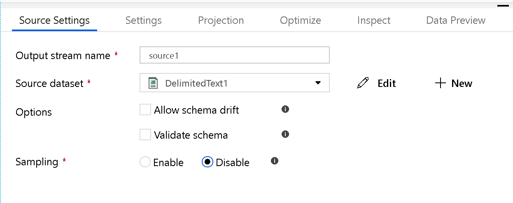
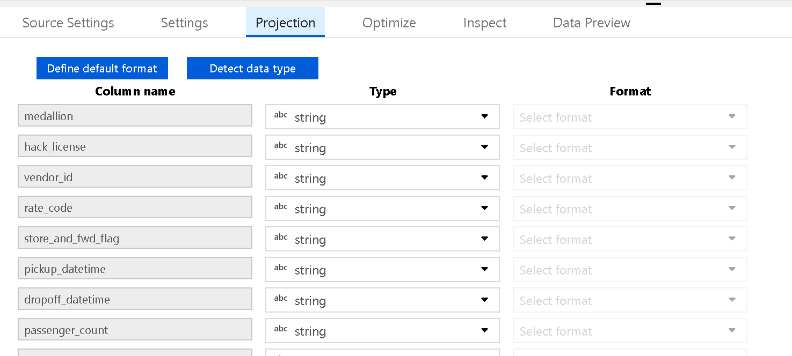

# Mapping Data Flow Source Transformation

[!INCLUDE [notes](../../includes/data-factory-data-flow-preview.md)]

The Source transformation configures a data source that you wish to use to bring data into your data flow. You may have more than one Source transform in a single Data Flow. Always begin designing your Data Flows with a Source transformation.

> [!NOTE]
> Every Data Flow requires at least one Source Transformation. Add as many additional Sources as you require to complete your data transformations. You can join those sources together with a Join or Union transformation. When you debug your data flow in debug sessions, data will be read from the source using the Sampling setting or Debug source limits. However, no data will be written to a Sink until you execute your data flow from a pipeline data flow activity. 

Each Data Flow source transformation must be associated with exactly one Data Factory dataset. The dataset defines the shape and location of your data to write to or read from. You may use wildcards and file lists in your source to work with more than one file at a time when using file sources.

## Data Flow Staging Areas

Data Flow works with "staging" datasets that are all in Azure. These data flow datasets are used for data staging to perform your data transformations. Data Factory has access to nearly 80 different native connectors. To include data from those other sources into your Data Flow, first stage that data into one of those Data Flow dataset staging areas by using the Copy Activity.

## Options

### Allow schema drift
Select Allow Schema Drift if the source columns will change often. This setting will allow all incoming fields from your source to flow through the transformations to the Sink.

### Validate Schema

If the incoming version of the source data does not match the defined schema, then execution of the data flow will fail.

### Sampling
Use Sampling to limit the number of rows from your Source.  This is useful when testing or sampling data from your source for debugging purposes.

## Define Schema

For source file types that are not strongly typed (i.e. flat files as opposed to Parquet files) you should define the data types for each field here in the Source transformation. You can subsequently change the column names in a Select transformation and the data types in a Derived Column transformation. 

For strongly-typed sources, you can modify the data types in a subsequent Select transformation. 

### Optimize

On the Optimize tab for the Source Transformation, you will see an additional partitioning type called "Source". This will only light-up when you have selected Azure SQL DB as your source. This is because ADF will wish to parallelize connections to execute large queries against your Azure SQL DB source.

Partitioning data on your SQL DB source is optional, but is useful for large queries. You have two options:

### Column

Select a column to partition on from your source table. You must also set the max number of connections.

### Query Condition

You can optionally choose to partition the connections based on a query. For this option, simply put in the contents of a WHERE predicate. I.e. year > 1980

## Source file management

* Wilcard path to pick a series of files from your source folder that match a pattern. This will override any file that you have set in your dataset definition.
* List of Files. Same as a file set. Point to a text file that you create with a list of relative path files to process.
* Column to store file name will store the name of the file from the source in a column in your data. Enter a new name here to store the file name string.
* After Completion (You can choose to do nothing with the source file after the data flow executes, delete the source file(s) or move the source files. The paths for move are relative paths.

### SQL Datasets

When you are using Azure SQL DB or Azure SQL DW as your source, you will have additional options.

* Query: Enter a SQL query for your source. Setting a query will override any table that you've chosen in the dataset. Note that Order By clauses are not supported here.

* Batch size: Enter a batch size to chunk large data into batch-sized reads.

> [!NOTE]
> The file operation settings will only execute when the Data Flow is executed from a pipeline run (pipeline debug or execution run) using the Execute Data Flow activity in a pipeline. File operations do NOT execute in Data Flow debug mode.

### Projection

Similar to schemas in datasets, the Projection in Source defines the data columns, data types, and data formats from the source data. If you have a text file with no defined schema, click "Detect Data Type" to ask ADF to attempt to sample and infer the data types. You can set the default data formats for auto-detect using the "Define Default Format" button. You can modify the column data types in a subsequent Derived Column transformation. The column names can be modified using the Select transformation.

## Next steps

Begin building your data transformation with [Derived Column](data-flow-derived-column.md) and [Select](data-flow-select.md).
