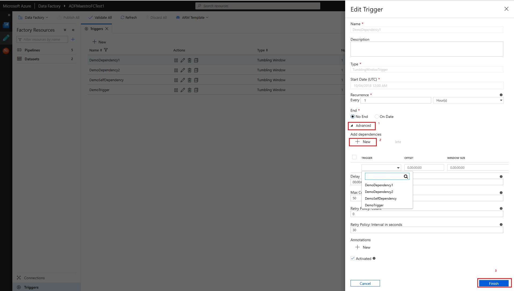

# Create a tumbling window trigger dependency

This article provides steps to create a dependency on a tumbling window trigger. For general information about Tumbling Window triggers, see [How to create tumbling window trigger](how-to-create-tumbling-window-trigger.md).

In order to build a dependency chain and make sure that a trigger is executed only after the successful execution of another trigger in the data factory, use this advanced feature to create a tumbling window dependency.

## Create a dependency in the Data Factory UI

To create dependency on a trigger, select **Trigger > Advanced > New**, and then choose the trigger to depend on with the appropriate offset and size. Select **Finish** and publish the data factory changes for the dependencies to take effect.



## Tumbling window dependency properties

A tumbling window trigger dependency has the following properties:

```json
{
	"name": "DemoTrigger",
	"properties": {
		"runtimeState": "Started",
		"pipeline": {
			"pipelineReference": {
				"referenceName": "Demo",
				"type": "PipelineReference"
			}
		},
		"type": "TumblingWindowTrigger",
		"typeProperties": {
			"frequency": "Hour",
			"interval": 1,
			"startTime": "2018-10-04T00:00:00.000Z",
			"delay": "00:00:00",
			"maxConcurrency": 50,
			"retryPolicy": {
				"intervalInSeconds": 30
			},
			"dependsOn": [
				{
					"type": "TumblingWindowTriggerDependencyReference",
					"size": "-02:00:00",
					"offset": "-01:00:00",
					"referenceTrigger": {
						"referenceName": "DemoDependency1",
						"type": "TriggerReference"
					}
				}
			]
		}
	}
}
```

The following table provides the list of attributes needed to define a Tumbling Window dependency.

| **Property Name** | **Description**  | **Type** | **Required** |
|---|---|---|---|
| Trigger  | All the existing tumbling window triggers are displayed in this drop down. Choose the trigger to take dependency on.  | TumblingWindowTrigger | Yes |
| Offset | Offset of the dependency trigger. Provide a value in the time span format and both negative and positive offsets are allowed. This parameter is mandatory if the trigger is depending on itself and in all other cases it is optional. Self-dependency should always be a negative offset. | Timespan | Self-Dependency: Yes Other: No |
| Window Size | Size of the dependency tumbling window. Provide a value in the time span format. This parameter is optional. | Timespan | No  |
|||||

## Tumbling window self-dependency properties

In the scenarios where the trigger should not proceed to next window until the previous window is successfully completed, build a self-dependency. Self-dependency trigger will have below properties:

```json
{
	"name": "DemoSelfDependency",
	"properties": {
		"runtimeState": "Started",
		"pipeline": {
			"pipelineReference": {
				"referenceName": "Demo",
				"type": "PipelineReference"
			}
		},
		"type": "TumblingWindowTrigger",
		"typeProperties": {
			"frequency": "Hour",
			"interval": 1,
			"startTime": "2018-10-04T00:00:00Z",
			"delay": "00:01:00",
			"maxConcurrency": 50,
			"retryPolicy": {
				"intervalInSeconds": 30
			},
			"dependsOn": [
				{
					"type": "SelfDependencyTumblingWindowTriggerReference",
					"size": "01:00:00",
					"offset": "-01:00:00"
				}
			]
		}
	}
}
```

Below are the illustrations of the scenarios and the usage of tumbling window dependency properties.

## Dependency offset


## Dependency size


## Self-dependency


## Usage scenarios

### Dependency on another tumbling window trigger

For instance, a daily telemetry processing job depending on another daily job aggregating the last seven days output and generates seven-day rolling window streams:


### Dependency on itself

A daily job with no gaps in the output streams of the job:


## Monitor dependencies

You can monitor dependency chain and the corresponding windows from the trigger run monitoring page. Navigate to  **Monitoring > Trigger Runs**.


Click on the looking glass to view all the dependent trigger runs of the selected window.


## Next steps

Review [How to create a tumbling window trigger](how-to-create-tumbling-window-trigger.md).