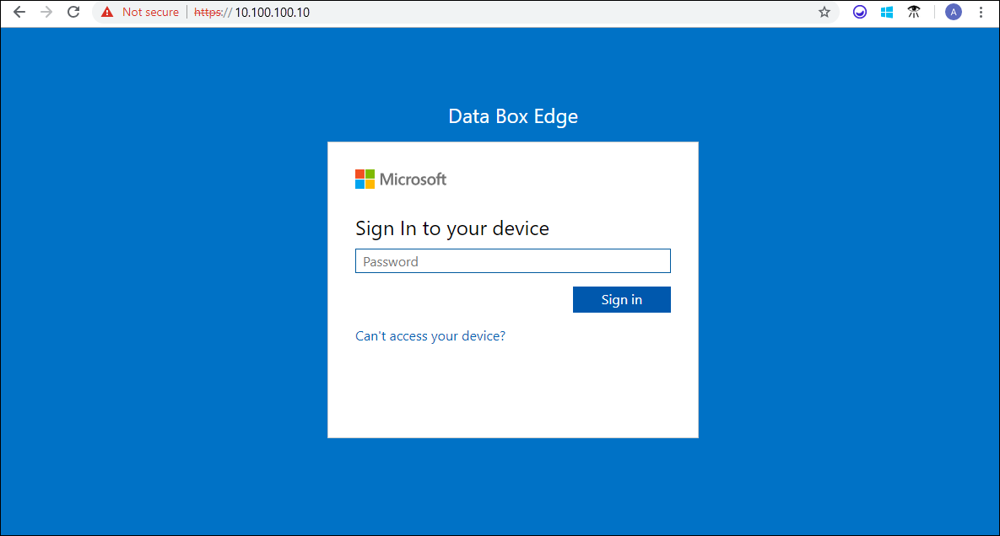
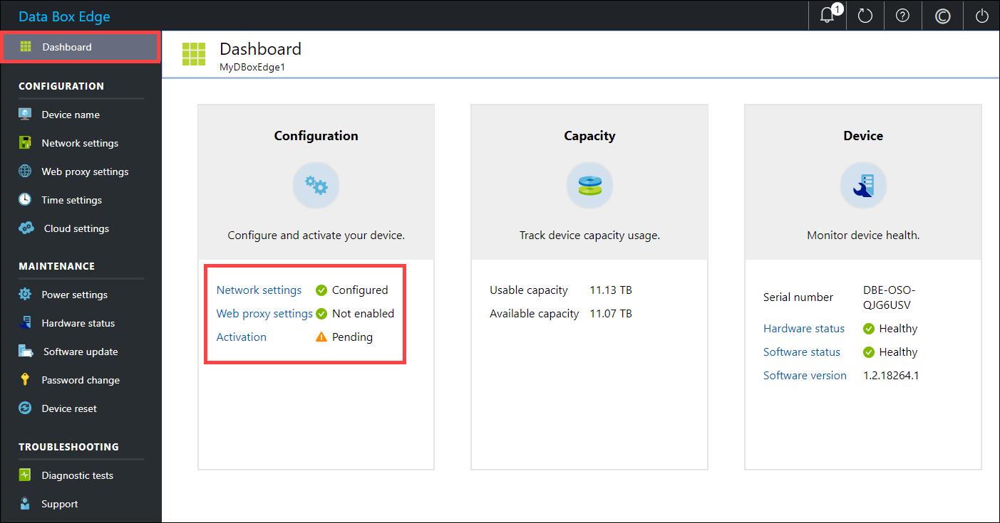
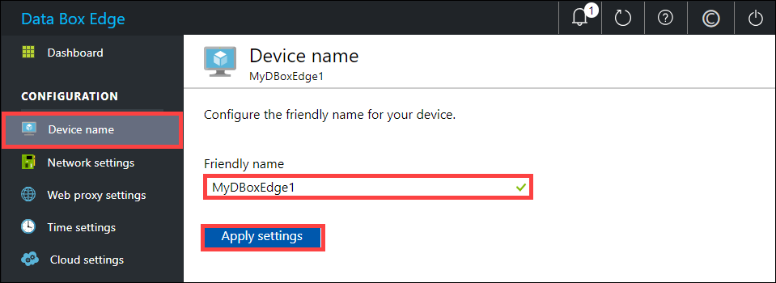
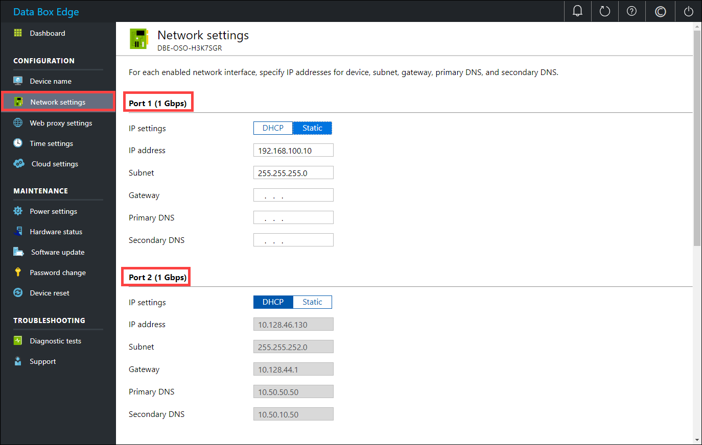
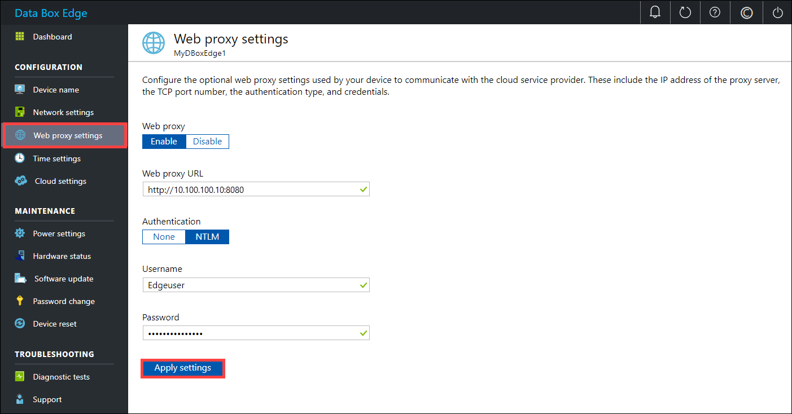
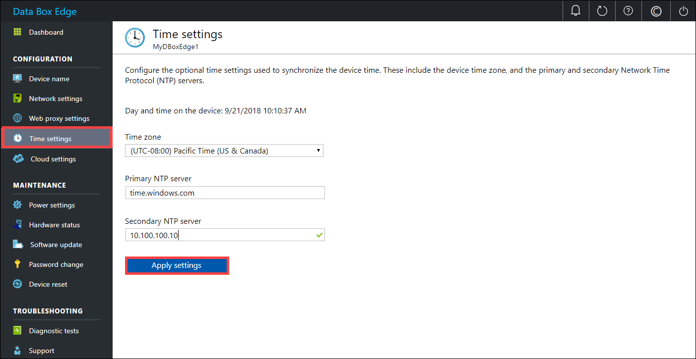
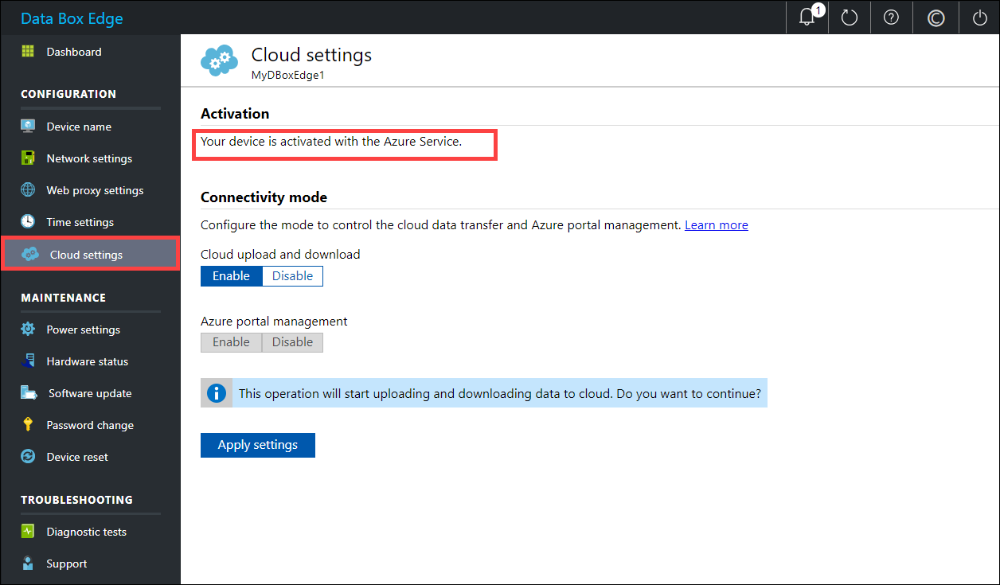

# Tutorial: Connect, set up, and activate Azure Data Box Edge (preview) 

This tutorial describes how you can connect to, set up, and activate your Azure Data Box Edge device by using the local web UI. 

The setup and activation process can take around 20 minutes to complete. 

In this tutorial, you learn how to:

> [!div class="checklist"]
> * Connect to a physical device
> * Set up and activate the physical device

> [!IMPORTANT]
> Data Box Edge is in preview. Before you order and deploy this solution, review the [Azure terms of service for preview](https://azure.microsoft.com/support/legal/preview-supplemental-terms/). 

## Prerequisites

Before you configure and set up your Data Box Edge device, make sure that:

* You've installed the physical device as detailed in [Install Data Box Edge](data-box-edge-deploy-install.md).
* You have the activation key from the Data Box Edge service that you created to manage the Data Box Edge device. For more information, go to [Prepare to deploy Azure Data Box Edge](data-box-edge-deploy-prep.md).

## Connect to the local web UI setup 

1. Configure the Ethernet adapter on your computer to connect to the Edge device with a static IP address of 192.168.100.5 and subnet 255.255.255.0.

1. Connect the computer to PORT 1 on your device. 

1. Open a browser window and access the local web UI of the device at https://192.168.100.10.  
    This action may take a few minutes after you've turned on the device. 

    You see an error or a warning indicating that there is a problem with the website’s security certificate. 
   
    

1. Select **Continue to this webpage**.  
    These steps might vary depending on the browser you're using.

1. Sign in to the web UI of your device. The default password is *Password1*. 
   
    

1. At the prompt, change the device administrator password.  
    The new password must contain from 8 to 16 characters. It must contain three of the following characters: uppercase, lowercase, numeric, and special characters.

You're now at the dashboard of your device.

## Set up and activate the physical device
 
Your dashboard displays the various settings that are required to configure and register the physical device with the Data Box Edge service. The **Device name**, **Network settings**, **Web proxy settings**, and **Time settings** are optional. The only required settings are **Cloud settings**.
   

1. In the left pane, select **Device name**, and then enter a friendly name for your device.  
    The friendly name must contain from 1 to 15 characters and contain letters, numbers, and hyphens.

    

1. (Optional) In the left pane, select **Network settings** and then configure the settings.  
    On your physical device are six network interfaces. PORT 1 and PORT 2 are 1-Gbps network interfaces. PORT 3, PORT 4, PORT 5, and PORT 6 are all 25-Gbps network interfaces. PORT 1 is automatically configured as a management-only port, and PORT 2 to PORT 6 are all data ports. The **Network settings** page as shown below.
    
    
   
    As you configure the network settings, keep in mind:

   - If DHCP is enabled in your environment, network interfaces are automatically configured. An IP address, subnet, gateway, and DNS are automatically assigned.
   - If DHCP isn't enabled, you can assign static IPs if needed.
   - You can configure your network interface as IPv4.

     >[!NOTE] 
     > We recommend that you do not switch the local IP address of the network interface from static to DCHP, unless you have another IP address to connect to the device. If using one network interface and you switch to DHCP, there would be no way to determine the DHCP address. If you want to change to a DHCP address, wait until after the device has registered with the service, and then change. You can then view the IPs of all the adapters in the **Device properties** in the Azure portal for your service.

1. (Optional) In the left pane, select **Web proxy settings**, and then configure your web proxy server. Although web proxy configuration is optional, if you use a web proxy, you can configure it on this page only.
   
   
   
   On the **Web proxy settings** page, do the following:
   
   a. In the **Web proxy URL** box, enter the URL in this format: `http://host-IP address or FQDN:Port number`. HTTPS URLs are not supported.

   b. Under **Authentication**, select **None** or **NTLM**.

   c. If you're using authentication, enter a username and password.

   d. To validate and apply the configured web proxy settings, select **Apply settings**.

1. (Optional) In the left pane, select **Time settings**, and then configure the time zone and the primary and secondary NTP servers for your device.  
    NTP servers are required because your device must synchronize time so that it can authenticate with your cloud service providers.
    
    
    
    On the **Time settings** page, do the following:
    
    a. In the **Time zone** drop-down list, select the time zone that corresponds to the geographic location in which the device is being deployed.  
        The default time zone for your device is PST. Your device will use this time zone for all scheduled operations.

    b. In the **Primary NTP server** box, enter the primary server for your device or accept the default value of time.windows.com.  
        Ensure that your network allows NTP traffic to pass from your datacenter to the internet.

    c. Optionally, in the **Secondary NTP server** box, enter a secondary server for your device.

    d. To validate and apply the configured time settings, select **Apply**.

6. In the left pane, select **Cloud settings**, and then activate your device with the Data Box Edge service in the Azure portal.
    
    a. In the **Activation key** box, enter the activation key that you got in [Get the activation key](data-box-edge-deploy-prep.md#get-the-activation-key) for Data Box Edge.

    b. Select **Apply**. 
       
    
    
    After the device is successfully activated, you're presented with connectivity mode options. These settings are configured if you need to work with the device in partially disconnected or disconnected mode. 

        

The device setup is complete. You can now add shares on your device.

## Next steps

In this tutorial, you learned how to:

> [!div class="checklist"]
> * Connect to a physical device
> * Set up and activate the physical device

To learn how to transfer data with your Data Box Edge device, see:

> [!div class="nextstepaction"]
> [Transfer data with Data Box Edge](./data-box-edge-deploy-add-shares.md).
