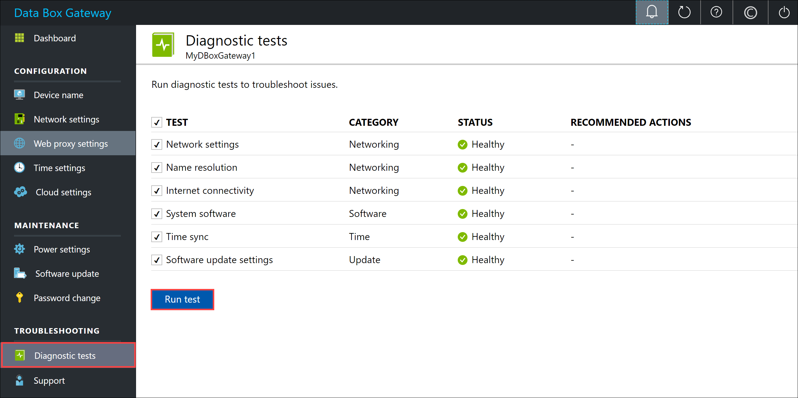
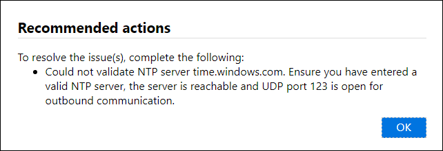

# Troubleshoot your Azure Data Box Gateway issues 

This article describes how to troubleshoot issues on your Azure Data Box Gateway. 

> [!IMPORTANT]
> - Data Box Gateway is in preview. Review the [Azure terms of service for preview](https://azure.microsoft.com/support/legal/preview-supplemental-terms/) before you order and deploy this solution.

In this article, you learn how to:

> [!div class="checklist"]
> * Run diagnostics
> * Collect Support package
> * Use logs to troubleshoot


## Run diagnostics

To diagnose and troubleshoot any device errors, you can run the diagnostics tests. Do the following steps in the local web UI of your device to run diagnostic tests.

1. In the local web UI, go to **Troubleshooting > Diagnostic tests**. Select the test you want to run and click **Run test**. This runs the tests to diagnose any possible issues with your network, device, web proxy, time, or cloud settings. You are notified that the device is running tests.

    
 
2. After the tests have completed, the results are displayed. If a test fails, then a URL for recommended action is presented. You can click the URL to view the recommended action. 
 
    


## Collect Support package

A log package is composed of all the relevant logs that can help Microsoft Support troubleshoot any device issues. You can generate a log package via the local web UI.

Do the following steps to collect a Support package. 

1. In the local web UI, go to **Troubleshooting > Support**. Click **Create support package**. The system starts collecting support package. The package collection may take several minutes.

    
 
2. After the Support package is created, click **Download Support package**. A zipped package is downloaded on the path you chose. You can unzip the package and the view the system log files.

    

## Use logs to troubleshoot

Any errors experienced during the upload and refresh processes are included in the respective error files.

1. To view the error files, go to your share and click the share to view the contents. 

      

2. Click the _Microsoft Data Box Gateway folder_. This folder has two subfolders:

   - Upload folder that has log files for upload errors.
   - Refresh folder for errors during refresh.

     Here is a sample log file for refresh.

     ```
     <root container="brownbag1" machine="VM15BS020663" timestamp="07/18/2018 00:11:10" />
     <file item="test.txt" local="False" remote="True" error="16001" />
     <summary runtime="00:00:00.0945320" errors="1" creates="2" deletes="0" insync="3" replaces="0" pending="9" />
     ``` 

3. When you see an error in this file (highlighted in the sample), note down the error code, in this case it is 16001. Look up the description of this error code against the following error reference.

    |     Error code     |     Exception name                                         |     Error description                                                                                                                                                                                                                     |
    |--------------------|------------------------------------------------------------|-------------------------------------------------------------------------------------------------------------------------------------------------------------------------------------------------------------------------------------------|
    |    100             |    ERROR_CONTAINER_OR_SHARE_NAME_LENGTH                    |    The container or share name must be between 3 and 63 characters.                                                                                                                                                                     |
    |    101             |    ERROR_CONTAINER_OR_SHARE_NAME_ALPHA_NUMERIC_DASH        |    The container or share name must consist of only letters, numbers, or hyphens.                                                                                                                                                       |
    |    102             |    ERROR_CONTAINER_OR_SHARE_NAME_IMPROPER_DASH             |    The container or share name must consist of only letters, numbers, or hyphens.                                                                                                                                                       |
    |    103             |    ERROR_BLOB_OR_FILE_NAME_CHARACTER_CONTROL               |    The blob or file name contains unsupported control characters.                                                                                                                                                                       |
    |    104             |    ERROR_BLOB_OR_FILE_NAME_CHARACTER_ILLEGAL               |    The blob or file name contains illegal characters.                                                                                                                                                                                   |
    |    105             |    ERROR_BLOB_OR_FILE_NAME_SEGMENT_COUNT                   |    Blob or file name contains too many segments (each segment is separated by a slash -/).                                                                                                                                              |
    |    106             |    ERROR_BLOB_OR_FILE_NAME_AGGREGATE_LENGTH                |    The blob or file name is too long.                                                                                                                                                                                                     |
    |    107             |    ERROR_BLOB_OR_FILE_NAME_COMPONENT_LENGTH                |    One of the segments in the blob or file name is too long.                                                                                                                                                                            |
    |    108             |    ERROR_BLOB_OR_FILE_SIZE_LIMIT                           |    The file size exceeds the maximum file size for upload.                                                                                                                                                                              |
    |    109             |    ERROR_BLOB_OR_FILE_SIZE_ALIGNMENT                       |    The blob or file is incorrectly aligned.                                                                                                                                                                                               |
    |    110             |    ERROR_NAME_NOT_VALID_UNICODE                            |    The Unicode encoded file name or blob is not valid.                                                                                                                                                                                  |
    |    111             |    ERROR_RESERVED_NAME_NOT_ALLOWED                         |    The name or the prefix of the file or blob is a reserved name that isn't supported (for example, COM1).                                                                                                                             |
    |    2000            |    ERROR_ETAG_MISMATCH                                     |    An etag mismatch indicates that there is a conflict between a block blob in the cloud and on the device. To resolve this conflict, delete one of those files – either the version in the cloud or the version on the device.    |
    |    2001            |    ERROR_UNEXPECTED_FINALIZE_FAILURE                       |    An unexpected problem occurred while processing a file after the file was uploaded.    If you see this error, and the error persists for more than 24 hours, contact support.                                                      |
    |    2002            |    ERROR_ALREADY_OPEN                                      |    The file is already open in another process and can't be uploaded until the handle is closed.                                                                                                                                       |
    |    2003            |    ERROR_UNABLE_TO_OPEN                                    |    Couldn't open the file for upload. If you see this error, contact Microsoft Support.                                                                                                                                                |
    |    2004            |    ERROR_UNABLE_TO_CONNECT                                 |    Couldn't connect to the container to upload data to it.                                                                                                                                                                             |
    |    2005            |    ERROR_INVALID_CLOUD_CREDENTIALS                         |    Couldn't connect to the container because the account permissions are either wrong or out of date. Check your access.                                                                                                               |
    |    2006            |    ERROR_CLOUD_ACCOUNT_DISABLED                            |    Couldn't upload data to the account as the account or share is disabled.                                                                                                                                                            |
    |    2007            |    ERROR_CLOUD_ACCOUNT_PERMISSIONS                         |    Couldn't connect to the container because the account permissions are either wrong or out of date. Check your access.                                                                                                               |
    |    2008            |    ERROR_CLOUD_CONTAINER_SIZE_LIMIT_REACHED                |    Couldn't add new data as the container is full. Check the Azure specifications for supported container sizes based on type. For example, Azure File only supports a maximum file size of 5 TB.                                     |
    |    2009            |    ERROR_CLOUD_CONTAINER_MISSING                |     Couldn't upload data because the container associated with the share doesn't exist.                                     |    
    |    2997            |    ERROR_ITEM_CANCELED                                     |    An unexpected error occurred. This is a transient error that will resolve itself.                                                                           |
    |    2998            |    ERROR_UNMAPPED_FAILURE                                  |    An unexpected error occurred. The error may resolve itself but if it persists for more than 24 hours, contact Microsoft Support.                                                                                                     |
    |    16000           |    RefreshException                                        |    Couldn't bring down this file.                                                                                                                                                                                                        |
    |    16001           |    RefreshAlreadyExistsException                           |    Couldn't bring down this file since it already exists on your local system.                                                                                                                                                         |
    |    16002           |    RefreshWorkNeededException                              |    Couldn't refresh this file since it isn't fully uploaded.                                                                                                                                                                          | 


## Next steps

- Learn more about the [known issues in this release](data-box-gateway-release-notes.md).
