# Use Azure DNS to provide custom domain settings for an Azure service

Azure DNS provides DNS for a custom domain for any of your Azure resources that support custom domains or that have a fully qualified domain name (FQDN). An example is you have an Azure web app and you want your users to access it by either using contoso.com, or www\.contoso.com as an FQDN. This article walks you through configuring your Azure service with Azure DNS for using custom domains.

## Prerequisites

In order to use Azure DNS for your custom domain, you must first delegate your domain to Azure DNS. Visit [Delegate a domain to Azure DNS](./dns-delegate-domain-azure-dns.md) for instructions on how to configure your name servers for delegation. Once your domain is delegated to your Azure DNS zone, you are able to configure the DNS records needed.

You can configure a vanity or custom domain for [Azure Function Apps](#azure-function-app), [Public IP addresses](#public-ip-address), [App Service (Web Apps)](#app-service-web-apps), [Blob storage](#blob-storage), and [Azure CDN](#azure-cdn).

## Azure Function App

To configure a custom domain for Azure function apps, a CNAME record is created as well as configuration on the function app itself.
 
Navigate to **Function App** and select your function app. Click **Platform features** and under **Networking** click **Custom domains**.

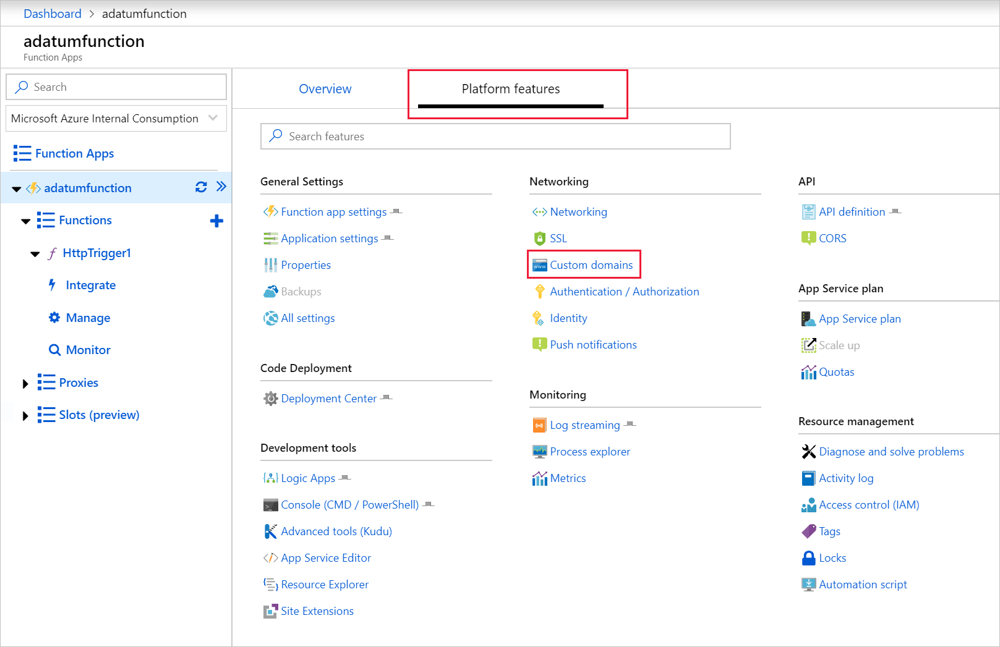

Note the current url on the **Custom domains** blade, this address is used as the alias for the DNS record created.

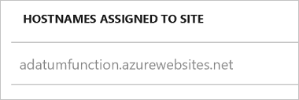

Navigate to your DNS Zone and click **+ Record set**. Fill out the following information on the **Add record set** blade and click **OK** to create it.

|Property  |Value  |Description  |
|---------|---------|---------|
|Name     | myfunctionapp        | This value along with the domain name label is the FQDN for the custom domain name.        |
|Type     | CNAME        | Use a CNAME record is using an alias.        |
|TTL     | 1        | 1 is used for 1 hour        |
|TTL unit     | Hours        | Hours are used as the time measurement         |
|Alias     | adatumfunction.azurewebsites.net        | The DNS name you are creating the alias for, in this example it is the adatumfunction.azurewebsites.net DNS name provided by default to the function app.        |

Navigate back to your function app, click **Platform features**, and under **Networking** click **Custom domains**, then under **Custom Hostnames** click **+ Add hostname**.

On the **Add hostname** blade, enter the CNAME record in the **hostname** text field and click **Validate**. If the record is found, the **Add hostname** button appears. Click **Add hostname** to add the alias.

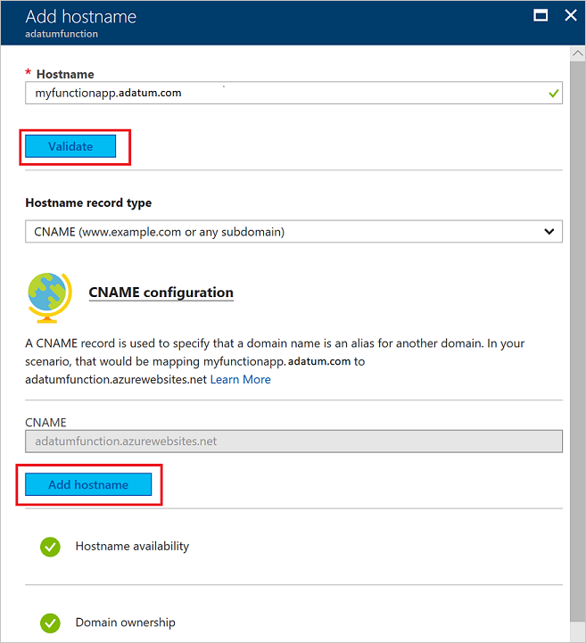

## Public IP address

To configure a custom domain for services that use a public IP address resource such as Application Gateway, Load Balancer, Cloud Service, Resource Manager VMs, and, Classic VMs, an A record is used.

Navigate to **Networking** > **Public IP address**, select the Public IP resource and click **Configuration**. Notate the IP address shown.

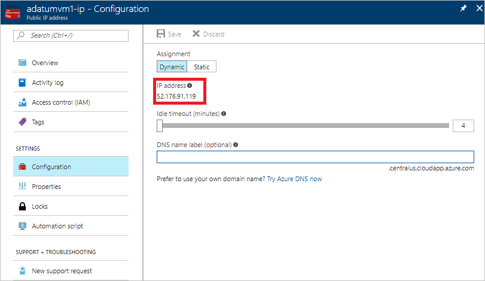

Navigate to your DNS Zone and click **+ Record set**. Fill out the following information on the **Add record set** blade and click **OK** to create it.

|Property  |Value  |Description  |
|---------|---------|---------|
|Name     | mywebserver        | This value along with the domain name label is the FQDN for the custom domain name.        |
|Type     | A        | Use an A record as the resource is an IP address.        |
|TTL     | 1        | 1 is used for 1 hour        |
|TTL unit     | Hours        | Hours are used as the time measurement         |
|IP Address     | <your ip address>       | The public IP address.|

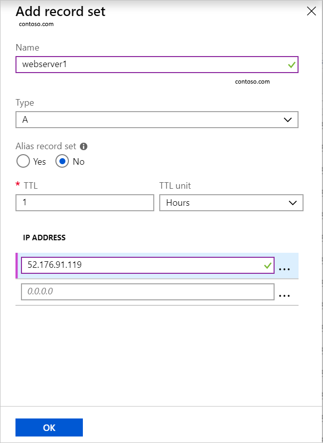

Once the A record is created, run `nslookup` to validate the record resolves.

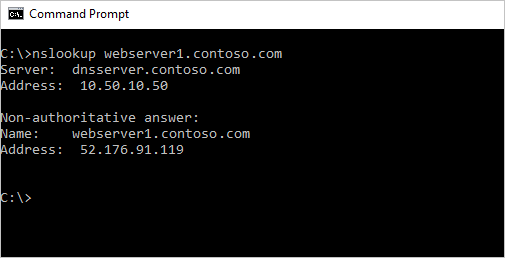

## App Service (Web Apps)

The following steps take you through configuring a custom domain for an app service web app.

Navigate to **App Service** and select the resource you are configuring a custom domain name, and click **Custom domains**.

Note the current url on the **Custom domains** blade, this address is used as the alias for the DNS record created.

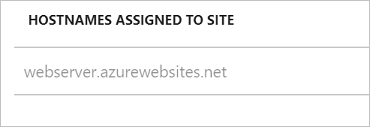

Navigate to your DNS Zone and click **+ Record set**. Fill out the following information on the **Add record set** blade and click **OK** to create it.

|Property  |Value  |Description  |
|---------|---------|---------|
|Name     | mywebserver        | This value along with the domain name label is the FQDN for the custom domain name.        |
|Type     | CNAME        | Use a CNAME record is using an alias. If the resource used an IP address, an A record would be used.        |
|TTL     | 1        | 1 is used for 1 hour        |
|TTL unit     | Hours        | Hours are used as the time measurement         |
|Alias     | webserver.azurewebsites.net        | The DNS name you are creating the alias for, in this example it is the webserver.azurewebsites.net DNS name provided by default to the web app.        |

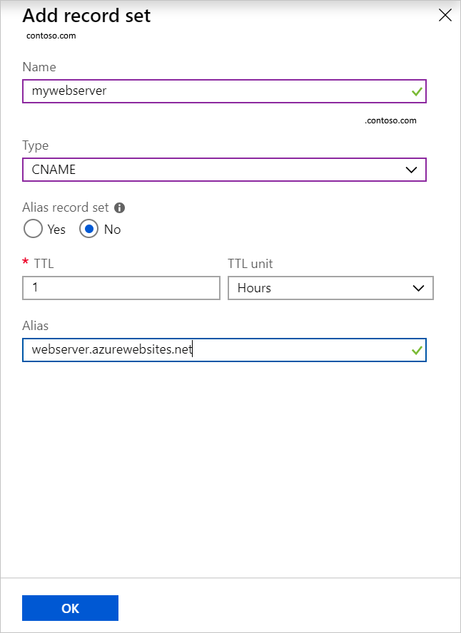

Navigate back to the app service that is configured for the custom domain name. Click **Custom domains**, then click **Hostnames**. To add the CNAME record you created, click **+ Add hostname**.

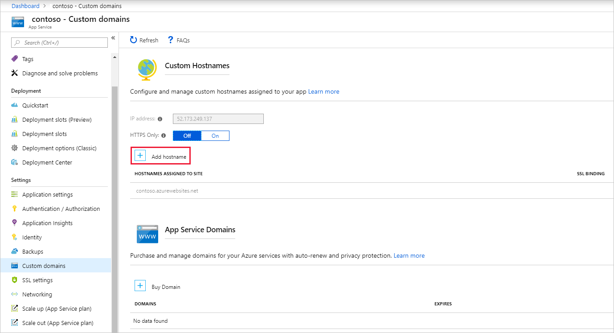

Once the process is complete, run **nslookup** to validate name resolution is working.

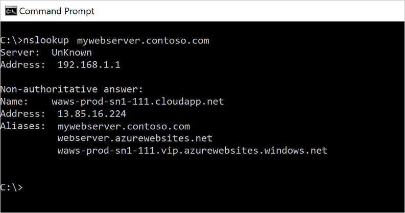

To learn more about mapping a custom domain to App Service, visit [Map an existing custom DNS name to Azure Web Apps](../app-service/app-service-web-tutorial-custom-domain.md?toc=%dns%2ftoc.json).

If you need to purchase a custom domain, visit [Buy a custom domain name for Azure Web Apps](../app-service/manage-custom-dns-buy-domain.md) to learn more about App Service domains.

## Blob storage

The following steps take you through configuring a CNAME record for a blob storage account using the asverify method. This method ensures there is no downtime.

Navigate to **Storage** > **Storage Accounts**, select your storage account, and click **Custom domain**. Notate the FQDN under step 2, this value is used to create the first CNAME record

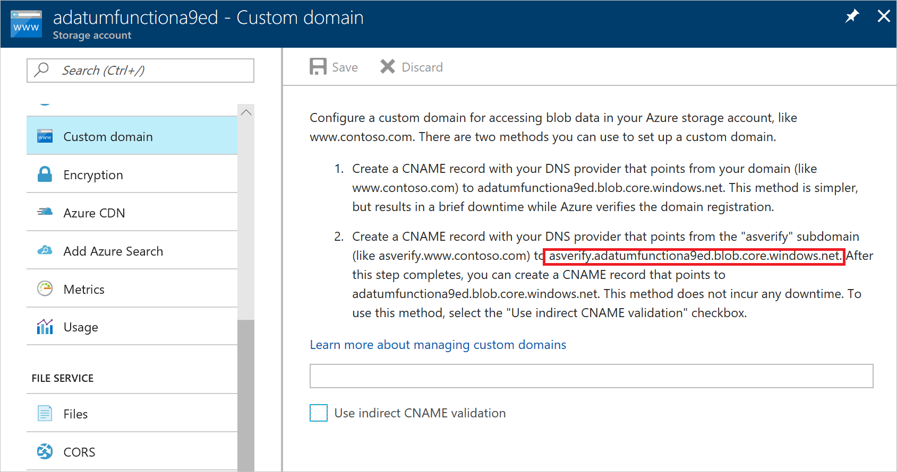

Navigate to your DNS Zone and click **+ Record set**. Fill out the following information on the **Add record set** blade and click **OK** to create it.

|Property  |Value  |Description  |
|---------|---------|---------|
|Name     | asverify.mystorageaccount        | This value along with the domain name label is the FQDN for the custom domain name.        |
|Type     | CNAME        | Use a CNAME record is using an alias.        |
|TTL     | 1        | 1 is used for 1 hour        |
|TTL unit     | Hours        | Hours are used as the time measurement         |
|Alias     | asverify.adatumfunctiona9ed.blob.core.windows.net        | The DNS name you are creating the alias for, in this example it is the asverify.adatumfunctiona9ed.blob.core.windows.net DNS name provided by default to the storage account.        |

Navigate back to your storage account by clicking **Storage** > **Storage Accounts**, select your storage account and click **Custom domain**. Type in the alias you created without the asverify prefix in the text box, check **Use indirect CNAME validation, and click **Save**. Once this step is complete, return to your DNS zone and create a CNAME record without the asverify prefix.  After that point, you are safe to delete the CNAME record with the cdnverify prefix.

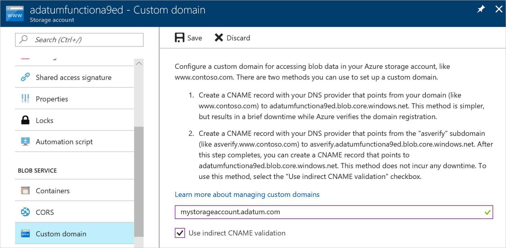

Validate DNS resolution by running `nslookup`

To learn more about mapping a custom domain to a blob storage endpoint visit [Configure a custom domain name for your Blob storage endpoint](../storage/blobs/storage-custom-domain-name.md?toc=%dns%2ftoc.json)

## Azure CDN

The following steps take you through configuring a CNAME record for a CDN endpoint using the cdnverify method. This method ensures there is no downtime.

Navigate to **Networking** > **CDN Profiles**, select your CDN profile.

Select the endpoint you are working with and click **+ Custom domain**. Note the **Endpoint hostname** as this value is the record that the CNAME record points to.

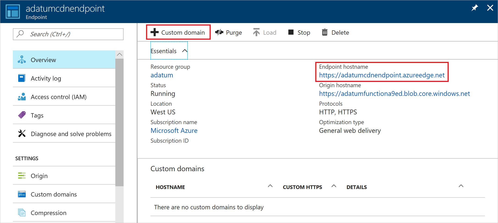

Navigate to your DNS Zone and click **+ Record set**. Fill out the following information on the **Add record set** blade and click **OK** to create it.

|Property  |Value  |Description  |
|---------|---------|---------|
|Name     | cdnverify.mycdnendpoint        | This value along with the domain name label is the FQDN for the custom domain name.        |
|Type     | CNAME        | Use a CNAME record is using an alias.        |
|TTL     | 1        | 1 is used for 1 hour        |
|TTL unit     | Hours        | Hours are used as the time measurement         |
|Alias     | cdnverify.adatumcdnendpoint.azureedge.net        | The DNS name you are creating the alias for, in this example it is the cdnverify.adatumcdnendpoint.azureedge.net DNS name provided by default to the storage account.        |

Navigate back to your CDN endpoint by clicking **Networking** > **CDN Profiles**, and select your CDN profile. Click **+ Custom domain** and enter your CNAME record alias without the cdnverify prefix and click **Add**.

Once this step is complete, return to your DNS zone and create a CNAME record without the cdnverify prefix.  After that point, you are safe to delete the CNAME record with the cdnverify prefix. For more information on CDN and how to configure a custom domain without the intermediate registration step visit [Map Azure CDN content to a custom domain](../cdn/cdn-map-content-to-custom-domain.md?toc=%dns%2ftoc.json).

## Next steps

Learn how to [configure reverse DNS for services hosted in Azure](dns-reverse-dns-for-azure-services.md).
