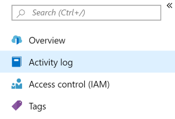

# Monitoring metrics for Front Door

By using Azure Front Door Service, you can monitor resources in the following ways:
* [Logs](#diagnostic-logging): Logs allow for performance, access, and other data to be saved or consumed from a resource for monitoring purposes.

* [Metrics](#metrics): Application Gateway currently has seven metrics to view performance counters.

## Metrics

Metrics are a feature for certain Azure resources where you can view performance counters in the portal. For Front Door, the following metrics are available:

| Metric | Metric Display Name | Unit | Dimensions | Description |
| --- | --- | --- | --- | --- |
| RequestCount | Request Count | Count | HttpStatus HttpStatusGroup ClientRegion ClientCountry | The number of client requests served by Front Door.  |
| RequestSize | Request Size | Bytes | HttpStatus HttpStatusGroup ClientRegion ClientCountry | The number of bytes sent as requests from clients to Front Door. |
| ResponseSize | Response Size | Bytes | HttpStatus HttpStatusGroup ClientRegion ClientCountry | The number of bytes sent as responses from Front Door to clients. |
| TotalLatency | Total Latency | Milliseconds | HttpStatus HttpStatusGroup ClientRegion ClientCountry | The time calculated from when the client request was received by Front Door until the client acknowledged the last response byte from Front Door. |
| BackendRequestCount | Backend Request Count | Count | HttpStatus HttpStatusGroup Backend | The number of requests sent from Front Door to backends. |
| BackendRequestLatency | Backend Request Latency | Milliseconds | Backend | The time calculated from when the request was sent by Front Door to the backend until Front Door received the last response byte from the backend. |
| BackendHealthPercentage | Backend Health Percentage | Percent | Backend BackendPool | The percentage of successful health probes from Front Door to backends. |
| WebApplicationFirewallRequestCount | Web Application Firewall Request Count | Count | PolicyName RuleName Action | The number of client requests processed by the application layer security of Front Door. |

## Activity Logs

Activity logs provide insight into the operations that were performed on your Front Door. Using activity logs, you can determine the "what, who, and when" for any write operations (PUT, POST, DELETE) taken on your Front Door.

> [!NOTE]
> Activity logs do not include read (GET) operations or operations performed in the Azure portal or using the original Management APIs.

You can access activity logs in your Front Door, or access logs of all your Azure resources in Azure Monitor. 

To view activity logs:

1. Select your Front Door instance.
2. Click **Activity log**.

    

3. Select desired filtering scope and click **Apply**.

## Diagnostic logs
Diagnostic logs provide rich information about operations and errors that are important for auditing as well as troubleshooting purposes. Diagnostics logs differ from activity logs. Activity logs provide insights into the operations that were performed on your Azure resources. Diagnostics logs provide insight into operations that your resource performed. Learn more about [Azure Monitor diagnostic logs](../azure-monitor/platform/diagnostic-logs-overview.md). 

To configure diagnostic logs for your Front Door:

1. Select your APIM service instance.
2. Click **Diagnostic settings**.

    

3. Click **Turn on diagnostics**. You can archive diagnostic logs along with metrics to a storage account, stream them to an Event Hub, or send them to Azure Monitor logs. 

Azure Front Door Service currently provides diagnostics logs (batched hourly) about individual API request with each entry having the following schema:

| Property  | Description |
| ------------- | ------------- |
| ClientIp | The IP address of the client that made the request. |
| ClientPort | The IP port of the client that made the request. |
| HttpMethod | HTTP method used by the request. |
| HttpStatusCode | The HTTP status code returned from the proxy. |
| HttpStatusDetails | Resulting status on the request. Meaning of this string value can be found at a Status reference table. |
| HttpVersion | Type of the request or connection. |
| RequestBytes | The size of the HTTP request message in bytes, including the request headers and the request body. |
| RequestUri | URI of the received request. |
| ResponseBytes | Bytes sent by the backend server as the response.  |
| RoutingRuleName | The name of the routing rule that the request matched. |
| SecurityProtocol | The TLS/SSL protocol version used by the request or null if no encryption. |
| TimeTaken | The length of time that the action took, in milliseconds. |
| UserAgent | The browser type that the client used |
| TrackingReference | The unique reference string that identifies a request served by Front Door, also sent as X-Azure-Ref header to the client. Required for searching details in the access logs for a specific request. |

## Next steps

- Learn how to [create a Front Door](quickstart-create-front-door.md).
- Learn [how Front Door works](front-door-routing-architecture.md).
