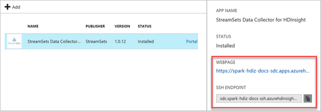
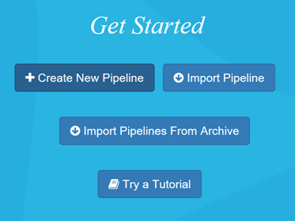
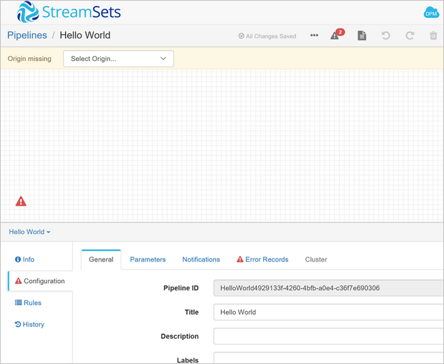

# Install published application - StreamSets Data Collector

This article describes how to install and run the [StreamSets Data Collector for HDInsight](https://streamsets.com/) published [Apache Hadoop](https://hadoop.apache.org/) application on Azure HDInsight. For an overview of the HDInsight application platform, and a list of available Independent Software Vendor (ISV) published applications, see [Install third-party Apache Hadoop applications](hdinsight-apps-install-applications.md). For instructions on installing your own application, see [Install custom HDInsight applications](hdinsight-apps-install-custom-applications.md).

## About StreamSets Data Collector

The StreamSets Data Collector deploys on top of an Azure HDInsight application. StreamSets Data Collector provides a full-featured integrated development environment (IDE) that lets you design, test, deploy, and manage any-to-any ingest pipelines. These pipelines can mesh stream and batch data, and include a variety of in-stream transformations, all without having to write custom code.

StreamSets Data Collector lets you build data flows using numerous Big Data components such as [Apache Hadoop HDFS](https://hadoop.apache.org/docs/r1.2.1/hdfs_design.html), [Apache Kafka](https://kafka.apache.org/), [Apache Solr](https://lucene.apache.org/solr/), [Apache Hive](https://hive.apache.org/), [Apache HBase](https://hbase.apache.org/), and [Apache Kudu](https://kudu.apache.org/). Once StreamSets Data Collector is running on an edge server, or in your Hadoop cluster, you get real-time monitoring for both data anomalies and data flow operations. This monitoring includes threshold-based alerting, anomaly detection, and automatic remediation of error records.

StreamSets Data Collector is designed to logically isolate each stage in a pipeline, so you can meet new business requirements by dropping in new processors and connectors without coding and with minimal downtime.

### StreamSets resource links

* [Documentation](https://streamsets.com/documentation/datacollector/latest/help/#Getting_Started/GettingStarted_Title.html)
* [Blog](https://streamsets.com/blog/)
* [Tutorials](https://github.com/streamsets/tutorials)
* [Developer Support Forum](https://groups.google.com/a/streamsets.com/forum/#!forum/sdc-user)
* [Slack Public StreamSets Channel](https://streamsetters.slack.com/)
* [Source Code](https://github.com/streamsets)

## Prerequisites

To install this app on a new HDInsight cluster, or an existing cluster, you must have the following configuration:

* Cluster tier(s): Standard or Premium
* Cluster version(s): 3.5 and above

## Install the StreamSets Data Collector published application

For step-by-step instructions on installing this and other available ISV applications, read [Install third-party Apache Hadoop applications](hdinsight-apps-install-applications.md).

## Launch StreamSets Data Collector

1. After installation, you can launch StreamSets from your cluster in Azure portal by going to the **Settings** pane, then selecting **Applications** under the **General** category. The Installed Apps pane lists the installed applications.

    

2. When you select StreamSets Data Collector, you see a link to the web page, and the SSH endpoint path. Select the WEBPAGE link.

3. In the Login dialog box, use the following credentials to log in: `admin` and `admin`.

4. On the Get Started page, click **Create New Pipeline**.

    

5. In the New Pipeline window, enter a name for the pipeline ("Hello World"), optionally enter a description, and select **Save**.

6. The Data Collector console is shown. The Properties panel displays pipeline properties.
 
    

7. You are now ready to follow the [StreamSets tutorial](https://streamsets.com/documentation/datacollector/latest/help/#Tutorial/Tutorial-title.html). The tutorial provides step-by-step directions for creating your first pipeline.

## Next steps

* [StreamSets Data Collector documentation](https://streamsets.com/documentation/datacollector/latest/help/#Getting_Started/GettingStarted_Title.html#concept_htw_ghg_jq).
* [Install custom HDInsight applications](hdinsight-apps-install-custom-applications.md): Learn how to deploy an unpublished HDInsight application to HDInsight.
* [Publish HDInsight applications](hdinsight-apps-publish-applications.md): Learn how to publish your custom HDInsight applications to Azure Marketplace.
* [MSDN: Install an HDInsight application](https://msdn.microsoft.com/library/mt706515.aspx): Learn how to define HDInsight applications.
* [Customize Linux-based HDInsight clusters using Script Action](hdinsight-hadoop-customize-cluster-linux.md): Learn how to use Script Action to install additional applications.
* [Use empty edge nodes in HDInsight](hdinsight-apps-use-edge-node.md): Learn how to use an empty edge node for accessing HDInsight clusters, and for testing and hosting HDInsight applications.
