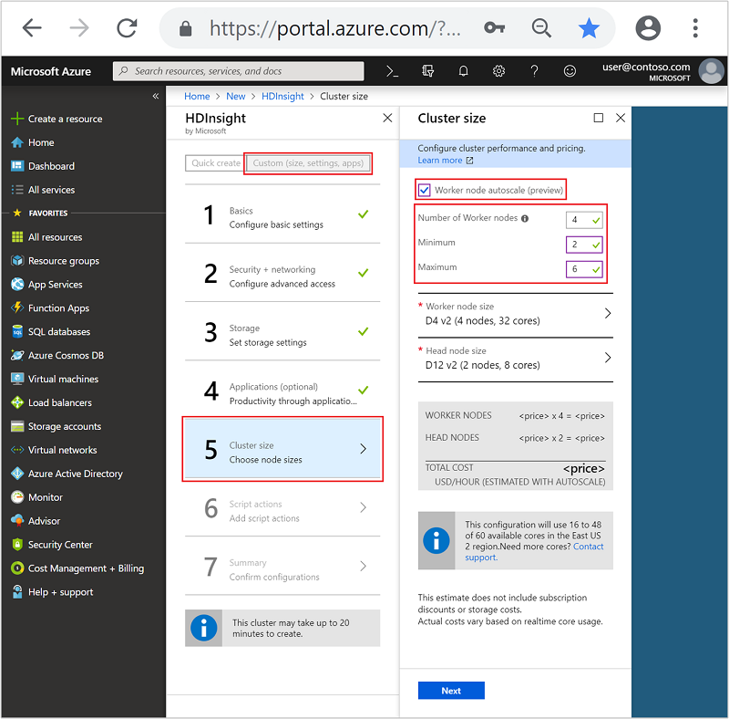

# Automatically scale Azure HDInsight clusters (preview)

>[!Important]
>The HDInsight Autoscale feature is currently in preview. Please send an email to hdiautoscalepm@microsoft.com to have Autoscale enabled for your subscription.

Azure HDInsight’s cluster Autoscale feature automatically scales the number of worker nodes in a cluster up and down based on load within a predefined range. During the creation of a new HDInsight cluster, a minimum and maximum number of worker nodes can be set. Autoscale then monitors the resource requirements of the analytics load and scales the number of worker nodes up or down accordingly. There is no additional charge for this feature.

## Getting started

### Create a cluster with the Azure portal

> [!Note]
> Autoscale is currently only supported for Azure HDInsight Hive, MapReduce and Spark clusters version 3.6.

To enable the Autoscale feature, do the following as part of the normal cluster creation process:

1. Select **Custom (size, settings, apps)** rather than **Quick create**.
2. On **Custom** step 5 (**Cluster size**) check the **Worker node autoscale** checkbox.
3. Enter the desired values for the following properties:  

    * Initial **Number of Worker nodes**.  
    * **Minimum** number of worker nodes.  
    * **Maximum** number of worker nodes.  



The initial number of worker nodes must fall between the minimum and maximum, inclusive. This value defines the initial size of the cluster when it is created. The minimum number of worker nodes must be greater than zero.

After you choose the VM type for each node type, you will be able to see the estimated cost range for the whole cluster. You can then adjust these settings to fit your budget.

Your subscription has a capacity quota for each region. The total number of cores of your head nodes combined with the maximum number of worker nodes can’t exceed the capacity quota. However, this quota is a soft limit; you can always create a support ticket to get it increased easily.

> [!Note]  
> If you exceed the total core quota limit, You will receive an error message saying ‘the maximum node exceeded the available cores in this region, please choose another region or contact the support to increase the quota.’

For more information on HDInsight cluster creation using the Azure portal, see [Create Linux-based clusters in HDInsight using the Azure portal](hdinsight-hadoop-create-linux-clusters-portal.md).  

### Create a cluster with a Resource Manager template

To create an HDInsight cluster with an Azure Resource Manager template, add an `autoscale` node to the `computeProfile` > `workernode` section with the properties `minInstanceCount` and `maxInstanceCount` as shown in the json snippet below.

```json
{                            
    "name": "workernode",
    "targetInstanceCount": 4,
    "autoscale": {
        "minInstanceCount": 2,
        "maxInstanceCount": 10
    },
    "hardwareProfile": {
        "vmSize": "Standard_D13_V2"
    },
    "osProfile": {
        "linuxOperatingSystemProfile": {
            "username": "[parameters('sshUserName')]",
            "password": "[parameters('sshPassword')]"
        }
    },
    "virtualNetworkProfile": null,
    "scriptActions": []
}
```

For more information on creating clusters with Resource Manager templates, see [Create Apache Hadoop clusters in HDInsight by using Resource Manager templates](hdinsight-hadoop-create-linux-clusters-arm-templates.md).  

### Enable and disable Autoscale for a running cluster

You can enable or disable Autoscale for HDInsight clusters created after January 1, 2019 through the Azure portal.

## Monitoring

You can view the cluster scale-up and scale-down history as part of the cluster metrics. You can also list all scaling actions over the past day, week, or longer period of time.

## How it works

### Metrics monitoring

Autoscale continuously monitors the cluster and collects the following metrics:

1. **Total Pending CPU**: The total number of cores required to start execution of all pending containers.
2. **Total Pending Memory**: The total memory (in MB) required to start execution of all pending containers.
3. **Total Free CPU**: The sum of all unused cores on the active worker nodes.
4. **Total Free Memory**: The sum of unused memory (in MB) on the active worker nodes.
5. **Used Memory per Node**: The load on a worker node. A worker node on which 10 GB of memory is used, is considered under more load than a worker with 2 GB of used memory.
6. **Number of Application Masters per Node**: The number of Application Master (AM) containers running on a worker node. A worker node that is hosting two AM containers, is considered more important than a worker node that is hosting zero AM containers.

The above metrics are checked every 60 seconds. Autoscale will make scale-up and scale-down decisions based on these metrics.

### Cluster scale-up

When the following conditions are detected, Autoscale will issue a scale-up request:

* Total pending CPU is greater than total free CPU for more than 1 minute.
* Total pending memory is greater than total free memory for more than 1 minute.

We will calculate that a certain number of new worker nodes are needed to meet the current CPU and memory requirements and then issue a scale-up request that adds that number of new worker nodes.

### Cluster scale-down

When the following conditions are detected, Autoscale will issue a scale-down request:

* Total pending CPU is less than total free CPU for more than 10 minutes.
* Total pending memory is less than total free memory for more than 10 minutes.

Based on the number of AM containers per node and the current CPU and memory requirements, Autoscale will issue a request to remove a certain number of nodes, specifying which nodes are potential candidates for removal. By default, two nodes will be removed in one cycle.

## Next steps

* Read about best practices for scaling clusters manually in [Scaling best practices](hdinsight-scaling-best-practices.md)
