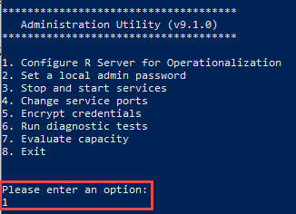
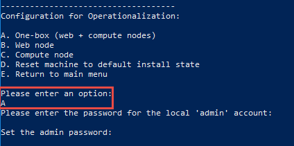
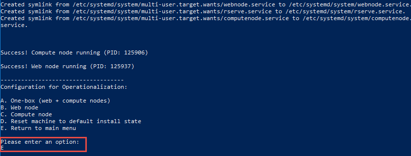
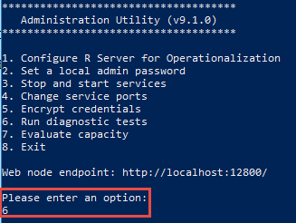
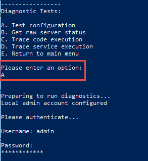
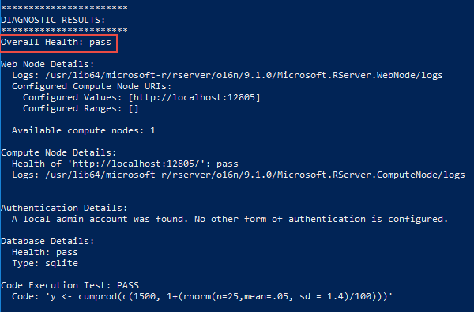

# Operationalize ML Services cluster on Azure HDInsight

After you have used ML Services cluster in HDInsight to complete your data modeling, you can operationalize the model to make predictions. This article provides instructions on how to perform this task.

## Prerequisites

* **An ML Services cluster on HDInsight**: For instructions, see [Get started with ML Services on HDInsight](r-server-get-started.md).

* **A Secure Shell (SSH) client**: An SSH client is used to remotely connect to the HDInsight cluster and run commands directly on the cluster. For more information, see [Use SSH with HDInsight](../hdinsight-hadoop-linux-use-ssh-unix.md).

## Operationalize ML Services cluster with one-box configuration

> [!NOTE]  
> The steps below are applicable to R Server 9.0 and ML Server 9.1. For ML Server 9.3, refer to [Use the administration tool to manage the operationalization configuration](https://docs.microsoft.com/machine-learning-server/operationalize/configure-admin-cli-launch).

1. SSH into the edge node.

        ssh USERNAME@CLUSTERNAME-ed-ssh.azurehdinsight.net

    For instructions on how to use SSH with Azure HDInsight, see [Use SSH with HDInsight.](../hdinsight-hadoop-linux-use-ssh-unix.md).

1. Change directory for the relevant version and sudo the dot net dll: 

    - For Microsoft ML Server 9.1:

            cd /usr/lib64/microsoft-r/rserver/o16n/9.1.0
            sudo dotnet Microsoft.RServer.Utils.AdminUtil/Microsoft.RServer.Utils.AdminUtil.dll

    - For Microsoft R Server 9.0:

            cd /usr/lib64/microsoft-deployr/9.0.1
            sudo dotnet Microsoft.DeployR.Utils.AdminUtil/Microsoft.DeployR.Utils.AdminUtil.dll

1. You are presented with the options to choose from. Choose the first option, as shown in the following screenshot, to **Configure ML Server for Operationalization**.

    

1. You are now presented with the option to choose how you want to operationalize ML Server. From the presented options, choose the first one by entering **A**.

    

1. When prompted, enter and reenter the password for a local admin user.

1. You should see outputs suggesting that the operation was successful. You are also prompted to select another option from the menu. Select E to go back to the main menu.

    

1. Optionally, you can perform diagnostic checks by running a diagnostic test as follows:

    a. From the main menu, select **6** to run diagnostic tests.

    

    b. From the Diagnostic Tests menu, select **A**. When prompted, enter the password that you provided for the local admin user.

    

    c. Verify that the output shows that overall health is a pass.

    

    d. From the menu options presented, enter **E** to return to the main menu and then enter **8** to exit the admin utility.

### Long delays when consuming web service on Apache Spark

If you encounter long delays when trying to consume a web service created with mrsdeploy functions in an Apache Spark compute context, you may need to add some missing folders. The Spark application belongs to a user called '*rserve2*' whenever it is invoked from a web service using mrsdeploy functions. To work around this issue:

	# Create these required folders for user 'rserve2' in local and hdfs:

	hadoop fs -mkdir /user/RevoShare/rserve2
	hadoop fs -chmod 777 /user/RevoShare/rserve2

	mkdir /var/RevoShare/rserve2
	chmod 777 /var/RevoShare/rserve2

	# Next, create a new Spark compute context:
 
	rxSparkConnect(reset = TRUE)

At this stage, the configuration for operationalization is complete. Now you can use the `mrsdeploy` package on your RClient to connect to the operationalization on edge node and start using its features like [remote execution](https://docs.microsoft.com/machine-learning-server/r/how-to-execute-code-remotely) and [web-services](https://docs.microsoft.com/machine-learning-server/operationalize/concept-what-are-web-services). Depending on whether your cluster is set up on a virtual network or not, you may need to set up port forward tunneling through SSH login. The following sections explain how to set up this tunnel.

### ML Services cluster on virtual network

Make sure you allow traffic through port 12800 to the edge node. That way, you can use the edge node to connect to the Operationalization feature.

	library(mrsdeploy)

	remoteLogin(
    	deployr_endpoint = "http://[your-cluster-name]-ed-ssh.azurehdinsight.net:12800",
    	username = "admin",
    	password = "xxxxxxx"
	)

If the `remoteLogin()` cannot connect to the edge node, but you can SSH to the edge node, then you need to verify whether the rule to allow traffic on port 12800 has been set properly or not. If you continue to face the issue, you can work around it by setting up port forward tunneling through SSH. For instructions, see the following section:

### ML Services cluster not set up on virtual network

If your cluster is not set up on vnet or if you are having troubles with connectivity through vnet, you can use SSH port forward tunneling:

	ssh -L localhost:12800:localhost:12800 USERNAME@CLUSTERNAME-ed-ssh.azurehdinsight.net

Once your SSH session is active, the traffic from your local machine's port 12800 is forwarded to the edge node's port 12800 through SSH session. Make sure you use `127.0.0.1:12800` in your `remoteLogin()` method. This logs into the edge node's operationalization through port forwarding.

	library(mrsdeploy)

	remoteLogin(
    	deployr_endpoint = "http://127.0.0.1:12800",
    	username = "admin",
    	password = "xxxxxxx"
	)

## Scale operationalized compute nodes on HDInsight worker nodes

To scale the compute nodes, you first decommission the worker nodes and then configure compute nodes on the decommissioned worker nodes.

### Step 1: Decommission the worker nodes

ML Services cluster is not managed through [Apache Hadoop YARN](https://hadoop.apache.org/docs/current/hadoop-yarn/hadoop-yarn-site/YARN.html). If the worker nodes are not decommissioned, the YARN Resource Manager does not work as expected because it is not aware of the resources being taken up by the server. In order to avoid this situation, we recommend decommissioning the worker nodes before you scale out the compute nodes.

Follow these steps to decommission worker nodes:

1. Log in to the cluster's Ambari console and click on **Hosts** tab.

1. Select worker nodes (to be decommissioned).

1. Click  **Actions** > **Selected Hosts** > **Hosts** > **Turn ON Maintenance Mode**. For example, in the following image we have selected wn3 and wn4 to decommission.  

     

* Select **Actions** > **Selected Hosts** > **DataNodes** > click **Decommission**.
* Select **Actions** > **Selected Hosts** > **NodeManagers** > click **Decommission**.
* Select **Actions** > **Selected Hosts** > **DataNodes** > click **Stop**.
* Select **Actions** > **Selected Hosts** > **NodeManagers** > click on **Stop**.
* Select **Actions** > **Selected Hosts** > **Hosts** > click **Stop All Components**.
* Unselect the worker nodes and select the head nodes.
* Select **Actions** > **Selected Hosts** > "**Hosts** > **Restart All Components**.

###	Step 2: Configure compute nodes on each decommissioned worker node(s)

1. SSH into each decommissioned worker node.

1. Run admin utility using the relevant DLL for the ML Services cluster that you have. For ML Server 9.1, run the following:

        dotnet /usr/lib64/microsoft-deployr/9.0.1/Microsoft.DeployR.Utils.AdminUtil/Microsoft.DeployR.Utils.AdminUtil.dll

1. Enter **1** to select option **Configure ML Server for Operationalization**.

1. Enter **C** to select option `C. Compute node`. This configures the compute node on the worker node.

1. Exit the Admin Utility.

### Step 3: Add compute nodes details on web node

Once all decommissioned worker nodes are configured to run compute node, come back on the edge node and add decommissioned worker nodes' IP addresses in the ML Server web node's configuration:

1. SSH into the edge node.

1. Run `vi /usr/lib64/microsoft-deployr/9.0.1/Microsoft.DeployR.Server.WebAPI/appsettings.json`.

1. Look for the "Uris" section, and add worker node's IP and port details.

       "Uris": {
         "Description": "Update 'Values' section to point to your backend machines. Using HTTPS is highly recommended",
         "Values": [
           "http://localhost:12805", "http://[worker-node1-ip]:12805", "http://[workder-node2-ip]:12805"
         ]
       }

## Next steps

* [Manage ML Services cluster on HDInsight](r-server-hdinsight-manage.md)
* [Compute context options for ML Services cluster on HDInsight](r-server-compute-contexts.md)
* [Azure Storage options for ML Services cluster on HDInsight](r-server-storage.md)
