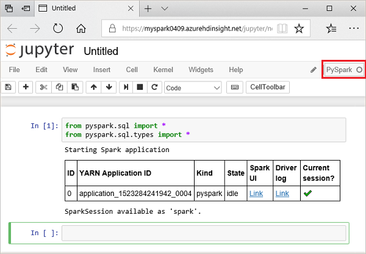

# Tutorial: Load data and run queries on an Apache Spark cluster in Azure HDInsight

In this tutorial, you learn how to create a dataframe from a csv file, and how to run interactive Spark SQL queries against an [Apache Spark](https://spark.apache.org/) cluster in Azure HDInsight. In Spark, a dataframe is a distributed collection of data organized into named columns. Dataframe is conceptually equivalent to a table in a relational database or a data frame in R/Python.
 
In this tutorial, you learn how to:
> [!div class="checklist"]
> * Create a dataframe from a csv file
> * Run queries on the dataframe

If you don't have an Azure subscription, [create a free account](https://azure.microsoft.com/free/) before you begin.

## Prerequisites

* Complete [Create an Apache Spark cluster in Azure HDInsight](apache-spark-jupyter-spark-sql.md).

## Create a dataframe from a csv file

Applications can create dataframes directly from files or folders on the remote storage such as Azure Storage or Azure Data Lake Storage; from a Hive table; or from other data sources supported by Spark, such as Cosmos DB, Azure SQL DB, DW, etc. The following screenshot shows a snapshot of the HVAC.csv file used in this tutorial. The csv file comes with all HDInsight Spark clusters. The data captures the temperature variations of some buildings.
    


1. Open the Jupyter notebook that you created in the prerequisites section.
2. Paste the following code in an empty cell of the notebook, and then press **SHIFT + ENTER** to run the code. The code imports the types required for this scenario:

    ```python
    from pyspark.sql import *
    from pyspark.sql.types import *
    ```

    When running an interactive query in Jupyter, the web browser window or tab caption shows a **(Busy)** status along with the notebook title. You also see a solid circle next to the **PySpark** text in the top-right corner. After the job is completed, it changes to a hollow circle.

    

3. Run the following code to create a dataframe and a temporary table (**hvac**) by running the following code. 

    ```python
    # Create a dataframe and table from sample data
    csvFile = spark.read.csv('/HdiSamples/HdiSamples/SensorSampleData/hvac/HVAC.csv', header=True, inferSchema=True)
    csvFile.write.saveAsTable("hvac")
    ```

    > [!NOTE]  
    > By using the PySpark kernel to create a notebook, the `spark` session is automatically created for you when you run the first code cell. You do not need to explicitly create the session.


## Run queries on the dataframe

Once the table is created, you can run an interactive query on the data.

1. Run the following code in an empty cell of the notebook:

    ```sql
    %%sql
    SELECT buildingID, (targettemp - actualtemp) AS temp_diff, date FROM hvac WHERE date = \"6/1/13\"
    ```

   The following tabular output is displayed.

     

3. You can also see the results in other visualizations as well. To see an area graph for the same output, select **Area** then set other values as shown.

    

10. From the **File** menu on the notebook, select **Save and Checkpoint**. 

11. If you're starting the [next tutorial](apache-spark-use-bi-tools.md) now, leave the notebook open. If not, shut down the notebook to release the cluster resources: from the **File** menu on the notebook, select **Close and Halt**.

## Clean up resources

With HDInsight, your data and Jupyter notebooks are stored in Azure Storage or Azure Data Lake Storage, so you can safely delete a cluster when it is not in use. You are also charged for an HDInsight cluster, even when it is not in use. Since the charges for the cluster are many times more than the charges for storage, it makes economic sense to delete clusters when they are not in use. If you plan to work on the next tutorial immediately, you might want to keep the cluster.

Open the cluster in the Azure portal, and select **Delete**.


You can also select the resource group name to open the resource group page, and then select **Delete resource group**. By deleting the resource group, you delete both the HDInsight Spark cluster, and the default storage account.

## Next steps

In this tutorial, you learned how to:

* Create an Apache Spark dataframe.
* Run Spark SQL against the dataframe.

Advance to the next article to see how the data you registered in Apache Spark can be pulled into a BI analytics tool such as Power BI. 
> [!div class="nextstepaction"]
> [Analyze data using BI tools](apache-spark-use-bi-tools.md)

