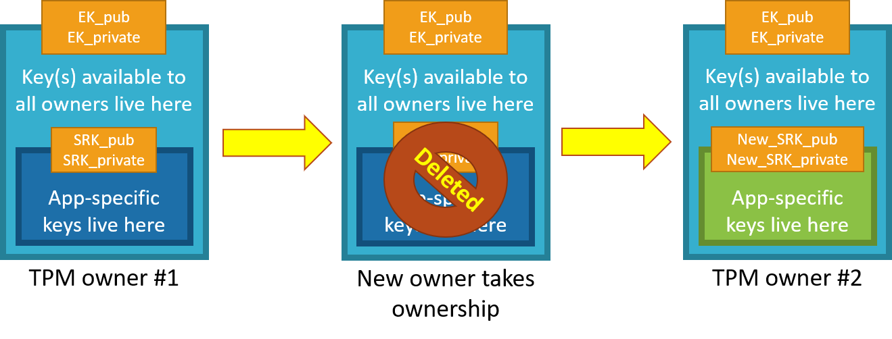
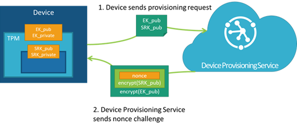
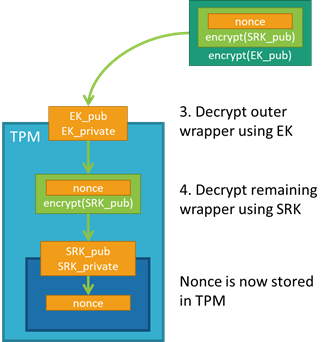
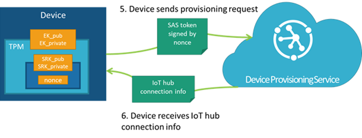

# TPM attestation

IoT Hub Device Provisioning Service is a helper service for IoT Hub that you use to configure zero-touch device provisioning to a specified IoT hub. With the Device Provisioning Service, you can provision millions of devices in a secure manner.

This article describes the identity attestation process when using a [TPM](./concepts-device.md). TPM stands for Trusted Platform Module and is a type of hardware security module (HSM). This article assumes you are using a discrete, firmware, or integrated TPM. Software emulated TPMs are well-suited for prototyping or testing, but they do not provide the same level of security as discrete, firmware, or integrated TPMs do. We do not recommend using software TPMs in production. For more information about types of TPMs, see [A Brief Introduction to TPM](https://trustedcomputinggroup.org/wp-content/uploads/TPM-2.0-A-Brief-Introduction.pdf).

This article is only relevant for devices using TPM 2.0 with HMAC key support and their endorsement keys. It is not for devices using X.509 certificates for authentication. TPM is an industry-wide, ISO standard from the Trusted Computing Group, and you can read more about TPM at the [complete TPM 2.0 spec](https://trustedcomputinggroup.org/tpm-library-specification/) or the [ISO/IEC 11889 spec](https://www.iso.org/standard/66510.html). This article also assumes you are familiar with public and private key pairs, and how they are used for encryption.

The Device Provisioning Service device SDKs handle everything that is described in this article for you. There is no need for you to implement anything additional if you are using the SDKs on your devices. This article helps you understand conceptually what’s going on with your TPM security chip when your device provisions and why it’s so secure.

## Overview

TPMs use something called the endorsement key (EK) as the secure root of trust. The EK is unique to the TPM and changing it essentially changes the device into a new one.

There's another type of key that TPMs have, called the storage root key (SRK). An SRK may be generated by the TPM's owner after it takes ownership of the TPM. Taking ownership of the TPM is the TPM-specific way of saying "someone sets a password on the HSM." If a TPM device is sold to a new owner, the new owner can take ownership of the TPM to generate a new SRK. The new SRK generation ensures the previous owner can't use the TPM. Because the SRK is unique to the owner of the TPM, the SRK can be used to seal data into the TPM itself for that owner. The SRK provides a sandbox for the owner to store their keys and provides access revocability if the device or TPM is sold. It's like moving into a new house: taking ownership is changing the locks on the doors and destroying all furniture left by the previous owners (SRK), but you can't change the address of the house (EK).

Once a device has been set up and ready to use, it will have both an EK and an SRK available for use.

One note on taking ownership of the TPM: Taking ownership of a TPM depends on many things, including TPM manufacturer, the set of TPM tools being used, and the device OS. Follow the instructions relevant to your system to take ownership.

The Device Provisioning Service uses the public part of the EK (EK_pub) to identify and enroll devices. The device vendor can read the EK_pub during manufacture or final testing and upload the EK_pub to the provisioning service so that the device will be recognized when it connects to provision. The Device Provisioning Service does not check the SRK or owner, so “clearing” the TPM erases customer data, but the EK (and other vendor data) is preserved and the device will still be recognized by the Device Provisioning Service when it connects to provision.

## Detailed attestation process

When a device with a TPM first connects to the Device Provisioning Service, the service first checks the provided EK_pub against the EK_pub stored in the enrollment list. If the EK_pubs do not match, the device is not allowed to provision. If the EK_pubs do match, the service then requires the device to prove ownership of the private portion of the EK via a nonce challenge, which is a secure challenge used to prove identity. The Device Provisioning Service generates a nonce and then encrypts it with the SRK and then the EK_pub, both of which are provided by the device during the initial registration call. The TPM always keeps the private portion of the EK secure. This prevents counterfeiting and ensures SAS tokens are securely provisioned to authorized devices.

Let’s walk through the attestation process in detail.

### Device requests an IoT Hub assignment

First the device connects to the Device Provisioning Service and requests to provision. In doing so, the device provides the service with its registration ID, an ID scope, and the EK_pub and SRK_pub from the TPM. The service passes the encrypted nonce back to the device and asks the device to decrypt the nonce and use that to sign a SAS token to connect again and finish provisioning.

### Nonce challenge

The device takes the nonce and uses the private portions of the EK and SRK to decrypt the nonce into the TPM; the order of nonce encryption delegates trust from the EK, which is immutable, to the SRK, which can change if a new owner takes ownership of the TPM.

### Validate the nonce and receive credentials

The device can then sign a SAS token using the decrypted nonce and reestablish a connection to the Device Provisioning Service using the signed SAS token. With the Nonce challenge completed, the service allows the device to provision.

## Next steps

Now the device connects to IoT Hub, and you rest secure in the knowledge that your devices’ keys are securely stored. Now that you know how the Device Provisioning Service securely verifies a device’s identity using TPM, check out the following articles to learn more:

* [Learn about all the concepts in auto-provisioning](./concepts-auto-provisioning.md)
* [Get started using auto-provisioning](./quick-setup-auto-provision.md) using the SDKs to take care of the flow.
