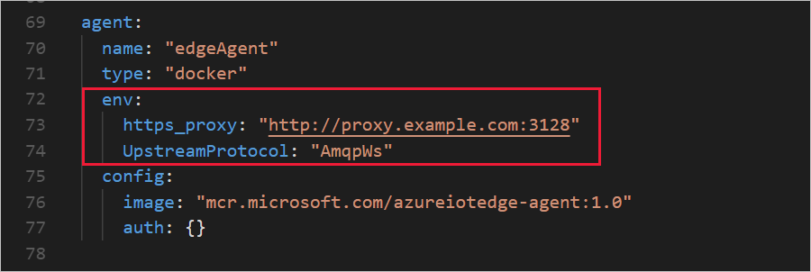
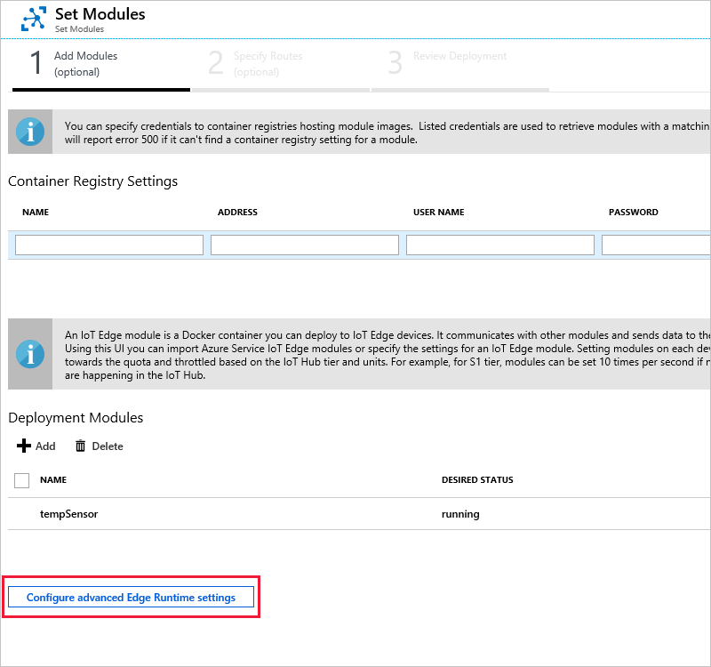
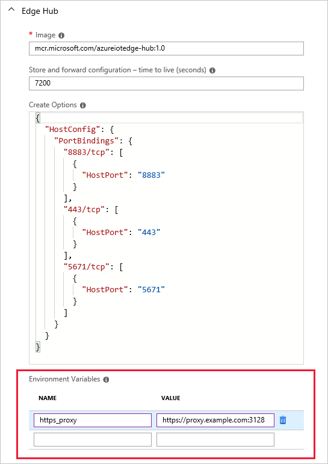

# Configure an IoT Edge device to communicate through a proxy server

IoT Edge devices send HTTPS requests to communicate with IoT Hub. If your device is connected to a network that uses a proxy server, you need to configure the IoT Edge runtime to communicate through the server. Proxy servers can also affect individual IoT Edge modules if they make HTTP or HTTPS requests that aren't routed through the IoT Edge hub. 

Configuring an IoT Edge device to work with a proxy server follows these basic steps: 

1. Install the IoT Edge runtime on your device. 
2. Configure the Docker daemon and the IoT Edge daemon on your device to use the proxy server.
3. Configure the edgeAgent properties in the config.yaml file on your device.
4. Set environment variables for the IoT Edge runtime and other IoT Edge modules in the deployment manifest.

## Know your proxy URL

To configure both the Docker daemon and IoT Edge on your device, you need to know your proxy URL.

Proxy URLs take the following format: **protocol**://**proxy_host**:**proxy_port**.

* The **protocol** is either HTTP or HTTPS. The Docker daemon can use either protocol, depending on your container registry settings, but the IoT Edge daemon and runtime containers should always use HTTPS.

* The **proxy_host** is an address for the proxy server. If your proxy server requires authentication, you can provide your credentials as part of the proxy_host in the format of **user**:**password**\@**proxy_host**.

* The **proxy_port** is the network port at which the proxy responds to network traffic.

## Install the runtime

If you're installing the IoT Edge runtime on a Linux device, configure the package manager to go through your proxy server to access the installation package. For example, [Set up apt-get to use a http-proxy](https://help.ubuntu.com/community/AptGet/Howto/#Setting_up_apt-get_to_use_a_http-proxy). Once your package manager is configured, follow the instructions in [Install Azure IoT Edge runtime on Linux (ARM32v7/armhf)](how-to-install-iot-edge-linux-arm.md) or [Install the Azure IoT Edge runtime on Linux (x64)](how-to-install-iot-edge-linux.md) as usual.

If you're installing the IoT Edge runtime on a Windows device, you need to go through the proxy server once to download the installer script file, then again during the installation to download the necessary components. You can configure proxy information in Windows settings, or include your proxy information directly in the installation script. The following powershell script is an example of a windows installation using the `-proxy` argument:

```powershell
. {Invoke-WebRequest -proxy <proxy URL> -useb aka.ms/iotedge-win} | Invoke-Expression; `
Install-SecurityDaemon -Manual -ContainerOs Windows -proxy <proxy URL>
```

If you have complicated credentials for the proxy server that can't be included in the URL, use the `-ProxyCredential` parameter within `-InvokeWebRequestParameters`. For example,

```powershell
$proxyCredential = (Get-Credential).GetNetworkCredential()
. {Invoke-WebRequest -proxy <proxy URL> -ProxyCredential $proxyCredential -useb aka.ms/iotedge-win} | Invoke-Expression; `
Install-SecurityDaemon -Manual -ContainerOs Windows -InvokeWebRequestParameters @{ '-Proxy' = '<proxy URL>'; '-ProxyCredential' = $proxyCredential }
```

For more information about proxy parameters, see [Invoke-WebRequest](https://docs.microsoft.com/powershell/module/microsoft.powershell.utility/invoke-webrequest). For more information about installation options, see [Install Azure IoT Edge runtime on Windows](how-to-install-iot-edge-windows.md).

Once the IoT Edge runtime is installed, use the following section to configure it with your proxy information. 

## Configure the daemons

The Docker and IoT Edge daemons running on your IoT Edge device need to be configured to use the proxy server. The Docker daemon makes web requests to pull container images from container registries. The IoT Edge daemon makes web requests to communicate with IoT Hub.

### Docker daemon

Refer to the Docker documentation to configure the Docker daemon with environment variables. Most container registries (including DockerHub and Azure Container Registries) support HTTPS requests, so the parameter that you should set is **HTTPS_PROXY**. If you're pulling images from a registry that doesn't support transport layer security (TLS), then you should set the **HTTP_PROXY** parameter. 

Choose the article that applies to your Docker version: 

* [Docker for Linux](https://docs.docker.com/config/daemon/systemd/#httphttps-proxy)
* [Docker for Windows](https://docs.microsoft.com/virtualization/windowscontainers/manage-docker/configure-docker-daemon#proxy-configuration)

### IoT Edge daemon

The IoT Edge daemon is configured in a similar manner to the Docker daemon. All the requests that IoT Edge sends to IoT Hub use HTTPS. Use the following steps to set an environment variable for the service, based on your operating system. 

#### Linux

Open an editor in the terminal to configure the IoT Edge daemon. 

```bash
sudo systemctl edit iotedge
```

Enter the following text, replacing **\<proxy URL>** with your proxy server address and port. Then, save and exit. 

```ini
[Service]
Environment="https_proxy=<proxy URL>"
```

Refresh the service manager to pick up the new configuration for IoT Edge.

```bash
sudo systemctl daemon-reload
```

Restart IoT Edge for the changes to take effect.

```bash
sudo systemctl restart iotedge
```

Verify that your environment variable was created, and the new configuration was loaded. 

```bash
systemctl show --property=Environment iotedge
```

#### Windows

Open a PowerShell window as an administrator and run the following command to edit the registry with the new environment variable. Replace **\<proxy url>** with your proxy server address and port. 

```powershell
reg add HKLM\SYSTEM\CurrentControlSet\Services\iotedge /v Environment /t REG_MULTI_SZ /d https_proxy=<proxy URL>
```

Restart IoT Edge for the changes to take effect.

```powershell
Restart-Service iotedge
```

## Configure the IoT Edge agent

The IoT Edge agent is the first module to start on any IoT Edge device. It's started for the first time based on the information in the IoT Edge config.yaml file. The IoT Edge agent then connects to IoT Hub to retrieve deployment manifests, which declare what other modules should be deployed on the device.

Open the config.yaml file on your IoT Edge device. On Linux systems, this file is located at **/etc/iotedge/config.yaml**. On Windows systems, this file is located at **C:\ProgramData\iotedge\config.yaml**. The configuration file is protected, so you need administrative privileges to access it. On Linux systems, that means using the `sudo` command before opening the file in your preferred text editor. On Windows, that means opening a text editor like Notepad to run as administrator and then opening the file. 

In the config.yaml file, find the **Edge Agent module spec** section. The IoT Edge agent definition includes an **env** parameter where you can add environment variables. 

<!--

-->

Remove the curly brackets that are placeholders for the env parameter, and add the new variable on a new line. Remember that indents in YAML are two spaces. 

```yaml
https_proxy: "<proxy URL>"
```

The IoT Edge runtime uses AMQP by default to talk to IoT Hub. Some proxy servers block AMQP ports. If that's the case, then you also need to configure edgeAgent to use AMQP over WebSocket. Add a second environment variable.

```yaml
UpstreamProtocol: "AmqpWs"
```



Save the changes to config.yaml and close the editor. Restart IoT Edge for the changes to take effect. 

* Linux: 

   ```bash
   sudo systemctl restart iotedge
   ```

* Windows:

   ```powershell
   Restart-Service iotedge
   ```

## Configure deployment manifests  

Once your IoT Edge device is configured to work with your proxy server, you need to continue to declare the environment variables in future deployment manifests. Always configure the two runtime modules, edgeAgent and edgeHub, to communicate through the proxy server so they can maintain a connection with IoT Hub. Other IoT Edge modules that connect to the internet should be configured for the proxy server. However, modules that route their messages through edgeHub or that only communicate with other modules on the device don't need the proxy server details. 

You can create deployment manifests using the Azure portal or manually by editing a JSON file. 

### Azure portal

When you use the **Set modules** wizard to create deployments for IoT Edge devices, every module has an **Environment Variables** section that you can use to configure proxy server connections. 

To configure the IoT Edge agent and IoT Edge hub modules, select **Configure advanced Edge Runtime settings** on the first step of the wizard. 



Add the **https_proxy** environment variable to both the IoT Edge agent and IoT Edge hub module definitions. If you included the **UpstreamProtocol** environment variable in the config.yaml file on your IoT Edge device, add that to the IoT Edge agent module definition too. 



All other modules that you add to a deployment manifest follow the same pattern. In the page where you set the module name and image, there is an environment variables section.

### JSON deployment manifest files

If you create deployments for IoT Edge devices using the templates in Visual Studio Code or by manually creating JSON files, you can add the environment variables directly to each module definition. 

Use the following JSON format: 

```json
"env": {
    "https_proxy": {
        "value": "<proxy URL>"
    }
}
```

With the environment variables included, your module definition should look like the following edgeHub example:

```json
"edgeHub": {
    "type": "docker",
    "settings": {
        "image": "mcr.microsoft.com/azureiotedge-hub:1.0",
        "createOptions": ""
    },
    "env": {
        "https_proxy": {
            "value": "https://proxy.example.com:3128"
        }
    },
    "status": "running",
    "restartPolicy": "always"
}
```

If you included the **UpstreamProtocol** environment variable in the confige.yaml file on your IoT Edge device, add that to the IoT Edge agent module definition too. 

```json
"env": {
    "https_proxy": {
        "value": "<proxy URL>"
    },
    "UpstreamProtocol": {
        "value": "AmqpWs"
    }
}
```

## Next steps

Learn more about the roles of the [IoT Edge runtime](iot-edge-runtime.md).

Troubleshoot installation and configuration errors with [Common issues and resolutions for Azure IoT Edge](troubleshoot.md)

