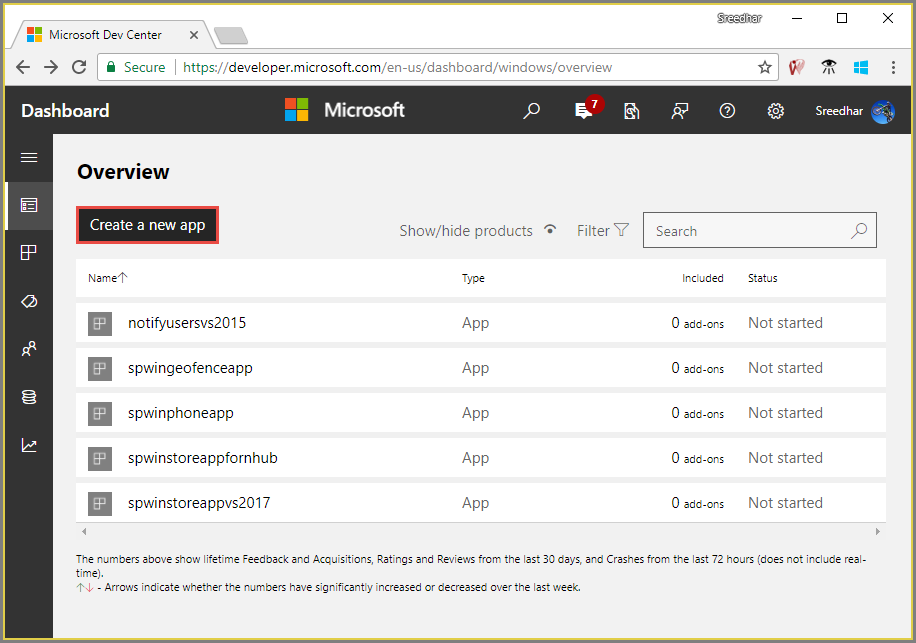
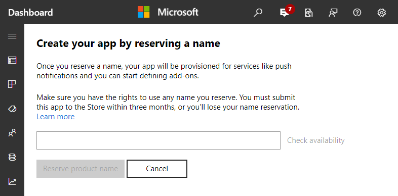
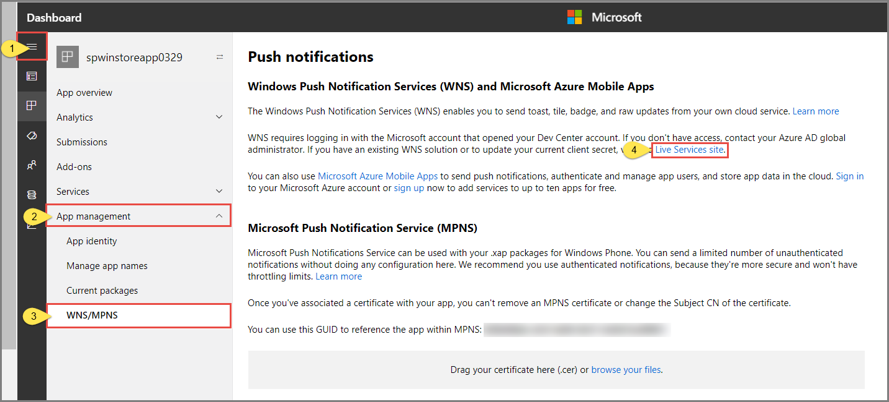
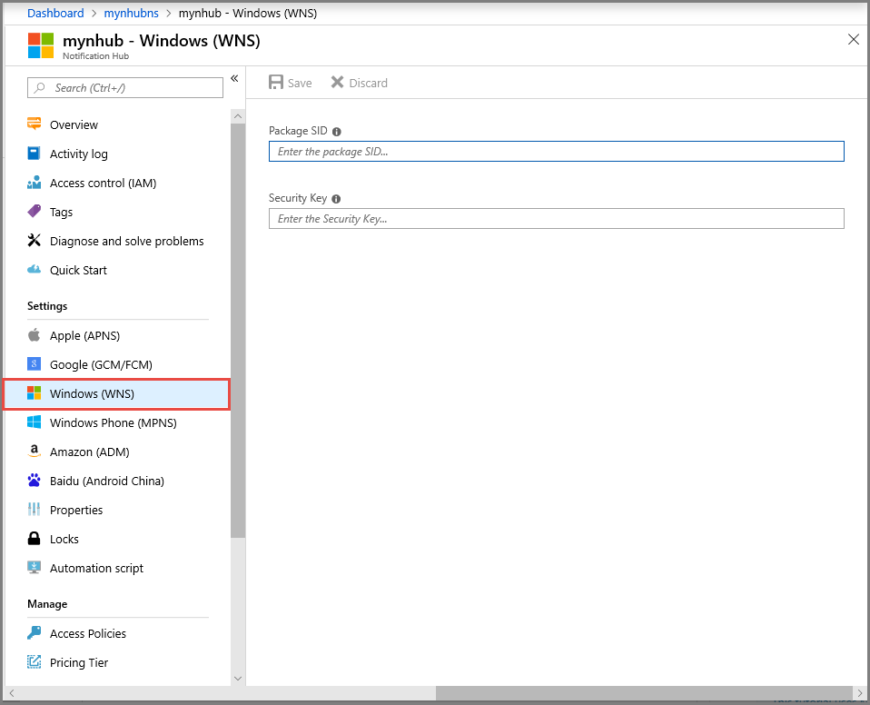
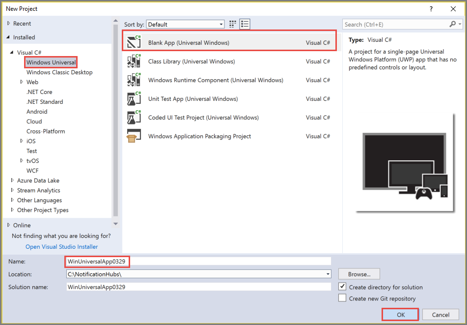
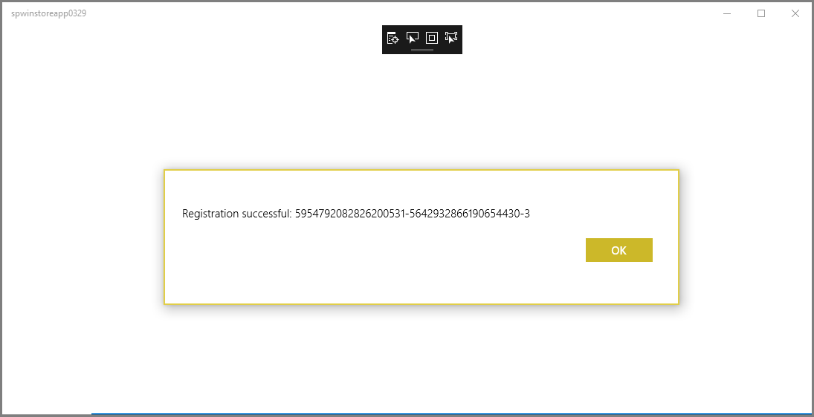
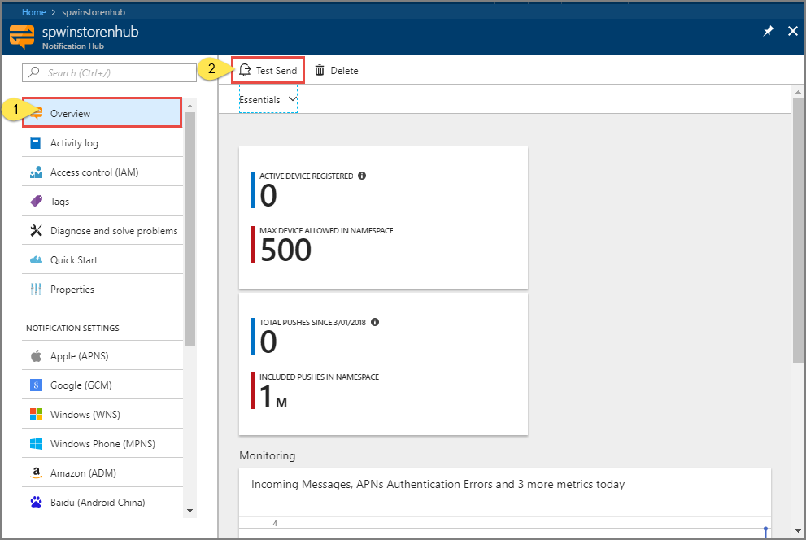
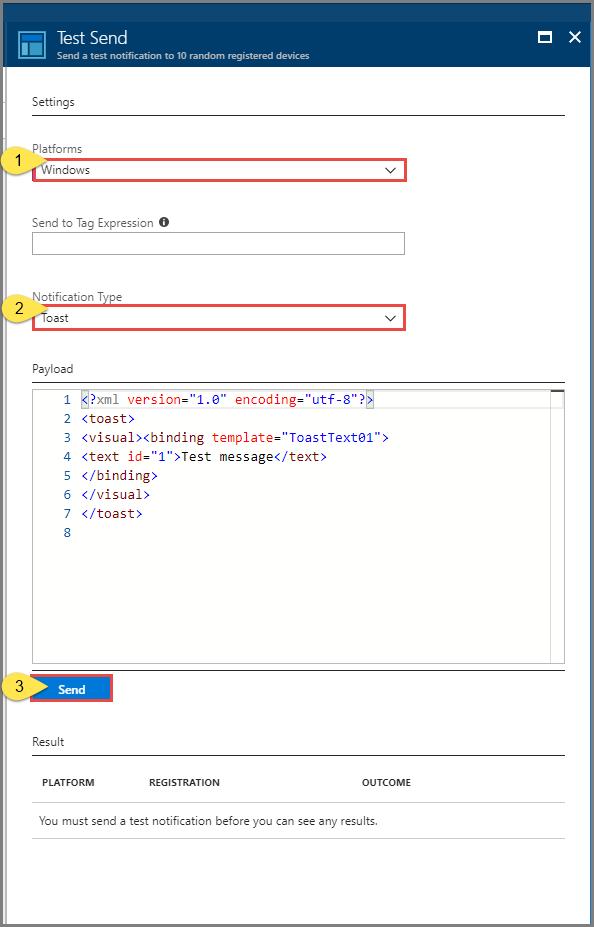
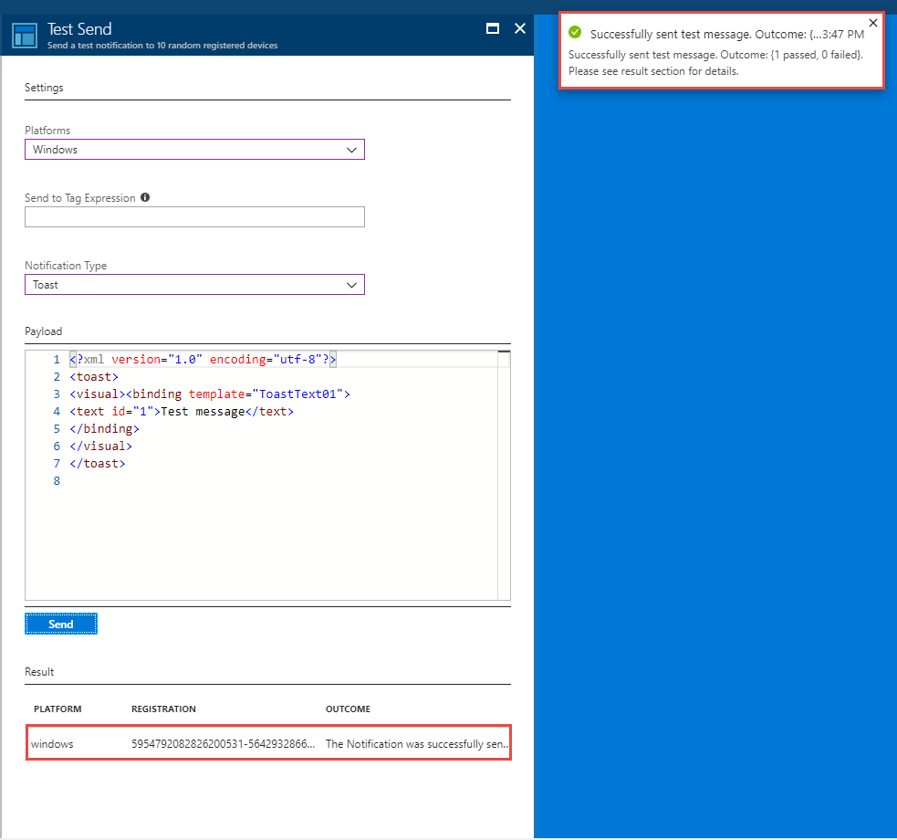

# Tutorial: Send notifications to Universal Windows Platform apps by using Azure Notification Hubs

[!INCLUDE [notification-hubs-selector-get-started](../../includes/notification-hubs-selector-get-started.md)]

In this tutorial, you create a notification hub to send push notifications to a Universal Windows Platform (UWP) app. You create a blank Windows Store app that receives push notifications by using the Windows Push Notification Service (WNS). Then, you can use your notification hub to broadcast push notifications to all devices that are running your app.

> [!NOTE]
> You can find the completed code for this tutorial on [GitHub](https://github.com/Azure/azure-notificationhubs-samples/tree/master/dotnet/GetStartedWindowsUniversal).

In this tutorial, you take the following steps:

> [!div class="checklist"]
> * Create an app in Windows Store
> * Create a Notification Hub
> * Create a sample Windows app
> * Send test notifications

## Prerequisites

- **Azure subscription**. If you don't have an Azure subscription, [create a free Azure account](https://azure.microsoft.com/free/?WT.mc_id=A261C142F) before you begin.
- [Microsoft Visual Studio Community 2015 or later](https://www.visualstudio.com/products/visual-studio-community-vs) or later.
- [UWP app-development tools installed](https://msdn.microsoft.com/windows/uwp/get-started/get-set-up)
- An active Windows Store account

Completing this tutorial is a prerequisite for all other Notification Hubs tutorials for UWP apps.

## Create an app in Windows Store

To send push notifications to UWP apps, associate your app to the Windows Store. Then, configure your notification hub to integrate with WNS.

1. Navigate to the [Windows Dev Center](https://dev.windows.com/overview), sign in with your Microsoft account, and then select **Create a new app**.

    
2. Type a name for your app, and then select **Reserve product name**. Doing so creates a new Windows Store registration for your app.

    
3. Expand **App Management**, select **WNS/MPNS**, and then select **Live Services site**. Sign in to your Microsoft account. The **Application Registration Portal** opens in a new tab. Alternatively, you can navigate directly to the [Application Registration Portal](https://apps.dev.microsoft.com), select your application name to get to this page.

    
4. Note the **Application Secret** password and the **Package security identifier (SID)**.

    >[!WARNING]
    >The application secret and package SID are important security credentials. Do not share these values with anyone or distribute them with your app.

## Create a Notification Hub

[!INCLUDE [notification-hubs-portal-create-new-hub](../../includes/notification-hubs-portal-create-new-hub.md)]

### Configure WNS settings for the hub

1. In the **NOTIFICATION SETTINGS** category, select **Windows (WNS)**.
2. Enter values for **Package SID** and **Security Key** you noted from the previous section.
3. Click **Save** on the toolbar.

    

Your notification hub is now configured to work with WNS. You have the connection strings to register your app and send notifications.

## Create a sample Windows app

1. In Visual Studio, open the **File** menu, select **New**, and then select **Project**.
2. In the **New Project** dialog, complete the following steps:

    1. Expand **Visual C#**.
    2. Select **Windows Universal**.
    3. Select **Blank App (Universal Windows)**.
    4. Enter a **name** for the project.
    5. Select **OK**.

        
3. Accept the defaults for the **target** and **minimum** platform versions, and select **OK**.
4. In Solution Explorer, right-click the Windows Store app project, select **Store**, and then select **Associate App with the Store**. The **Associate Your App with the Windows Store** wizard appears.
5. In the wizard, sign in with your Microsoft account.
6. Select the app that you registered in step 2, select **Next**, and then select **Associate**. Doing so adds the required Windows Store registration information to the application manifest.
7. In Visual Studio, right-click the solution, and then select **Manage NuGet Packages**. The **Manage NuGet Packages** window opens.
8. In the search box, enter **WindowsAzure.Messaging.Managed**, select **Install**, and accept the terms of use.

    ![The Manage NuGet Packages window][20]

    This action downloads, installs, and adds a reference to the Azure Notification Hubs library for Windows by using the [Microsoft.Azure.NotificationHubs NuGet package](https://www.nuget.org/packages/Microsoft.Azure.NotificationHubs).
9. Open the `App.xaml.cs` project file, and add the following statements:

    ```csharp
    using Windows.Networking.PushNotifications;
    using Microsoft.WindowsAzure.Messaging;
    using Windows.UI.Popups;
    ```

10. In the project's `App.xaml.cs` file, locate the `App` class, and add the following `InitNotificationsAsync` method definition:

    ```csharp
    private async void InitNotificationsAsync()
    {
        var channel = await PushNotificationChannelManager.CreatePushNotificationChannelForApplicationAsync();

        var hub = new NotificationHub("<your hub name>", "<Your DefaultListenSharedAccessSignature connection string>");
        var result = await hub.RegisterNativeAsync(channel.Uri);

        // Displays the registration ID so you know it was successful
        if (result.RegistrationId != null)
        {
            var dialog = new MessageDialog("Registration successful: " + result.RegistrationId);
            dialog.Commands.Add(new UICommand("OK"));
            await dialog.ShowAsync();
        }
    }
    ```

    This code retrieves the channel URI for the app from WNS, and then registers that channel URI with your notification hub.

    >[!NOTE]
    > Replace the `hub name` placeholder with the name of the notification hub that appears in the Azure portal. Also replace the connection string placeholder with the `DefaultListenSharedAccessSignature` connection string that you obtained from the **Access Polices** page of your notification hub in a previous section.

11. At the top of the `OnLaunched` event handler in `App.xaml.cs`, add the following call to the new `InitNotificationsAsync` method:

    ```csharp
    InitNotificationsAsync();
    ```

    This action guarantees that the channel URI is registered in your notification hub each time the application launches.

12. To run the app, press the keyboard's **F5** key. A dialog box containing the registration key will display. To close the dialog, click **OK**.

    

Your app is now ready to receive toast notifications.

## Send test notifications

You can quickly test receiving notifications in your app by sending notifications in the [Azure portal](https://portal.azure.com/).

1. In the Azure portal, switch to the Overview tab, and select **Test Send** on the toolbar.

    
2. In the **Test Send** window, do the following actions:
    1. For **Platforms**, select **Windows**.
    2. For **Notification Type**, select **Toast**.
    3. Select **Send**.

        
3. See the result of the Send operation in the **Result** list at the bottom of the window. You also see an alert message.

    
4. You see the notification message: **Test message** on your desktop.

    

## Next steps

In this tutorial, you sent broadcast notifications to all your Windows devices by using the portal or a console app. To learn how to push notifications to specific devices, advance to the following tutorial:

> [!div class="nextstepaction"]
>[Push notifications to specific devices](
notification-hubs-windows-notification-dotnet-push-xplat-segmented-wns.md)

<!-- Images. -->
[13]: ./media/notification-hubs-windows-store-dotnet-get-started/notification-hub-create-console-app.png
[14]: ./media/notification-hubs-windows-store-dotnet-get-started/notification-hub-windows-toast.png
[19]: ./media/notification-hubs-windows-store-dotnet-get-started/notification-hub-windows-reg.png
[20]: ./media/notification-hubs-windows-store-dotnet-get-started/notification-hub-windows-universal-app-install-package.png

<!-- URLs. -->
[Use Notification Hubs to push notifications to users]: notification-hubs-aspnet-backend-windows-dotnet-wns-notification.md
[Use Notification Hubs to send breaking news]: notification-hubs-windows-notification-dotnet-push-xplat-segmented-wns.md
[toast catalog]: https://msdn.microsoft.com/library/windows/apps/hh761494.aspx
[tile catalog]: https://msdn.microsoft.com/library/windows/apps/hh761491.aspx
[badge overview]: https://msdn.microsoft.com/library/windows/apps/hh779719.aspx
