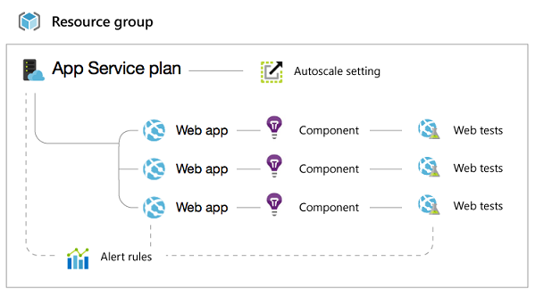
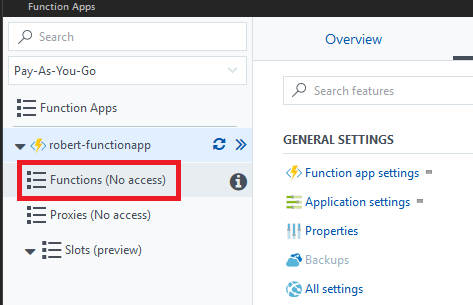

# Troubleshoot RBAC for Azure resources

This article answers common questions about role-based access control (RBAC) for Azure resources, so that you know what to expect when using the roles in the Azure portal and can troubleshoot access problems.

## Problems with RBAC role assignments

- If you are unable to add a role assignment because the **Add role assignment** option is disabled or because you get a permissions error, check that you are using a role that has the `Microsoft.Authorization/roleAssignments/*` permission at the scope you are trying to assign the role. If you don't have this permission, check with your subscription administrator.
- If you get a permissions error when you try to create a resource, check that you are using a role that has permission to create resources at the selected scope. For example, you might need to be a Contributor. If you don't have the permission, check with your subscription administrator.
- If you get a permissions error when you try to create or update a support ticket, check that you are using a role that has the `Microsoft.Support/*` permission, such as [Support Request Contributor](built-in-roles.md#support-request-contributor).
- If you get an error that the number of role assignments are exceeded when you try to assign a role, try to reduce the number of role assignments by assigning roles to groups instead. Azure supports up to **2000** role assignments per subscription.

## Problems with custom roles

- If you are unable to update an existing custom role, check whether you have the `Microsoft.Authorization/roleDefinition/write` permission.
- If you are unable to update an existing custom role, check whether one or more assignable scopes have been deleted in the tenant. The `AssignableScopes` property for a custom role controls [who can create, delete, update, or view the custom role](custom-roles.md#who-can-create-delete-update-or-view-a-custom-role).
- If you get an error that the role definition limit exceeded when you try to create a new role, delete any custom roles that aren't be used. You can also try to consolidate or reuse any existing custom roles. Azure supports up to **2000** custom roles in a tenant.
- If you are unable to delete a custom role, check whether one or more role assignments are still using the custom role.

## Recover RBAC when subscriptions are moved across tenants

- If you need steps for how to transfer a subscription to a different tenant, see [Transfer ownership of an Azure subscription to another account](../billing/billing-subscription-transfer.md).
- When you transfer a subscription to a different tenant, all role assignments are permanently deleted from the source tenant and are not migrated to the target tenant. You must re-create your role assignments in the target tenant.
- If you are a Global Administration and you have lost access to a subscription, use the **Access management for Azure resources** toggle to temporarily [elevate your access](elevate-access-global-admin.md) to regain access to the subscription.

## RBAC changes are not being detected

Azure Resource Manager sometimes caches configurations and data to improve performance. When creating or deleting role assignments, it can take up to 30 minutes for changes to take effect. If you are using the Azure portal, Azure PowerShell, or Azure CLI, you can force a refresh of your role assignment changes by signing out and signing in. If you are making role assignment changes with REST API calls, you can force a refresh by refreshing your access token.

## Web app features that require write access

If you grant a user read-only access to a single web app, some features are disabled that you might not expect. The following management capabilities require **write** access to a web app (either Contributor or Owner), and aren't available in any read-only scenario.

* Commands (like start, stop, etc.)
* Changing settings like general configuration, scale settings, backup settings, and monitoring settings
* Accessing publishing credentials and other secrets like app settings and connection strings
* Streaming logs
* Diagnostic logs configuration
* Console (command prompt)
* Active and recent deployments (for local git continuous deployment)
* Estimated spend
* Web tests
* Virtual network (only visible to a reader if a virtual network has previously been configured by a user with write access).

If you can't access any of these tiles, you need to ask your administrator for Contributor access to the web app.

## Web app resources that require write access

Web apps are complicated by the presence of a few different resources that interplay. Here is a typical resource group with a couple of websites:

As a result, if you grant someone access to just the web app, much of the functionality on the website blade in the Azure portal is disabled.

These items require **write** access to the **App Service plan** that corresponds to your website:  

* Viewing the web app's pricing tier (Free or Standard)  
* Scale configuration (number of instances, virtual machine size, autoscale settings)  
* Quotas (storage, bandwidth, CPU)  

These items require **write** access to the whole **Resource group** that contains your website:  

* SSL Certificates and bindings (SSL certificates can be shared between sites in the same resource group and geo-location)  
* Alert rules  
* Autoscale settings  
* Application insights components  
* Web tests  

## Virtual machine features that require write access

Similar to web apps, some features on the virtual machine blade require write access to the virtual machine, or to other resources in the resource group.

Virtual machines are related to Domain names, virtual networks, storage accounts, and alert rules.

These items require **write** access to the **Virtual machine**:

* Endpoints  
* IP addresses  
* Disks  
* Extensions  

These require **write** access to both the **Virtual machine**, and the **Resource group** (along with the Domain name) that it is in:  

* Availability set  
* Load balanced set  
* Alert rules  

If you can't access any of these tiles, ask your administrator for Contributor access to the Resource group.

## Azure Functions and write access

Some features of [Azure Functions](../azure-functions/functions-overview.md) require write access. For example, if a user is assigned the Reader role, they will not be able to view the functions within a function app. The portal will display **(No access)**.

A reader can click the **Platform features** tab and then click **All settings** to view some settings related to a function app (similar to a web app), but they can't modify any of these settings.

## Next steps
* [Manage access to Azure resources using RBAC and the Azure portal](role-assignments-portal.md)
* [View activity logs for RBAC changes to Azure resources](change-history-report.md)

