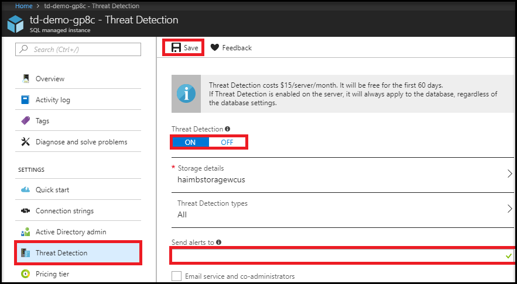

# Configure threat detection (Preview) in Azure SQL Database managed instance

[Threat detection](sql-database-threat-detection-overview.md) for a [managed instance](sql-database-managed-instance-index.yml) detects anomalous activities indicating unusual and potentially harmful attempts to access or exploit databases. Threat detection can identify **Potential SQL injection**, **Access from unusual location or data center**, **Access from unfamiliar principal or potentially harmful application**, and **Brute force SQL credentials** - see more details in [threat detection alerts](sql-database-threat-detection-overview.md#threat-detection-alerts).

You can receive notifications about the detected threats via [email notifications](sql-database-threat-detection-overview.md#explore-anomalous-database-activities-upon-detection-of-a-suspicious-event) or [Azure portal](sql-database-threat-detection-overview.md#explore-threat-detection-alerts-for-your-database-in-the-azure-portal)

[Threat detection](sql-database-threat-detection-overview.md) is part of the [advanced data security](sql-database-advanced-data-security.md) (ADS) offering, which is a unified package for advanced SQL security capabilities. Threat detection can be accessed and managed via the central SQL ADS portal. Threat detection service is charged 15$/month per managed instance, with first 30 days free of charge.

## Set up threat detection for your managed instance in the Azure portal

1. Launch the Azure portal at [https://portal.azure.com](https://portal.azure.com).
2. Navigate to the configuration page of the managed instance you want to protect. In the **Settings** page, select **Threat Detection**.
3. In the Threat Detection configuration page
   - Turn **ON** Threat detection.
   - Configure the **list of emails** to receive security alerts upon detection of anomalous database activities.
   - Select the **Azure storage account** where anomalous threat audit records are saved.
4. Click **Save** to save the new or updated threat detection policy.

   

## Next steps

- Learn more about [threat detection](sql-database-threat-detection-overview.md).
- Learn about managed instances, see [What is a managed instance](sql-database-managed-instance.md).
- Learn more about [threat detection for single database](sql-database-threat-detection.md).
- Learn more about [managed instance auditing](https://go.microsoft.com/fwlink/?linkid=869430).
- Learn more about [Azure security center](https://docs.microsoft.com/azure/security-center/security-center-intro).
